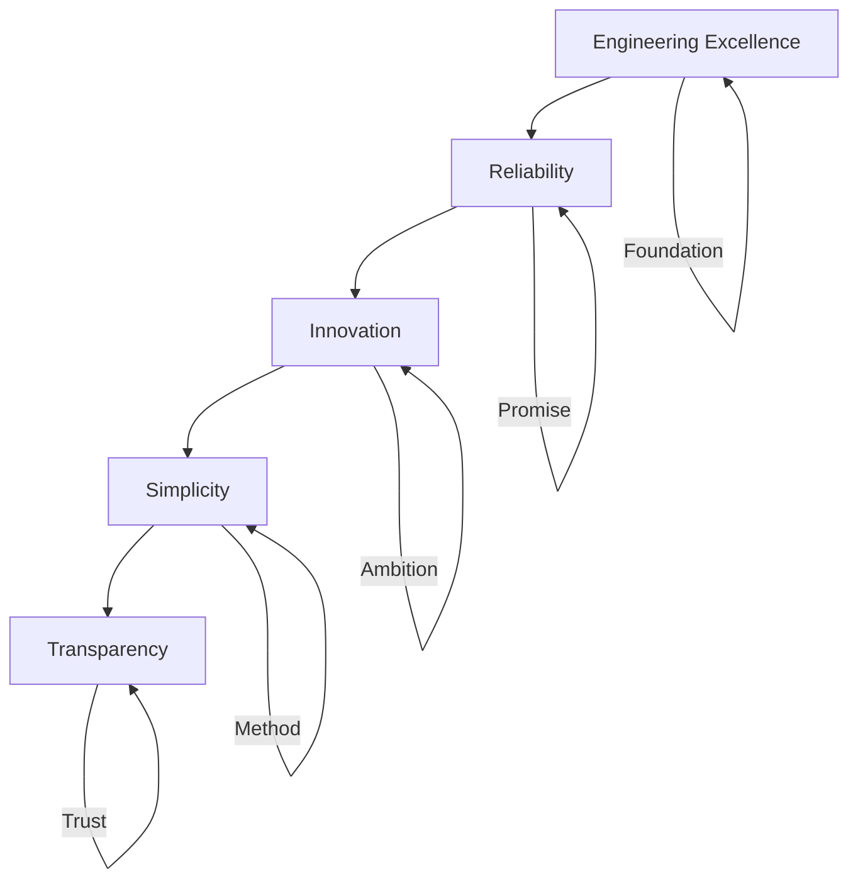
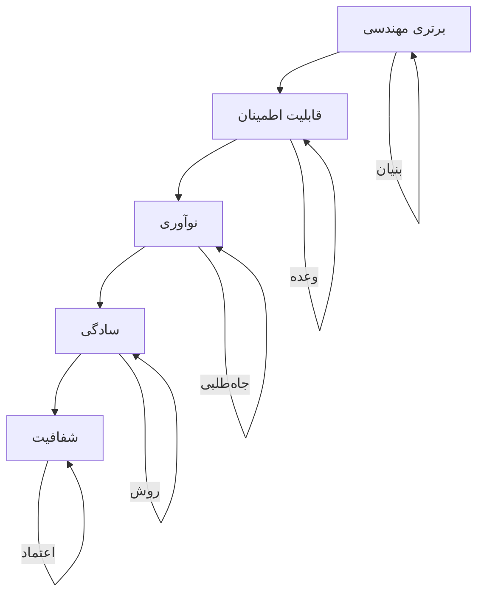

# SMG Portfolio V3 — Brand Book

| Field | Value |
|-------|-------|
| **Document** | Brand Book |
| **Version** | 3.0 |
| **Owner** | Saman Qasempour |
| **Brand** | SMG |
| **Website** | samansmg.ir |
| **Status** | Active |
| **Last Updated** | 2026-08-07 |
| **Depends On** | PRD.md, PRODUCT_STRATEGY.md |
| **References** | Vercel, Linear |

---

## Table of Contents

- [1. Brand Story](#1-brand-story)
- [2. Brand Values](#2-brand-values)
- [3. Brand Personality](#3-brand-personality)
- [4. Tone of Voice](#4-tone-of-voice)
- [5. Logo Rules](#5-logo-rules)
- [6. Colors](#6-colors)
- [7. Typography](#7-typography)
- [8. Icon Style](#8-icon-style)
- [9. Image Style](#9-image-style)

---

# 1. Brand Story

## English

### Origin

SMG was born from a simple observation: **most developer portfolios look the same**.

Dark background. Gradient text. Generic project cards. Template-based layouts. The same boilerplate that thousands of developers use.

SMG was created to be different. Not louder. Not flashier. **More deliberate.**

### The Name

**SMG** = **S**a**m**an **G**asempour

- Short (3 letters)
- Memorable
- Domain-friendly (samansmg.ir)
- Scalable (works as personal brand today, company brand tomorrow)

### The Narrative

> I don't build websites. I build systems.
>
> Every server I configure, every container I deploy, every pipeline I automate — it all works because I care about the details that most people skip.
>
> SMG is where I show you what that looks like.

### Brand Essence

**The intersection of engineering precision and digital craft.**

SMG exists at the point where:
- Infrastructure meets design
- Reliability meets aesthetics
- Technical depth meets clarity
- Systems thinking meets visual storytelling

### Brand Promise

> "Building reliable systems and digital products."

Every project, every system, every product built under the SMG brand will be:
- **Reliable** — it works, always
- **Well-engineered** — every detail is considered
- **Built to last** — not a quick hack, but a lasting solution

## فارسی

### خاستگاه

SMG از یک مشاهده ساده متولد شد: **بیشتر پورتفولیوهای توسعه‌دهنده شبیه هم هستند.**

پس‌زمینه تاریک. متن گرادیانت. کارت‌های پروژه عمومی. طرح‌بندی‌های مبتنی بر قالب. همان قالب استانداردی که هزاران توسعه‌دهنده استفاده می‌کنند.

SMG متفاوت ساخته شد. بلندتر نه. درخشان‌تر نه. **عمدی‌تر.**

### نام

**SMG** = **S**a**m**an **G**asempour (قاسمپور)

- کوتاه (۳ حرف)
- به یاد ماندنی
- دامنه‌پسند (samansmg.ir)
- مقیاس‌پذیر (امروز به عنوان برند شخصی، فردا به عنوان برند شرکتی)

### روایت

> من وب‌سایت نمی‌سازم. من سیستم می‌سازم.
>
> هر سروری که پیکربندی می‌کنم، هر کانتینری که استقرار می‌دهم، هر خط لوله‌ای که خودکار می‌کنم — همه کار می‌کنند چون به جزئیاتی اهمیت می‌دهم که بیشتر مردم رد می‌شوند.
>
> SMG جایی است که به شما نشان می‌دهم این چه شکلی است.

### جوهره برند

**تقاطع دقت مهندسی و صنعت دیجیتال.**

SMG در نقطه‌ای وجود دارد که:
- زیرساخت با طراحی ملاقات می‌کند
- قابلیت اطمینان با زیبایی‌شناسی ملاقات می‌کند
- عمق فنی با وضوح ملاقات می‌کند
- تفکر سیستمی با داستان‌گویی بصری ملاقات می‌کند

### وعده برند

> "ساختن سیستم‌های قابل اعتماد و محصولات دیجیتال."

هر پروژه، هر سیستم، هر محصولی که تحت برند SMG ساخته می‌شود:
- **قابل اعتماد** خواهد بود — همیشه کار می‌کند
- **خوب مهندسی شده** — هر جزئیات در نظر گرفته شده
- **برای ماندن ساخته شده** — نه یک هک موقت، بلکه یک راه‌حل ماندگار

---

# 2. Brand Values

## English

### Core Values

| Value | Symbol | Expression |
|-------|--------|------------|
| **Engineering Excellence** | ⚙️ | Every detail matters. Every decision is deliberate. |
| **Reliability** | 🛡️ | Systems that work, always. No compromises. |
| **Innovation** | 🚀 | Pushing boundaries. Building what's next. |
| **Simplicity** | ✨ | Complex problems, simple solutions. |
| **Transparency** | 🔍 | Open source, honest journey, real work. |

### Value Hierarchy



### Value in Action

| Value | What It Looks Like | What It Doesn't Look Like |
|-------|-------------------|--------------------------|
| **Engineering Excellence** | Clean code, precise design, documented decisions | Messy code, inconsistent design, undocumented |
| **Reliability** | Systems that uptime 99.9%, tested paths, error handling | Downtime, untested code, silent failures |
| **Innovation** | Real products (NexusOps), AI integration, automation | Copying trends, shallow implementations |
| **Simplicity** | Minimal UI, clear hierarchy, focused content | Cluttered layouts, confusing navigation |
| **Transparency** | Open source repos, honest journey, real metrics | Hidden code, inflated claims, fake metrics |

## فارسی

### ارزش‌های اصلی

| ارزش | نماد | بیان |
|------|------|------|
| **برتری مهندسی** | ⚙️ | هر جزئیات مهم است. هر تصمیم عمدی است. |
| **قابلیت اطمینان** | 🛡️ | سیستم‌هایی که همیشه کار می‌کنند. بدون سازش. |
| **نوآوری** | 🚀 | جابه‌جایی مرزها. ساختن آینده. |
| **سادگی** | ✨ | مشکلات پیچیده، راه‌حل‌های ساده. |
| **شفافیت** | 🔍 | Open Source، مسیر صادقانه، کار واقعی. |

### سلسله مراتب ارزش‌ها



### ارزش در عمل

| ارزش | چه شکلی است | چه شکلی نیست |
|------|------------|--------------|
| **برتری مهندسی** | کد تمیز، طراحی دقیق، تصمیمات مستند شده | کد نامرتب، طراحی ناسازگار، بدون مستندات |
| **قابلیت اطمینان** | آپتایم ۹۹.۹٪، مسیرهای تست شده، مدیریت خطا | downtime، کد تست نشده، خطاهای ساکت |
| **نوآوری** | محصولات واقعی (NexusOps)، یکپارچه‌سازی AI، خودکارسازی | کپی‌برداری از روندها، پیاده‌سازی‌های سطحی |
| **سادگی** | UI مینیمال، سلسله مراتب واضح، محتوای متمرکز | طرح‌بندی شلوغ، ناوبری گیج‌کننده |
| **شفافیت** | مخازن Open Source، مسیر صادقانه، معیارهای واقعی | کد پنهان، ادعاهای بزرگ‌نمایی شده، معیارهای جعلی |

---

# 3. Brand Personality

## English

### The SMG Personality Matrix

| Trait | Level | Description |
|-------|-------|-------------|
| **Confident** | ████████░░ 80% | Knows what it stands for, doesn't need validation |
| **Technical** | █████████░ 90% | Deep expertise, not surface knowledge |
| **Minimal** | ████████░░ 80% | Every element earns its place |
| **Reliable** | █████████░ 90% | Systems that work, always |
| **Professional** | ████████░░ 80% | Enterprise-grade quality |
| **Timeless** | ████████░░ 80% | Not following trends, setting standards |
| **Approachable** | ██████░░░░ 60% | Professional but not cold |
| **Playful** | ███░░░░░░░ 30% | Serious about work, not about everything |

### Brand Archetype: The Sage + The Creator

| Aspect | The Sage | The Creator |
|--------|----------|-------------|
| **Goal** | Truth, understanding | Vision, innovation |
| **Fear** | Ignorance, deception | Mediocrity, no impact |
| **Voice** | Knowledgeable, thoughtful | Expressive, visionary |
| **SMG Expression** | Technical depth, documentation | Building products, solving problems |

### Personality in Communication

| Situation | SMG Personality |
|-----------|----------------|
| **Describing a project** | Confident, specific, evidence-based |
| **Explaining architecture** | Clear, structured, educational |
| **Sharing achievements** | Humble, factual, understated |
| **Responding to feedback** | Open, appreciative, action-oriented |
| **Writing documentation** | Thorough, patient, user-focused |

### Brand Voice Spectrum

```
← More Human                                    More Technical →
    ●─────────────────────────────────────────────────●
    |                                                 |
    Friendly                                    Precise
    Casual                                      Formal
    Emotional                                   Rational
    Subjective                                  Objective
    
    SMG Position: ●──────────────────●
                  Technical but approachable
                  Professional but not cold
```

## فارسی

### ماتریس شخصیت SMG

| ویژگی | سطح | توضیح |
|-------|------|-------|
| **مطمئن** | ████████░░ ۸۰٪ | می‌داند چه چیزی را نمایندگی می‌کند، نیاز به تأیید ندارد |
| **فنی** | █████████░ ۹۰٪ | تخصص عمیق، نه دانش سطحی |
| **مینیمال** | ████████░░ ۸۰٪ | هر عنصر جای خود را کسب می‌کند |
| **قابل اعتماد** | █████████░ ۹۰٪ | سیستم‌هایی که همیشه کار می‌کنند |
| **حرفه‌ای** | ████████░░ ۸۰٪ | کیفیت درجه سازمانی |
| **جاودانه** | ████████░░ ۸۰٪ | دنبال نکردن روندها، تعیین استانداردها |
| **قابل نزدیکی** | ██████░░░░ ۶۰٪ | حرفه‌ای اما سرد نیست |
| **بازیگوش** | ███░░░░░░░ ۳۰٪ | جدی در مورد کار، نه در مورد همه چیز |

### آرکی‌تایپ برند: حکیم + خالق

| جنبه | حکیم | خالق |
|------|------|------|
| **هدف** | حقیقت، درک | چشم‌انداز، نوآوری |
| **ترس** | جهل، فریبکاری | متوسط بودن، بدون تأثیر |
| **صدا** | آگاه، اندیشمند | بیانگر، رؤیاپرداز |
| **بیان SMG** | عمق فنی، مستندات | ساختن محصولات، حل مشکلات |

### شخصیت در ارتباطات

| موقعیت | شخصیت SMG |
|--------|-----------|
| **توصیف یک پروژه** | مطمئن، خاص، مبتنی بر شواهد |
| **توضیح معماری** | واضح، ساختارمند، آموزشی |
| **اشتراک‌گذاری دستاوردها** | فروتن، واقعی، محتاط |
| **پاسخ به بازخورد** | باز، قدردان، عمل‌گرا |
| **نوشتن مستندات** | جامع، صبور، کاربرمحور |

### طیف صدای برند

```
← انسانی‌تر                                    فنی‌تر →
    ●─────────────────────────────────────────────────●
    |                                                 |
    صمیمی                                      دقیق
    غیررسمی                                    رسمی
    عاطفی                                      عقلانی
    ذهنی                                       عینی
    
    موقعیت SMG: ●──────────────────●
                فنی اما قابل نزدیکی
                حرفه‌ای اما سرد نیست
```

---

# 4. Tone of Voice

## English

### Voice Principles

1. **Confident, not arrogant** — State facts, don't boast
2. **Technical, not jargon-heavy** — Use precise language, explain when needed
3. **Direct, not verbose** — Say it once, say it well
4. **Professional, not cold** — Be human, but stay focused
5. **Specific, not generic** — Details build credibility

### Tone by Context

| Context | Tone | Example |
|---------|------|---------|
| **Hero tagline** | Confident, concise | "Building reliable systems and digital products" |
| **Project description** | Specific, evidence-based | "AI-powered DevOps platform with real-time monitoring" |
| **About section** | Personal, purposeful | "I build systems that work, always" |
| **Technical content** | Clear, educational | "Docker containers isolate environments for consistency" |
| **Contact section** | Welcoming, professional | "Let's build something reliable together" |
| **Error states** | Helpful, calm | "Something went wrong. Here's what you can try." |

### Writing Rules

| Rule | Good Example | Bad Example |
|------|-------------|-------------|
| **Use active voice** | "I built NexusOps" | "NexusOps was built by me" |
| **Be specific** | "50+ GitHub stars" | "Popular on GitHub" |
| **Avoid clichés** | "Building reliable systems" | "Passionate about technology" |
| **Use numbers** | "99.9% uptime" | "High availability" |
| **Keep it short** | "DevOps platform" | "A comprehensive platform for DevOps" |
| **Show, don't tell** | "NexusOps monitors 50+ servers" | "Powerful monitoring" |

### Language Do's and Don'ts

| DO | DON'T |
|----|-------|
| "Built with Next.js and TypeScript" | "Built with cutting-edge technology" |
| "Handles 1000+ requests/second" | "Highly scalable architecture" |
| "Automates deployment pipeline" | "Revolutionary automation" |
| "Open source on GitHub" | "Available for the community" |
| "3 years of Linux experience" | "Extensive experience" |

## فارسی

### اصول صدا

۱. **مطمئن، نه متکبر** — واقعیت‌ها را بیان کن، فخرفروشی نکن
۲. **فنی، نه پر از اصطلاحات** — از زبان دقیق استفاده کن، در صورت نیاز توضیح بده
۳. **مستقیم، نه طولانی** — یک بار بگو، خوب بگو
۴. **حرفه‌ای، نه سرد** — انسان باش، اما متمرکز بمان
۵. **خاص، نه عمومی** — جزئیات اعتبار می‌سازد

### لحن بر اساس زمینه

| زمینه | لحن | مثال |
|-------|------|------|
| **شعار Hero** | مطمئن، مختصر | "ساختن سیستم‌های قابل اعتماد و محصولات دیجیتال" |
| **توصیف پروژه** | خاص، مبتنی بر شواهد | "پلتفرم DevOps با هوش مصنوعی با مانیتورینگ بلادرنگ" |
| **بخش About** | شخصی، هدفمند | "من سیستم‌هایی می‌سازم که همیشه کار می‌کنند" |
| **محتوای فنی** | واضح، آموزشی | "کانتینرهای Docker محیط‌ها را برای یکپارچگی ایزوله می‌کنند" |
| **بخش تماس** | خوشایند، حرفه‌ای | "بیایید با هم چیز قابل اعتمادی بسازیم" |
| **حالت‌های خطا** | مفید، آرام | "مشکلی پیش آمد. این چیزی است که می‌توانید امتحان کنید." |

### قوانین نوشتن

| قانون | مثال خوب | مثال بد |
|-------|---------|--------|
| **از صدای فعال استفاده کن** | "من NexusOps را ساختم" | "NexusOps توسط من ساخته شد" |
| **خاص باش** | "۵۰+ ستاره GitHub" | "محبوب در GitHub" |
| **از کلیشه‌ها اجتناب کن** | "ساختن سیستم‌های قابل اعتماد" | "علاقه‌مند به فناوری" |
| **از اعداد استفاده کن** | "آپتایم ۹۹.۹٪" | "دسترسی بالا" |
| **کوتاه نگهش دار** | "پلتفرم DevOps" | "یک پلتفرم جامع برای DevOps" |
| **نشان بده، نگو** | "NexusOps بیش از ۱۰۰۰ سرور را مانیتور می‌کند" | "مانیتورینگ قدرتمند" |

### زبان بکن و نکن

| بکن | نکن |
|-----|-----|
| "ساخته شده با Next.js و TypeScript" | "ساخته شده با فناوری پیشرفته" |
| "بیش از ۱۰۰۰ درخواست/ثانیه مدیریت می‌کند" | "معماری بسیار مقیاس‌پذیر" |
| "خط لوله استقرار را خودکار می‌کند" | "خودکارسازی انقلابی" |
| "Open Source در GitHub" | "برای جامعه در دسترس" |
| "۳ سال تجربه Linux" | "تجربه گسترده" |

---

# 5. Logo Rules

## English

### Logo Concept

The SMG logo should be:
- **Minimal** — Clean, geometric
- **Technical** — Precise, engineered
- **Timeless** — Not trendy, not dated
- **Scalable** — Works at 16px favicon and 1920px hero

### Logo Variants

| Variant | Usage | Size |
|---------|-------|------|
| **Primary** | Hero, main branding | Full width |
| **Compact** | Navigation, footer | 32-48px height |
| **Icon** | Favicon, app icon | 16-64px |
| **Wordmark** | Text-only version | Variable |

### Logo Clear Space

```
┌─────────────────────────────────┐
│                                 │
│    ┌─────────────────────┐      │
│    │                     │      │
│    │       SMG           │      │
│    │                     │      │
│    └─────────────────────┘      │
│         ↕ X                     │
│    X ←→ ←→ X                   │
│                                 │
└─────────────────────────────────┘

X = height of the "M" in the logo
Minimum clear space = 1X on all sides
```

### Logo Minimum Size

| Context | Minimum Width |
|---------|---------------|
| **Digital** | 40px |
| **Print** | 15mm |
| **Favicon** | 16px |

### Logo Don'ts

| Don't | Why |
|-------|-----|
| Don't rotate the logo | Destroys readability |
| Don't change the colors | Breaks brand recognition |
| Don't add effects (shadow, glow) | Looks cheap |
| Don't stretch or distort | Looks unprofessional |
| Don't place on busy backgrounds | Reduces legibility |
| Don't use low-resolution versions | Looks blurry |
| Don't animate the logo (V3) | Distracting |

## فارسی

### مفهوم لوگو

لوگوی SMG باید:
- **مینیمال** — تمیز، هندسی
- **فنی** — دقیق، مهندسی شده
- **جاودانه** — نه مُد روز، نه قدیمی
- **مقیاس‌پذیر** — از favicon ۱۶px تا Hero ۱۹۲۰px کار کند

### نسخه‌های لوگو

| نسخه | استفاده | اندازه |
|------|---------|--------|
| **اصلی** | Hero، برندینگ اصلی | عرض کامل |
| **فشرده** | ناوبری، فوتر | ارتفاع ۳۲-۴۸px |
| **آیکون** | Favicon، آیکون اپلیکیشن | ۱۶-۶۴px |
| **Wordmark** | نسخه فقط متنی | متغیر |

### فضای خالی لوگو

```
┌─────────────────────────────────┐
│                                 │
│    ┌─────────────────────┐      │
│    │                     │      │
│    │       SMG           │      │
│    │                     │      │
│    └─────────────────────┘      │
│         ↕ X                     │
│    X ←→ ←→ X                   │
│                                 │
└─────────────────────────────────┘

X = ارتفاع "M" در لوگو
حداقل فضای خالی = ۱X در تمام طرفین
```

### حداقل اندازه لوگو

| زمینه | حداقل عرض |
|-------|-----------|
| **دیجیتال** | ۴۰px |
| **چاپ** | ۱۵mm |
| **Favicon** | ۱۶px |

### نکن‌های لوگو

| نکن | چرا |
|-----|------|
| لوگو را نچرخان | خوانایی را نابود می‌کند |
| رنگ‌ها را تغییر نده | بازشناسی برند را خراب می‌کند |
| افکت اضافه نکن (سایه، درخشش) | ارزان به نظر می‌رسد |
| کشید یا تحریف نکن | غیرحرفه‌ای به نظر می‌رسد |
| روی پس‌زمینه شلوغ قرار نده | خوانایی را کاهش می‌دهد |
| از نسخه‌های کم‌کیفیت استفاده نکن | تار به نظر می‌رسد |
| در V3 لوگو را متحرک نکن | حواس‌پرتی ایجاد می‌کند |

---

# 6. Colors

## English

### Color Philosophy

SMG uses a **dark-first** color system. The dark background:
- Reduces eye strain
- Creates premium feel
- Makes content pop
- Aligns with developer tools aesthetic

### Primary Palette

| Name | Hex | RGB | HSL | Usage |
|------|-----|-----|-----|-------|
| **Background** | `#0B0F19` | 11, 15, 25 | 225, 39%, 7% | Page background |
| **Surface** | `#111827` | 17, 24, 39 | 220, 26%, 11% | Card backgrounds |
| **Surface Elevated** | `#1E293B` | 30, 41, 59 | 215, 32%, 17% | Elevated elements |
| **Border** | `#1E293B` | 30, 41, 59 | 215, 32%, 17% | Borders, dividers |
| **Border Light** | `#334155` | 51, 65, 85 | 213, 24%, 27% | Hover borders |

### Accent Colors

| Name | Hex | RGB | HSL | Usage |
|------|-----|-----|-----|-------|
| **Primary** | `#3B82F6` | 59, 130, 246 | 217, 91%, 60% | Links, buttons, CTAs |
| **Primary Light** | `#60A5FA` | 96, 165, 250 | 217, 90%, 68% | Hover states |
| **Primary Dark** | `#2563EB` | 37, 99, 235 | 217, 83%, 53% | Active states |
| **Accent** | `#6366F1` | 99, 102, 241 | 245, 83%, 67% | Secondary accent |
| **Accent Light** | `#818CF8` | 129, 140, 248 | 245, 83%, 74% | Hover secondary |

### Text Colors

| Name | Hex | RGB | Usage |
|------|-----|-----|-------|
| **Text Primary** | `#FFFFFF` | 255, 255, 255 | Headings, primary text |
| **Text Secondary** | `#94A3B8` | 148, 163, 184 | Body text, descriptions |
| **Text Muted** | `#64748B` | 100, 116, 139 | Labels, captions |
| **Text Disabled** | `#475569` | 71, 85, 105 | Disabled states |

### Status Colors

| Name | Hex | Usage |
|------|-----|-------|
| **Success** | `#22C55E` | Live status, success states |
| **Warning** | `#F59E0B` | In-development status |
| **Error** | `#EF4444` | Error states |
| **Info** | `#3B82F6` | Information states |

### Color Tokens (CSS Variables)

```css
:root {
  /* Background */
  --color-bg: #0B0F19;
  --color-surface: #111827;
  --color-surface-elevated: #1E293B;
  
  /* Border */
  --color-border: #1E293B;
  --color-border-light: #334155;
  
  /* Primary */
  --color-primary: #3B82F6;
  --color-primary-light: #60A5FA;
  --color-primary-dark: #2563EB;
  
  /* Accent */
  --color-accent: #6366F1;
  --color-accent-light: #818CF8;
  
  /* Text */
  --color-text: #FFFFFF;
  --color-text-secondary: #94A3B8;
  --color-text-muted: #64748B;
  
  /* Status */
  --color-success: #22C55E;
  --color-warning: #F59E0B;
  --color-error: #EF4444;
}
```

### Color Combinations

| Background | Text | Contrast Ratio | WCAG |
|------------|------|---------------|------|
| `#0B0F19` | `#FFFFFF` | 17.5:1 | AAA ✓ |
| `#0B0F19` | `#94A3B8` | 7.2:1 | AAA ✓ |
| `#111827` | `#FFFFFF` | 13.8:1 | AAA ✓ |
| `#1E293B` | `#FFFFFF` | 9.4:1 | AAA ✓ |
| `#3B82F6` | `#FFFFFF` | 4.6:1 | AA ✓ |

## فارسی

### فلسفه رنگ

SMG از سیستم رنگ **dark-first** استفاده می‌کند. پس‌زمینه تاریک:
- خستگی چشم را کاهش می‌دهد
- حس پرمیوم ایجاد می‌کند
- محتوا را برجسته می‌کند
- با زیبایی‌شناسی ابزارهای توسعه‌دهنده همراستا است

### پالت اصلی

| نام | Hex | RGB | HSL | استفاده |
|-----|-----|-----|-----|---------|
| **پس‌زمینه** | `#0B0F19` | ۱۱, ۱۵, ۲۵ | ۲۲۵, ۳۹%, ۷% | پس‌زمینه صفحه |
| **سطح** | `#111827` | ۱۷, ۲۴, ۳۹ | ۲۲۰, ۲۶%, ۱۱% | پس‌زمینه کارت‌ها |
| **سطح بالا** | `#1E293B` | ۳۰, ۴۱, ۵۹ | ۲۱۵, ۳۲%, ۱۷% | عناصر بالا |
| **حاشیه** | `#1E293B` | ۳۰, ۴۱, ۵۹ | ۲۱۵, ۳۲%, ۱۷% | حاشیه‌ها، جداکننده‌ها |
| **حاشیه روشن** | `#334155` | ۵۱, ۶۵, ۸۵ | ۲۱۳, ۲۴%, ۲۷% | حاشیه‌های Hover |

### رنگ‌های ثانویه

| نام | Hex | RGB | HSL | استفاده |
|-----|-----|-----|-----|---------|
| **اصلی** | `#3B82F6` | ۵۹, ۱۳۰, ۲۴۶ | ۲۱۷, ۹۱%, ۶۰% | لینک‌ها، دکمه‌ها، CTA |
| **اصلی روشن** | `#60A5FA` | ۹۶, ۱۶۵, ۲۵۰ | ۲۱۷, ۹۰%, ۶۸% | حالت‌های Hover |
| **اصلی تاریک** | `#2563EB` | ۳۷, ۹۹, ۲۳۵ | ۲۱۷, ۸۳%, ۵۳% | حالت‌های فعال |
| **ثانویه** | `#6366F1` | ۹۹, ۱۰۲, ۲۴۱ | ۲۴۵, ۸۳%, ۶۷% | ثانویه |
| **ثانویه روشن** | `#818CF8` | ۱۲۹, ۱۴۰, ۲۴۸ | ۲۴۵, ۸۳%, ۷۴% | Hover ثانویه |

### رنگ‌های متن

| نام | Hex | RGB | استفاده |
|-----|-----|-----|---------|
| **متن اصلی** | `#FFFFFF` | ۲۵۵, ۲۵۵, ۲۵۵ | تیترها، متن اصلی |
| **متن ثانویه** | `#94A3B8` | ۱۴۸, ۱۶۳, ۱۸۴ | متن بدنه، توضیحات |
| **متن کم‌رنگ** | `#64748B` | ۱۰۰, ۱۱۶, ۱۳۹ | برچسب‌ها، زیرنویس‌ها |
| **متن غیرفعال** | `#475569` | ۷۱, ۸۵, ۱۰۵ | حالت‌های غیرفعال |

### رنگ‌های وضعیت

| نام | Hex | استفاده |
|-----|-----|---------|
| **موفقیت** | `#22C55E` | وضعیت زنده، حالت‌های موفقیت |
| **هشدار** | `#F59E0B` | وضعیت در حال توسعه |
| **خطا** | `#EF4444` | حالت‌های خطا |
| **اطلاعات** | `#3B82F6` | حالت‌های اطلاعاتی |

### توکن‌های رنگ (متغیرهای CSS)

```css
:root {
  /* پس‌زمینه */
  --color-bg: #0B0F19;
  --color-surface: #111827;
  --color-surface-elevated: #1E293B;
  
  /* حاشیه */
  --color-border: #1E293B;
  --color-border-light: #334155;
  
  /* اصلی */
  --color-primary: #3B82F6;
  --color-primary-light: #60A5FA;
  --color-primary-dark: #2563EB;
  
  /* ثانویه */
  --color-accent: #6366F1;
  --color-accent-light: #818CF8;
  
  /* متن */
  --color-text: #FFFFFF;
  --color-text-secondary: #94A3B8;
  --color-text-muted: #64748B;
  
  /* وضعیت */
  --color-success: #22C55E;
  --color-warning: #F59E0B;
  --color-error: #EF4444;
}
```

### ترکیبات رنگ

| پس‌زمینه | متن | نسبت کنتراست | WCAG |
|----------|------|-------------|------|
| `#0B0F19` | `#FFFFFF` | ۱۷.۵:۱ | AAA ✓ |
| `#0B0F19` | `#94A3B8` | ۷.۲:۱ | AAA ✓ |
| `#111827` | `#FFFFFF` | ۱۳.۸:۱ | AAA ✓ |
| `#1E293B` | `#FFFFFF` | ۹.۴:۱ | AAA ✓ |
| `#3B82F6` | `#FFFFFF` | ۴.۶:۱ | AA ✓ |

---

# 7. Typography

## English

### Font Selection

| Role | Font | Weight | Fallback |
|------|------|--------|----------|
| **Primary** | Geist | 400, 500, 600, 700 | -apple-system, BlinkMacSystemFont, sans-serif |
| **Monospace** | Geist Mono | 400, 500 | monospace |

### Why Geist?

- Modern, clean, technical
- Designed by Vercel (aligns with brand reference)
- Excellent readability at all sizes
- Variable font support
- Open source

### Type Scale

| Token | Size | Weight | Line Height | Letter Spacing | Usage |
|-------|------|--------|-------------|----------------|-------|
| `display` | 72px / 4.5rem | 700 | 1.1 | -0.02em | Hero headline |
| `h1` | 48px / 3rem | 700 | 1.2 | -0.015em | Page title |
| `h2` | 36px / 2.25rem | 600 | 1.3 | -0.01em | Section title |
| `h3` | 24px / 1.5rem | 600 | 1.4 | -0.005em | Subsection title |
| `h4` | 20px / 1.25rem | 500 | 1.4 | 0 | Card title |
| `body-lg` | 18px / 1.125rem | 400 | 1.6 | 0 | Large body text |
| `body` | 16px / 1rem | 400 | 1.6 | 0 | Default body text |
| `body-sm` | 14px / 0.875rem | 400 | 1.5 | 0 | Small body text |
| `caption` | 12px / 0.75rem | 500 | 1.5 | 0.01em | Labels, captions |
| `overline` | 12px / 0.75rem | 600 | 1.5 | 0.05em | Uppercase labels |

### Typography Rules

| Rule | Standard |
|------|----------|
| **Max heading size** | 72px (display) |
| **Min body size** | 16px |
| **Max line length** | 65-75 characters |
| **Paragraph spacing** | 1em (16px) |
| **Heading spacing** | 0.5em above, 0.25em below |
| **Font smoothing** | antialiased |

### Responsive Typography

| Breakpoint | Display | H1 | H2 | H3 | Body |
|------------|---------|----|----|----|----|
| **Mobile** | 36px | 28px | 24px | 20px | 16px |
| **Tablet** | 48px | 36px | 28px | 24px | 16px |
| **Desktop** | 72px | 48px | 36px | 24px | 16px |
| **Large** | 72px | 48px | 36px | 24px | 18px |

### Monospace Usage

| Context | Usage |
|---------|-------|
| **Code blocks** | Technical content |
| **Terminal** | CLI references |
| **Labels** | Technical labels |
| **Status** | System status |

## فارسی

### انتخاب فونت

| نقش | فونت | وزن | جایگزین |
|-----|------|------|---------|
| **اصلی** | Geist | ۴۰۰, ۵۰۰, ۶۰۰, ۷۰۰ | -apple-system, BlinkMacSystemFont, sans-serif |
| **مونواسپیس** | Geist Mono | ۴۰۰, ۵۰۰ | monospace |

### چرا Geist؟

- مدرن، تمیز، فنی
- توسط Vercel طراحی شده (هماهنگ با مرجع برند)
- خوانایی عالی در تمام اندازه‌ها
- پشتیبانی فونت متغیر
- Open Source

### مقیاس تایپوگرافی

| توکن | اندازه | وزن | ارتفاع خط | فاصله حروف | استفاده |
|------|--------|------|-----------|------------|---------|
| `display` | ۷۲px / ۴.۵rem | ۷۰۰ | ۱.۱ | -۰.۰۲em | تیتر Hero |
| `h1` | ۴۸px / ۳rem | ۷۰۰ | ۱.۲ | -۰.۰۱۵em | عنوان صفحه |
| `h2` | ۳۶px / ۲.۲۵rem | ۶۰۰ | ۱.۳ | -۰.۰۱em | عنوان بخش |
| `h3` | ۲۴px / ۱.۵rem | ۶۰۰ | ۱.۴ | -۰.۰۰۵em | عنوان زیربخش |
| `h4` | ۲۰px / ۱.۲۵rem | ۵۰۰ | ۱.۴ | ۰ | عنوان کارت |
| `body-lg` | ۱۸px / ۱.۱۲۵rem | ۴۰۰ | ۱.۶ | ۰ | متن بدنه بزرگ |
| `body` | ۱۶px / ۱rem | ۴۰۰ | ۱.۶ | ۰ | متن بدنه پیش‌فرض |
| `body-sm` | ۱۴px / ۰.۸۷۵rem | ۴۰۰ | ۱.۵ | ۰ | متن بدنه کوچک |
| `caption` | ۱۲px / ۰.۷۵rem | ۵۰۰ | ۱.۵ | ۰.۰۱em | برچسب‌ها، زیرنویس‌ها |
| `overline` | ۱۲px / ۰.۷۵rem | ۶۰۰ | ۱.۵ | ۰.۰۵em | برچسب‌های بزرگ |

### قوانین تایپوگرافی

| قانون | استاندارد |
|-------|----------|
| **حداکثر اندازه تیتر** | ۷۲px (display) |
| **حداقل اندازه بدنه** | ۱۶px |
| **حداکثر طول خط** | ۶۵-۷۵ کاراکتر |
| **فاصله پاراگراف** | ۱em (16px) |
| **فاصله تیتر** | ۰.۵em بالا، ۰.۲۵em پایین |
| **هموارسازی فونت** | antialiased |

### تایپوگرافی واکنش‌گرا

| نقطه شکست | Display | H1 | H2 | H3 | Body |
|------------|---------|----|----|----|----|
| **موبایل** | ۳۶px | ۲۸px | ۲۴px | ۲۰px | ۱۶px |
| **تبلت** | ۴۸px | ۳۶px | ۲۸px | ۲۴px | ۱۶px |
| **دسکتاپ** | ۷۲px | ۴۸px | ۳۶px | ۲۴px | ۱۶px |
| **بزرگ** | ۷۲px | ۴۸px | ۳۶px | ۲۴px | ۱۸px |

### کاربرد مونواسپیس

| زمینه | استفاده |
|-------|---------|
| **بلوک‌های کد** | محتوای فنی |
| **ترمینال** | مراجع CLI |
| **برچسب‌ها** | برچسب‌های فنی |
| **وضعیت** | وضعیت سیستم |

---

# 8. Icon Style

## English

### Icon Library

| Library | Usage | License |
|---------|-------|---------|
| **Lucide React** | Primary icon set | MIT |
| **Custom SVGs** | Brand-specific icons | Custom |

### Why Lucide?

- Clean, consistent style
- Lightweight
- Tree-shakeable
- Active maintenance
- MIT license

### Icon Rules

| Rule | Standard |
|------|----------|
| **Size** | 16px (sm), 20px (md), 24px (lg), 32px (xl) |
| **Stroke width** | 1.5px (consistent) |
| **Color** | Inherits from parent (currentColor) |
| **Style** | Outline (not filled) |
| **Alignment** | Center-aligned with text |
| **Spacing** | 8px gap with adjacent text |

### Icon Sizes

| Token | Size | Usage |
|-------|------|-------|
| `icon-sm` | 16px | Inline with small text |
| `icon-md` | 20px | Default, inline with body |
| `icon-lg` | 24px | Standalone, navigation |
| `icon-xl` | 32px | Feature icons, hero |

### Icon Do's and Don'ts

| DO | DON'T |
|----|-------|
| Use outline style | Use filled style |
| Keep consistent size | Mix sizes randomly |
| Use currentColor | Hardcode colors |
| Align with text baseline | Misalign with text |
| Use for decoration sparingly | Overload with icons |

## فارسی

### کتابخانه آیکون

| کتابخانه | استفاده | مجوز |
|----------|---------|------|
| **Lucide React** | مجموعه آیکون اصلی | MIT |
| **SVGهای سفارشی** | آیکونهای مخصوص برند | سفارشی |

### چرا Lucide؟

- سبک تمیز، یکپارچه
- سبک وزن
- Tree-shakeable
- نگهداری فعال
- مجوز MIT

### قوانین آیکون

| قانون | استاندارد |
|-------|----------|
| **اندازه** | ۱۶px (sm)، ۲۰px (md)، ۲۴px (lg)، ۳۲px (xl) |
| **ضخامت ضربه** | ۱.۵px (یکپارچه) |
| **رنگ** | از والد ارث‌بری می‌کند (currentColor) |
| **سبک** | Outline (نه filled) |
| **تراز** | مرکز شده با متن |
| **فاصله** | ۸px شکاف با متن مجاور |

### اندازه‌های آیکون

| توکن | اندازه | استفاده |
|------|--------|---------|
| `icon-sm` | ۱۶px | درون خطی با متن کوچک |
| `icon-md` | ۲۰px | پیش‌فرض، درون خطی با بدنه |
| `icon-lg` | ۲۴px | مستقل، ناوبری |
| `icon-xl` | ۳۲px | آیکونهای ویژگی، Hero |

### بکن و نکن آیکون

| بکن | نکن |
|-----|-----|
| از سبک outline استفاده کن | از سبک filled استفاده کن |
| اندازه یکپارچه حفظ کن | اندازه‌ها را تصادفی مخلوط کن |
| از currentColor استفاده کن | رنگ‌ها را هاردکد کن |
| با خط پایه متن تراز کن | با متن ناتراز باش |
| به ندرت برای تزئین استفاده کن | آیکون‌ها را زیاد نکن |

---

# 9. Image Style

## English

### Image Philosophy

Images should be:
- **Purposeful** — Every image serves a function
- **High-quality** — No pixelated, stretched, or blurry images
- **Consistent** — Same style across all sections
- **Performant** — Optimized for web

### Image Types

| Type | Usage | Style |
|------|-------|-------|
| **Hero background** | Abstract, minimal | Gradient, mesh, or subtle pattern |
| **Project images** | Screenshots, diagrams | Clean, labeled, high-res |
| **About section** | Professional photo | Minimal, branded background |
| **Icons** | UI elements | Lucide style (see Section 8) |
| **OG Image** | Social sharing | Branded, 1200x630px |
| **Favicon** | Browser tab | SMG mark, 32x32px |

### Image Guidelines

| Rule | Standard |
|------|----------|
| **Format** | WebP (primary), PNG (fallback), SVG (icons) |
| **Quality** | 85% for photos, 100% for graphics |
| **Max width** | 1920px for hero, 1200px for content |
| **Aspect ratio** | 16:9 for hero, 4:3 for projects |
| **Alt text** | Descriptive, relevant, concise |
| **Lazy loading** | All images below the fold |
| **Placeholder** | BlurHash or solid color |

### Hero Image Style

| Attribute | Value |
|-----------|-------|
| **Type** | Abstract gradient or mesh |
| **Colors** | Brand colors (blue/indigo spectrum) |
| **Animation** | Subtle, slow movement (optional) |
| **Overlay** | Dark gradient for text readability |

### Project Image Style

| Attribute | Value |
|-----------|-------|
| **Type** | Screenshot or architecture diagram |
| **Background** | Dark (#0B0F19 or #111827) |
| **Border** | Subtle border (#1E293B) |
| **Labels** | Monospace font, brand colors |
| **Padding** | 24px minimum |

### Image Don'ts

| Don't | Why |
|-------|-----|
| Don't use stock photos | Generic, not authentic |
| Don't use low-resolution images | Looks unprofessional |
| Don't add heavy filters | Distracts from content |
| Don't use text in images | Accessibility nightmare |
| Don't auto-play video | Annoying, performance hit |

## فارسی

### فلسفه تصویر

تصاویر باید:
- **هدفمند** — هر تصویر یک عملکرد دارد
- **باکیفیت** — بدون پیکسل، کشیدگی یا تاری
- **یکپارچه** — سبک مشابه در تمام بخش‌ها
- **عملکردی** — برای وب بهینه شده

### انواع تصویر

| نوع | استفاده | سبک |
|-----|---------|------|
| **پس‌زمینه Hero** | انتزاعی، مینیمال | گرادیانت، مش یا الگوی ظریف |
| **تصاویر پروژه** | اسکرین‌شات، نمودار | تمیز، برچسب‌دار، باکیفیت |
| **بخش About** | عکس حرفه‌ای | مینیمال، پس‌زمینه برند |
| **آیکون‌ها** | عناصر UI | سبک Lucide (بخش ۸ را ببینید) |
| **OG Image** | اشتراک‌گذاری اجتماعی | برند، ۱۲۰۰x۶۳۰px |
| **Favicon** | تب مرورگر | نشان SMG، ۳۲x۳۲px |

### راهنمای تصویر

| قانون | استاندارد |
|-------|----------|
| **قالب** | WebP (اصلی)، PNG (جایگزین)، SVG (آیکون‌ها) |
| **کیفیت** | ۸۵٪ برای عکس‌ها، ۱۰۰٪ برای گرافیک‌ها |
| **حداکثر عرض** | ۱۹۲۰px برای Hero، ۱۲۰۰px برای محتوا |
| **نسبت تصویر** | ۱۶:۹ برای Hero، ۴:۳ برای پروژه‌ها |
| **متن Alt** | توصیفی، مرتبط، مختصر |
| **بارگذاری تنبل** | تمام تصاویر زیرخط |
| **جاگزین** | BlurHash یا رنگ ثابت |

### سبک تصویر Hero

| ویژگی | مقدار |
|--------|-------|
| **نوع** | گرادیانت انتزاعی یا مش |
| **رنگ‌ها** | رنگ‌های برند (طیف آبی/ایندیگو) |
| **انیمیشن** | حرکت ظریف، آهسته (اختیاری) |
| **لایه‌بندی** | گرادیانت تاریک برای خوانایی متن |

### سبک تصویر پروژه

| ویژگی | مقدار |
|--------|-------|
| **نوع** | اسکرین‌شات یا نمودار معماری |
| **پس‌زمینه** | تاریک (#0B0F19 یا #111827) |
| **حاشیه** | حاشیه ظریف (#1E293B) |
| **برچسب‌ها** | فونت مونواسپیس، رنگ‌های برند |
| **پدینگ** | حداقل ۲۴px |

### نکن‌های تصویر

| نکن | چرا |
|-----|------|
| از عکس‌های استوک استفاده نکن | عمومی، غیر واقعی |
| از تصاویر کم‌کیفیت استفاده نکن | غیرحرفه‌ای به نظر می‌رسد |
| فیلترهای سنگین اضافه نکن | از محتوا حواس‌پرتی می‌کند |
| متن در تصویر نگذار | کابوس دسترسی‌پذیری |
| ویدیو را به صورت خودکار پخش نکن | آزاردهنده، ضربه عملکرد |

---

# Appendix: Brand Application

## How to Apply This Brand Book

| Element | Apply From Section |
|---------|-------------------|
| **Hero** | Colors (6), Typography (7), Image (9) |
| **About** | Values (2), Personality (3), Tone (4) |
| **Projects** | Colors (6), Icons (8), Images (9) |
| **Contact** | Tone (4), Typography (7) |
| **Footer** | Colors (6), Typography (7) |

## Brand Consistency Checklist

- [ ] All colors match the palette
- [ ] All typography uses the type scale
- [ ] All icons are from Lucide or custom SVGs
- [ ] All images follow the style guide
- [ ] All copy follows the tone of voice
- [ ] All interactions follow the UX principles
- [ ] All components follow the design rules

---

**Document Version:** 3.0
**Last Updated:** 2026-08-07
**Author:** SMG / Saman Qasempour
**Status:** Active — Brand Book
**Depends On:** PRD.md, PRODUCT_STRATEGY.md
