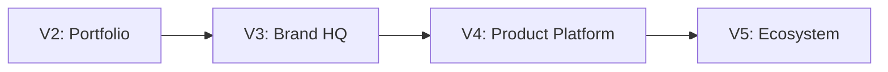
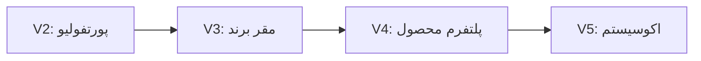
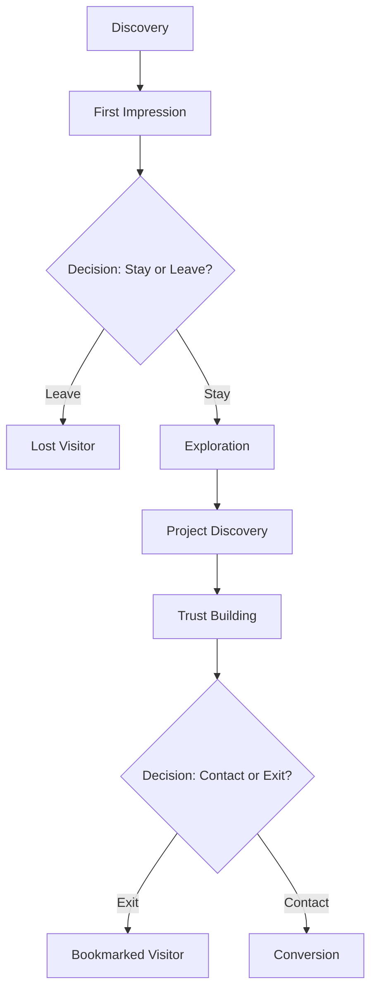
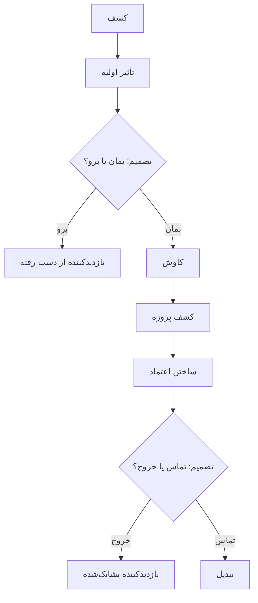
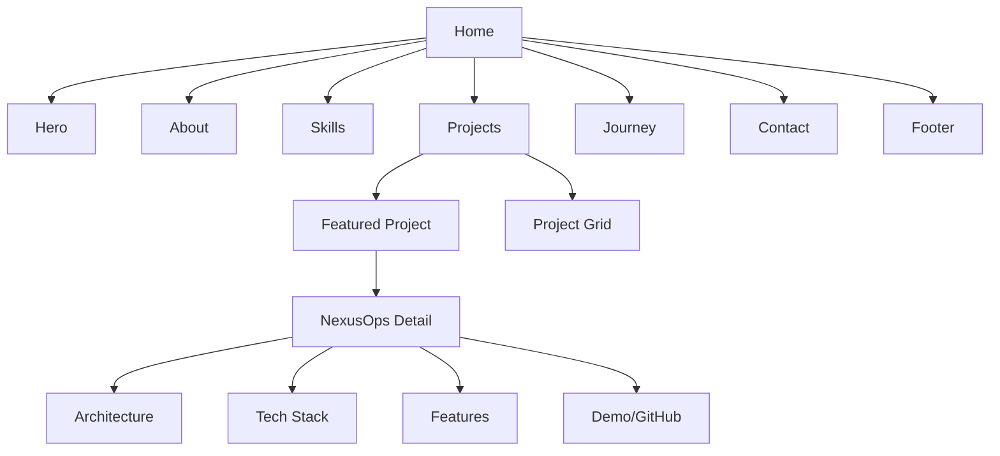
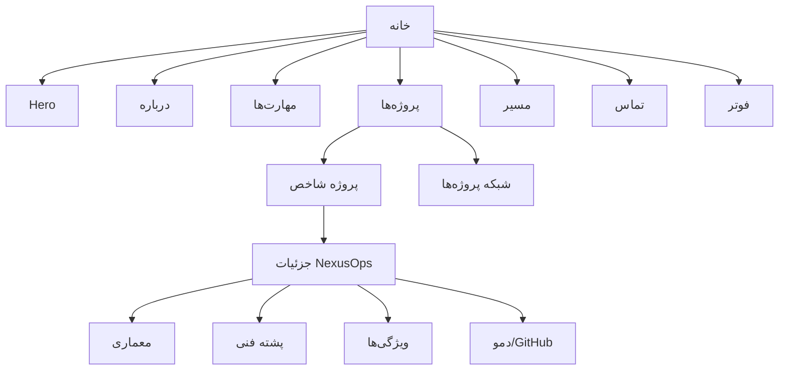
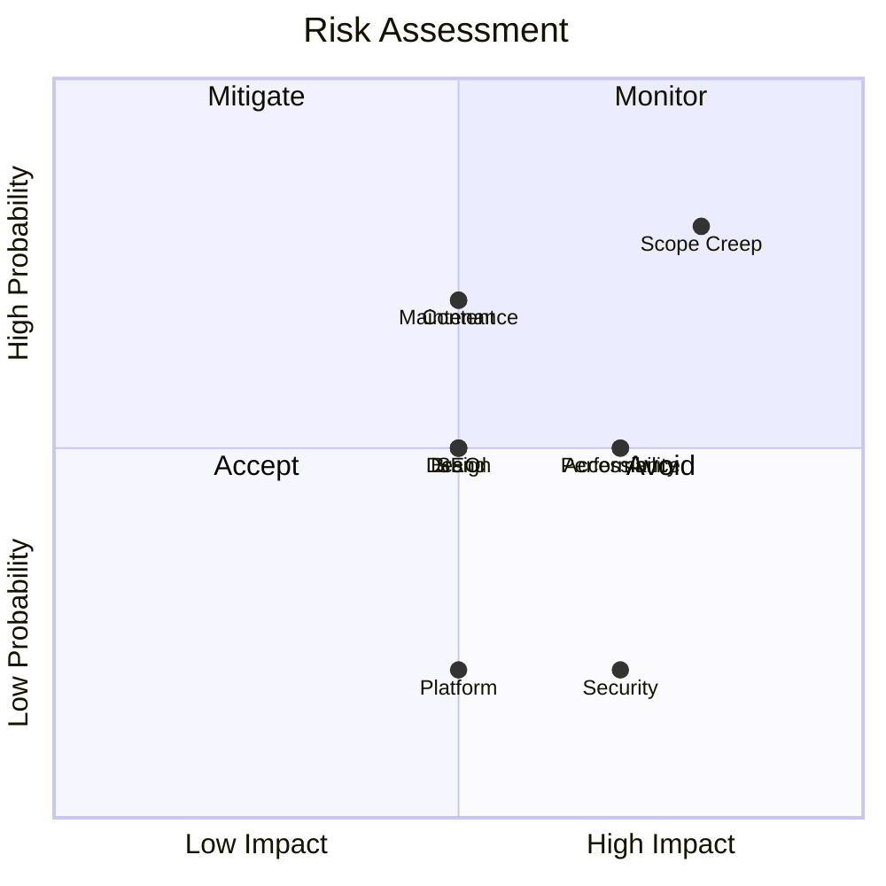
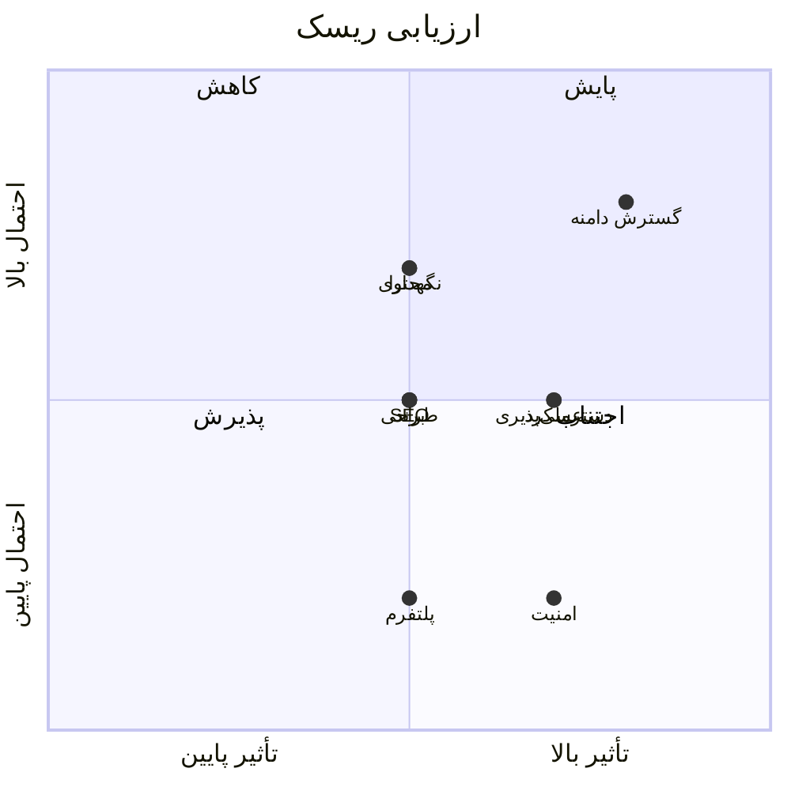
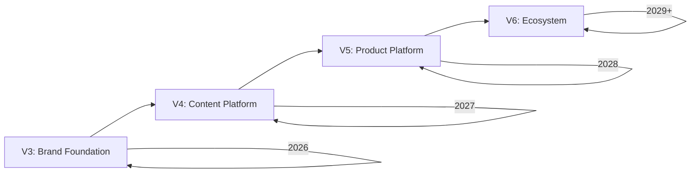
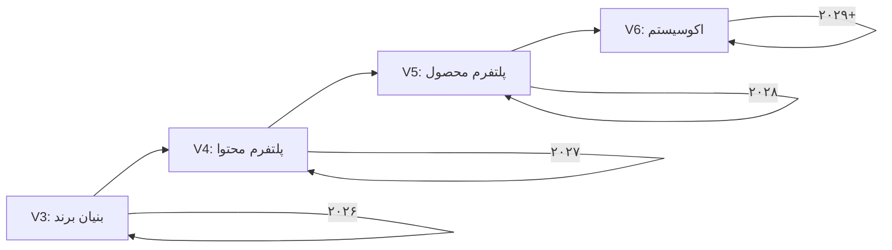

# SMG Portfolio V3 — Product Requirements Document

| Field | Value |
|-------|-------|
| **Document** | Product Requirements Document (PRD) |
| **Version** | 3.0 |
| **Owner** | Saman Qasempour |
| **Brand** | SMG |
| **Website** | samansmg.ir |
| **Status** | Active |
| **Last Updated** | 2026-08-06 |

---

## Table of Contents

- [1. Executive Summary](#1-executive-summary)
- [2. Product Vision](#2-product-vision)
- [3. Mission Statement](#3-mission-statement)
- [4. Product Goals](#4-product-goals)
- [5. Business Goals](#5-business-goals)
- [6. Target Audience](#6-target-audience)
- [7. User Personas](#7-user-personas)
- [8. User Journey](#8-user-journey)
- [9. Information Architecture](#9-information-architecture)
- [10. Sitemap](#10-sitemap)
- [11. Functional Requirements](#11-functional-requirements)
- [12. Non-Functional Requirements](#12-non-functional-requirements)
- [13. Brand Identity Overview](#13-brand-identity-overview)
- [14. Product Positioning](#14-product-positioning)
- [15. Success Metrics](#15-success-metrics)
- [16. Risks](#16-risks)
- [17. Constraints](#17-constraints)
- [18. Out of Scope](#18-out-of-scope)
- [19. Future Roadmap](#19-future-roadmap)
- [20. Product Principles](#20-product-principles)

---

# 1. Executive Summary

## English

SMG Portfolio V3 is the next-generation personal brand website for Saman Qasempour — a software engineer and DevOps specialist building infrastructure products and technology companies.

Version 2 currently exists and functions as a standard developer portfolio. Version 3 is a complete redesign from scratch, transforming the website from a personal portfolio into the **digital headquarters of a technology brand**.

The core transformation:

| Aspect | V2 (Current) | V3 (Target) |
|--------|-------------|-------------|
| **Identity** | Personal portfolio | Technology brand headquarters |
| **Positioning** | "I am a developer" | "I build systems and products" |
| **Feel** | Template-based | Custom-crafted, premium |
| **Content** | Generic descriptions | Specific, evidence-based |
| **Design** | Dark theme + glass | Minimal, confident, timeless |
| **Scope** | Single page | Multi-section, scalable |
| **Brand** | Name + colors | Complete brand system |

V3 is not about adding more features. It is about **removing everything that does not serve the brand** and **amplifying everything that does**.

The website must feel like visiting the homepage of a company like Vercel, Linear, or Stripe — not a freelancer's resume.

## فارسی

وب‌سایت SMG Portfolio V3 نسخه نسل بعدی وب‌سایت برند شخصی سامان قاسمپور — یک مهندس نرم‌افزار و متخصص DevOps که در حال ساخت محصولات زیرساختی و شرکت‌های فناوری است.

نسخه 2 در حال حاضر موجود است و به عنوان یک پورتفولیوی استاندارد توسعه‌دهنده عمل می‌کند. نسخه 3 یک بازطراحی کامل از صفر است که وب‌سایت را از یک پورتفولیوی شخصی به **مقر دیجیتال یک برند فناوری** تبدیل می‌کند.

تبدیل اصلی:

| جنبه | V2 (فعلی) | V3 (هدف) |
|------|-----------|----------|
| ** هویت** | پورتفولیوی شخصی | مقر برند فناوری |
| **جایگاه‌یابی** | "من یک توسعه‌دهنده هستم" | "من سیستم‌ها و محصولات می‌سازم" |
| **حس** | بر پایه قالب | سفارشی‌سازی شده، پرمیوم |
| **محتوا** | توضیحات عمومی | خاص، مبتنی بر شواهد |
| **طراحی** | تم تاریک + شیشه‌ای | مینیمال، مطمئن، جاودانه |
| **دامنه** | تک صفحه‌ای | چند بخشی، مقیاس‌پذیر |
| **برند** | نام + رنگ‌ها | سیستم برند کامل |

V3 در مورد اضافه کردن ویژگی‌های بیشتر نیست. در مورد **حذف هر چیزی که به برند خدمت نمی‌کند** و **تقویت هر چیزی که خدمت می‌کند** است.

وب‌سایت باید مانند بازدید از صفحه اصلی یک شرکت مثل Vercel، Linear یا Stripe باشد — نه رزومه یک فریلنسر.

---

# 2. Product Vision

## English

### Long-Term Vision

SMG becomes recognized as a technology brand that builds reliable infrastructure products. The website serves as the digital storefront — the first impression for every interaction with the brand.

### Future Positioning



- **V3 (Current):** Brand headquarters — showcase capability, build credibility
- **V4 (Future):** Product platform — NexusOps as a SaaS product page
- **V5 (Vision):** Ecosystem — documentation, community, open source hub

### Desired Perception

When a visitor leaves the website, they should think:

- "This person builds serious systems"
- "This is a real engineering operation"
- "I trust this person with my infrastructure"
- "I want to work with / hire this person"

### What V3 Is NOT

| It Is | It Is Not |
|-------|-----------|
| A technology brand website | A freelancer portfolio |
| A product showcase | A blog |
| A credibility builder | A resume PDF online |
| A trust signal | A social media profile |
| An engineering statement | A template website |

## فارسی

### چشم‌انداز بلندمدت

SMG به عنوان یک برند فناوری شناخته می‌شود که محصولات زیرساختی قابل اعتماد می‌سازد. وب‌سایت به عنوان فروشگاه دیجیتال عمل می‌کند — اولین تأثیر برای هر تعامل با برند.

### جایگاه‌یابی آینده



- **V3 (فعلی):** مقر برند — نمایش توانایی، ایجاد اعتبار
- **V4 (آینده):** پلتفرم محصول — NexusOps به عنوان صفحه محصول SaaS
- **V5 (چشم‌انداز):** اکوسیستم — مستندات، جامعه، مرکز Open Source

### تأثیر مورد انتظار

وقتی بازدیدکننده وب‌سایت را ترک می‌کند، باید فکر کند:

- "این شخص سیستم‌های جدی می‌سازد"
- "این یک عملیات مهندسی واقعی است"
- "من به این شخص برای زیرساعتم اعتماد دارم"
- "می‌خواهم با این شخص کار کنم / استخدامش کنم"

### V3 چیست و چیست نیست

| هست | نیست |
|------|------|
| وب‌سایت برند فناوری | پورتفولیوی فریلنسر |
| نمایشگاه محصول | وبلاگ |
| ایجادکننده اعتبار | رزومه آنلاین |
| سیگنال اعتماد | پروفایل شبکه اجتماعی |
| بیانیه مهندسی | وب‌سایت قالبی |

---

# 3. Mission Statement

## English

> **Build reliable systems and digital products.**
>
> SMG exists to solve real infrastructure problems with engineering precision. Every project is built to last. Every system is designed to scale. Every decision is made with care.

The mission is not to be "a developer portfolio." The mission is to be **the digital presence of someone who builds things that matter**.

### Mission Decomposition

| Component | Meaning |
|-----------|---------|
| "Build" | Active creation, not passive consumption |
| "Reliable systems" | Infrastructure that works, always |
| "Digital products" | Software that solves real problems |
| "Engineering precision" | Every detail matters |
| "Built to last" | Long-term thinking over quick hacks |

## فارسی

> **ساختن سیستم‌های قابل اعتماد و محصولات دیجیتال.**
>
> SMG برای حل مشکلات واقعی زیرساختی با دقت مهندسی وجود دارد. هر پروژه برای ماندن ساخته شده. هر سیستم برای مقیاس‌پذیری طراحی شده. هر تصمیم با دقت گرفته می‌شود.

ماموریت این نیست که "یک پورتفولیوی توسعه‌دهنده" باشیم. ماموریت این است که **حضور دیجیتال کسی باشیم که چیزهای مهم می‌سازد**.

### تفکیک ماموریت

| جزء | معنی |
|-----|------|
| "ساختن" | خلق فعال، نه مصرف منفعل |
| "سیستم‌های قابل اعتماد" | زیرساختی که همیشه کار کند |
| "محصولات دیجیتال" | نرم‌افزاری که مشکلات واقعی را حل کند |
| "دقت مهندسی" | هر جزئیات مهم است |
| "برای ماندن ساخته شده" | تفکر بلندمدت به جای راه‌حل‌های موقتی |

---

# 4. Product Goals

## English

### Primary Goals

| # | Goal | Metric | Priority |
|---|------|--------|----------|
| 1 | Establish SMG as a credible technology brand | Recruiter contact rate | P0 |
| 2 | Showcase NexusOps as a serious product | GitHub stars, demo requests | P0 |
| 3 | Demonstrate engineering capability | Project depth, technical detail | P0 |
| 4 | Enable professional networking | Contact form submissions, LinkedIn visits | P1 |

### Secondary Goals

| # | Goal | Metric | Priority |
|---|------|--------|----------|
| 5 | Attract open source contributors | GitHub followers, PR count | P2 |
| 6 | Build audience for future products | Email list, return visits | P2 |
| 7 | Create content for technical writing | Blog engagement (future) | P3 |

### Long-Term Goals (12+ months)

| # | Goal | Timeline |
|---|------|----------|
| 8 | NexusOps becomes recognizable product | 12-18 months |
| 9 | SMG brand associated with infrastructure quality | 18-24 months |
| 10 | Website becomes primary inbound channel | 12+ months |

## فارسی

### اهداف اصلی

| # | هدف | معیار | اولویت |
|---|------|-------|---------|
| 1 | تثبیت SMG به عنوان برند فناوری معتبر | نرخ تماس استخدام‌کنندگان | P0 |
| 2 | نمایش NexusOps به عنوان محصول جدی | ستاره‌های GitHub، درخواست‌های دمو | P0 |
| 3 | نشان دادن توانایی مهندسی | عمق پروژه، جزئیات فنی | P0 |
| 4 | فعال‌سازی شبکه‌سازی حرفه‌ای | ارسال‌های فرم تماس، بازدیدهای LinkedIn | P1 |

### اهداف فرعی

| # | هدف | معیار | اولویت |
|---|------|-------|---------|
| 5 | جذب مشارکت‌کنندگان Open Source | دنبال‌کنندگان GitHub، تعداد PR | P2 |
| 6 | ایجاد مخاطب برای محصولات آینده | لیست ایمیل، بازدیدهای مجدد | P2 |
| 7 | ایجاد محتوا برای نوشتن فنی | تعامل وبلاگ (آینده) | P3 |

### اهداف بلندمدت (۱۲+ ماه)

| # | هدف | بازه زمانی |
|---|------|-----------|
| 8 | NexusOps به محصول شناخته‌شده تبدیل شود | ۱۲-۱۸ ماه |
| 9 | برند SMG با کیفیت زیرساختی مرتبط شود | ۱۸-۲۴ ماه |
| 10 | وب‌سایت کانال اصلی Inbound شود | ۱۲+ ماه |

---

# 5. Business Goals

## English

The portfolio serves multiple business objectives simultaneously:

### 5.1 Credibility Building

**Why:** Trust is the foundation of every business relationship. A premium website signals that the owner takes their work seriously.

**How:**
- Professional design signals competence
- Technical depth signals expertise
- Real products signal capability
- Clean code signals discipline

### 5.2 Engineering Capability Showcase

**Why:** Clients, employers, and collaborators need evidence of capability before they engage.

**How:**
- Detailed project descriptions with architecture diagrams
- Real code repositories with quality documentation
- Technical blog posts demonstrating knowledge
- Infrastructure lab showcasing hands-on skills

### 5.3 Personal Brand as a Moat

**Why:** In a competitive market, brand is the only sustainable differentiator.

**How:**
- Consistent visual identity across all touchpoints
- Consistent voice and messaging
- Regular content creation
- Community engagement

### 5.4 Recruitment Pipeline

**Why:** The best opportunities come inbound, not through applications.

**How:**
- SEO-optimized content attracting recruiters
- Clear project showcase reducing screening time
- Easy contact mechanism
- Professional social proof

### 5.5 Future Startup Foundation

**Why:** Every successful product needs a strong brand foundation.

**How:**
- Website architecture supports future product pages
- Brand system scales to multiple products
- Content strategy supports product launches
- Technical stack supports rapid iteration

## فارسی

پورتفولیو همزمان چندین هدف تجاری را دنبال می‌کند:

### ۵.۱ ایجاد اعتبار

**چرا:** اعتماد پایه هر رابطه تجاری است. یک وب‌سایت پرمیوم نشان می‌دهد که مالک کار خود را جدی می‌گیرد.

**چطور:**
- طراحی حرفه‌ای شایستگی را نشان می‌دهد
- عمق فنی تخصص را نشان می‌دهد
- محصولات واقعی توانایی را نشان می‌دهد
- کد تمیز انضباط را نشان می‌دهد

### ۵.۲ نمایشگاه توانایی مهندسی

**چرا:** مشتریان، کارفرمایان و همکاران قبل از همکاری به شواهد توانایی نیاز دارند.

**چطور:**
- توصیفات پروژه با جزئیات و نمودارهای معماری
- مخازن کد واقعی با مستندات باکیفیت
- پست‌های وبلاگ فنی که دانش را نشان می‌دهند
- آزمایشگاه زیرساخت که مهارت‌های عملی را به نمایش می‌گذارد

### ۵.۳ برند شخصی به عنوان خندق

**چرا:** در بازار رقابتی، برند تنها متمایزکننده پایدار است.

**چطور:**
- هویت بصری ثابت در تمام نقاط تماس
- صدا و پیام‌رسانی ثابت
- تولید منظم محتوا
- تعامل با جامعه

### ۵.۴ خط لوله استخدام

**چرا:** بهترین فرصت‌ها از طریق Inbound می‌آیند، نه از طریق درخواست‌ها.

**چطور:**
- محتوای بهینه‌شده SEO که استخدام‌کنندگان را جذب می‌کند
- نمایش پروژه‌های واضح که زمان غربالگری را کاهش می‌دهد
- مکانیزم تماس آسان
- شواهد اجتماعی حرفه‌ای

### ۵.۵ بنیان استارتاپ آینده

**چرا:** هر محصول موفق به بنیان برند قوی نیاز دارد.

**چطور:**
- معماری وب‌سایت از صفحات محصول آینده پشتیبانی می‌کند
- سیستم برند به محصولات متعدد مقیاس‌پذیر است
- استراتژی محتوا از راه‌اندازی محصولات پشتیبانی می‌کند
- پشته فنی از تکرار سریع پشتیبانی می‌کند

---

# 6. Target Audience

## English

### Audience Matrix

| Audience | Primary Need | Entry Point | Desired Action |
|----------|-------------|-------------|----------------|
| **Recruiters** | Evaluate capability | Google / LinkedIn | Contact / Schedule call |
| **Developers** | Learn from projects | GitHub / Google | Follow / Contribute |
| **Clients** | Assess fit for hire | Google / Referral | Request proposal |
| **Startup Founders** | Evaluate technical partner | LinkedIn / Referral | Discuss collaboration |
| **Investors** | Assess founder capability | LinkedIn / Referral | Schedule meeting |
| **Open Source Community** | Discover useful tools | GitHub | Star / Contribute |
| **Students** | Learn from journey | Google / Social | Follow / Learn |

### 6.1 Recruiters

**Goals:** Quickly assess if this person fits the role.

**Needs:**
- Clear skill indicators
- Evidence of real projects
- Professional presentation
- Easy contact method

**Pain Points:**
- Generic portfolios that look the same
- No evidence of actual work
- Missing contact information
- Poor mobile experience

**Expected Outcome:** "This person is worth interviewing."

### 6.2 Developers

**Goals:** Learn from projects, discover tools, evaluate technical decisions.

**Needs:**
- Technical depth
- Code quality evidence
- Architecture decisions explained
- Open source contributions

**Pain Points:**
- Shallow project descriptions
- No code repositories
- No technical explanations
- Marketing fluff instead of substance

**Expected Outcome:** "This person knows what they're doing."

### 6.3 Clients

**Goals:** Determine if this person can solve their problem.

**Needs:**
- Relevant experience
- Portfolio of similar work
- Clear service description
- Easy contact process

**Pain Points:**
- No clear service offering
- No pricing signals
- No case studies
- Hard to reach

**Expected Outcome:** "I should contact this person."

### 6.4 Startup Founders

**Goals:** Evaluate potential technical co-founder or CTO.

**Needs:**
- Technical depth
- Product thinking
- Infrastructure experience
- Communication skills

**Pain Points:**
- Portfolio looks like a student project
- No product sense
- No infrastructure knowledge
- Poor communication

**Expected Outcome:** "This person could build our product."

### 6.5 Open Source Community

**Goals:** Discover useful tools and contribute.

**Needs:**
- Quality documentation
- Clear contribution guidelines
- Active maintenance
- Responsive maintainer

**Pain Points:**
- Abandoned projects
- Poor documentation
- Unwelcoming contribution process
- No response to issues

**Expected Outcome:** "This is a quality project worth contributing to."

### 6.6 Students

**Goals:** Learn from the journey, get inspired.

**Needs:**
- Learning path clarity
- Resource recommendations
- Honest journey description
- Accessible content

**Pain Points:**
- Unrealistic success stories
- No practical advice
- Gatekeeping knowledge
- Outdated information

**Expected Outcome:** "This is a realistic and inspiring path."

## فارسی

### ماتریس مخاطبان

| مخاطب | نیاز اصلی | نقطه ورود | عمل مورد انتظار |
|-------|-----------|-----------|----------------|
| **استخدام‌کنندگان** | ارزیابی توانایی | Google / LinkedIn | تماس / برنامه‌ریزی تماس |
| **توسعه‌دهندگان** | یادگیری از پروژه‌ها | GitHub / Google | دنبال کردن / مشارکت |
| **مشتریان** | ارزیابی تناسب برای استخدام | Google / ارجاع | درخواست پیشنهاد |
| **بنیان‌گذاران استارتاپ** | ارزیابی شریک فنی | LinkedIn / ارجاع | بحث در مورد همکاری |
| **سرمایه‌گذاران** | ارزیابی توانایی بنیان‌گذار | LinkedIn / ارجاع | برنامه‌ریزی جلسه |
| **جامعه Open Source** | کشف ابزارهای مفید | GitHub | ستاره دادن / مشارکت |
| **دانشجویان** | یادگیری از مسیر | Google / شبکه اجتماعی | دنبال کردن / یادگیری |

### ۶.۱ استخدام‌کنندگان

**اهداف:** به سرعت ارزیابی کنند که آیا این شخص با نقش تناسب دارد یا خیر.

**نیازها:**
- شاخص‌های مهارت واضح
- شواهدی از پروژه‌های واقعی
- ارائه حرفه‌ای
- روش تماس آسان

**دردها:**
- پورتفولیوهای عمومی که شبیه هم هستند
- شواهدی از کار واقعی وجود ندارد
- اطلاعات تماس وجود ندارد
- تجربه موبایل ضعیف

**نتیجه مورد انتظار:** "این شخص ارزش مصاحبه دارد."

### ۶.۲ توسعه‌دهندگان

**اهداف:** یادگیری از پروژه‌ها، کشف ابزارها، ارزیابی تصمیمات فنی.

**نیازها:**
- عمق فنی
- شواهد کیفیت کد
- توضیح تصمیمات معماری
- مشارکت‌های Open Source

**دردها:**
- توصیفات سطحی پروژه‌ها
- مخازن کد وجود ندارد
- توضیحات فنی وجود ندارد
- به جای محتوا، بازاریابی وجود دارد

**نتیجه مورد انتظار:** "این شخص می‌داند چه کار می‌کند."

### ۶.۳ مشتریان

**اهداف:** تعیین کنند که آیا این شخص می‌تواند مشکل آنها را حل کند.

**نیازها:**
- تجربه مرتبط
- نمونه‌کارهای مشابه
- توضیح واضح خدمات
- فرآیند تماس آسان

**دردها:**
- ارائه واضح خدمات وجود ندارد
- سیگنال‌های قیمت‌گذاری وجود ندارد
- مطالعات موردی وجود ندارد
- دسترسی دشوار

**نتیجه مورد انتظار:** "باید با این شخص تماس بگیرم."

### ۶.۴ بنیان‌گذاران استارتاپ

**اهداف:** ارزیابی همکار فنی بالقوه یا CTO.

**نیازها:**
- عمق فنی
- تفکر محصولی
- تجربه زیرساختی
- مهارت‌های ارتباطی

**دردها:**
- پورتفولیو شبیه پروژه دانشجویی به نظر می‌رسد
- حس محصول وجود ندارد
- دانش زیرساختی وجود ندارد
- ارتباط ضعیف

**نتیجه مورد انتظار:** "این شخص می‌تواند محصول ما را بسازد."

### ۶.۵ جامعه Open Source

**اهداف:** کشف ابزارهای مفید و مشارکت.

**نیازها:**
- مستندات باکیفیت
- راهنمای واضح مشارکت
- نگهداری فعال
- نگهدارنده پاسخگو

**دردها:**
- پروژه‌های رها شده
- مستندات ضعیف
- فرآیند مشارکت غیردوستانه
- بدون پاسخ به مشکلات

**نتیجه مورد انتظار:** "این یک پروژه باکیفیت است که ارزش مشارکت دارد."

---

# 7. User Personas

## English

### Persona 1: Arash — Technical Recruiter

| Attribute | Detail |
|-----------|--------|
| **Age** | 28-35 |
| **Role** | Senior Technical Recruiter at a tech company |
| **Goal** | Find qualified DevOps/Infrastructure engineers |
| **Frustration** | Portfolios that don't show real work |
| **Time on site** | 2-3 minutes |
| **Device** | Mobile (60%), Desktop (40%) |

**Typical Journey:**
1. Searches "DevOps engineer portfolio" on Google
2. Lands on homepage
3. Scans hero section (5 seconds decision)
4. Scrolls to projects
5. Clicks on NexusOps
6. Checks GitHub repository
7. Returns to contact page
8. Sends message or bookmarks

**Success Indicator:** Arash contacts Saman for an interview.

### Persona 2: Negar — Startup CTO

| Attribute | Detail |
|-----------|--------|
| **Age** | 30-40 |
| **Role** | CTO at a Series A startup |
| **Goal** | Find a reliable infrastructure engineer |
| **Frustration** | Can't find engineers who understand production |
| **Time on site** | 5-10 minutes |
| **Device** | Desktop (80%) |

**Typical Journey:**
1. Referral from LinkedIn
2. Visits homepage
3. Reads About section thoroughly
4. Examines Infrastructure Lab
5. Reviews NexusOps architecture
6. Checks Docker/Linux expertise
7. Evaluates code quality on GitHub
8. Contacts for potential collaboration

**Success Indicator:** Negar schedules a technical discussion.

### Persona 3: Dariush — Fellow Developer

| Attribute | Detail |
|-----------|--------|
| **Age** | 22-30 |
| **Role** | Full-stack developer |
| **Goal** | Learn DevOps practices, discover tools |
| **Frustration** | Shallow tutorials, no real examples |
| **Time on site** | 10-15 minutes |
| **Device** | Desktop (90%) |

**Typical Journey:**
1. Finds DockerOrbit on GitHub
2. Explores the repository
3. Visits the portfolio
4. Reads about Infrastructure Lab
5. Checks the tech stack
6. Follows on GitHub
7. Returns for future content

**Success Indicator:** Dariush follows Saman and contributes to open source.

### Persona 4: Sara — HR Manager

| Attribute | Detail |
|-----------|--------|
| **Age** | 30-40 |
| **Role** | HR Manager at a mid-size company |
| **Goal** | Quickly verify candidate credentials |
| **Frustration** | Can't find evidence of actual skills |
| **Time on site** | 1-2 minutes |
| **Device** | Mobile (70%) |

**Typical Journey:**
1. Receives resume from candidate
2. Searches name on Google
3. Visits portfolio
4. Glances at hero and projects
5. Checks if the site looks professional
6. Makes hiring decision based on impression

**Success Indicator:** Sara shortlists Saman for interview.

## فارسی

### پرسونا ۱: آرش — استخدام‌کننده فنی

| ویژگی | جزئیات |
|--------|--------|
| **سن** | ۲۸-۳۵ |
| **نقش** | استخدام‌کننده فنی ارشد در یک شرکت فناوری |
| **هدف** | یافتن مهندسان DevOps/زیرساخت واجد شرایط |
| **ناامیدی** | پورتفولیوهایی که کار واقعی را نشان نمی‌دهند |
| **زمان در سایت** | ۲-۳ دقیقه |
| **دستگاه** | موبایل (۶۰٪)، دسکتاپ (۴۰٪) |

**سفر معمول:**
1. جستجوی "DevOps engineer portfolio" در Google
2. ورود به صفحه اصلی
3. اسکن بخش Hero (تصمیم ۵ ثانیه‌ای)
4. اسکرول به پروژه‌ها
5. کلیک روی NexusOps
6. بررسی مخزن GitHub
7. بازگشت به صفحه تماس
8. ارسال پیام یا نشانک‌گذاری

**شاخص موفقیت:** آرش برای مصاحبه با سامان تماس می‌گیرد.

### پرسونا ۲: نگار — CTO استارتاپ

| ویژگی | جزئیات |
|--------|--------|
| **سن** | ۳۰-۴۰ |
| **نقش** | CTO در یک استارتاپ مرحله Series A |
| **هدف** | یافتن یک مهندس زیرسافت قابل اعتماد |
| **ناامیدی** | نمی‌تواند مهندسانی پیدا کند که تولید را درک کنند |
| **زمان در سایت** | ۵-۱۰ دقیقه |
| **دستگاه** | دسکتاپ (۸۰٪) |

**سفر معمول:**
1. ارجاع از LinkedIn
2. بازدید از صفحه اصلی
3. خواندن دقیق بخش About
4. بررسی آزمایشگاه زیرساخت
5. مرور معماری NexusOps
6. بررسی تخصص Docker/Linux
7. ارزیابی کیفیت کد در GitHub
8. تماس برای همکاری بالقوه

**شاخص موفقیت:** نگار یک بحث فنی برنامه‌ریزی می‌کند.

### پرسونا ۳: داریوش — توسعه‌دهنده همکار

| ویژگی | جزئیات |
|--------|--------|
| **سن** | ۲۲-۳۰ |
| **نقش** | توسعه‌دهنده فول‌استک |
| **هدف** | یادگیری شیوه‌های DevOps، کشف ابزارها |
| **ناامیدی** | آموزش‌های سطحی، بدون مثال‌های واقعی |
| **زمان در سایت** | ۱۰-۱۵ دقیقه |
| **دستگاه** | دسکتاپ (۹۰٪) |

**سفر معمول:**
1. یافتن DockerOrbit در GitHub
2. کاوش در مخزن
3. بازدید از پورتفولیو
4. خواندن درباره آزمایشگاه زیرساخت
5. بررسی پشته فنی
6. دنبال کردن در GitHub
7. بازگشت برای محتوای آینده

**شاخص موفقیت:** داریوش سامان را دنبال می‌کند و در Open Source مشارکت می‌کند.

### پرسونا ۴: سارا — مدیر منابع انسانی

| ویژگی | جزئیات |
|--------|--------|
| **سن** | ۳۰-۴۰ |
| **نقش** | مدیر منابع انسانی در یک شرکت متوسط |
| **هدف** | تأیید سریع صلاحیت نامزد |
| **ناامیدی** | نمی‌تواند شواهدی از مهارت‌های واقعی پیدا کند |
| **زمان در سایت** | ۱-۲ دقیقه |
| **دستگاه** | موبایل (۷۰٪) |

**سفر معمول:**
1. دریافت رزومه از نامزد
2. جستجوی نام در Google
3. بازدید از پورتفولیو
4. نگاه سریع به Hero و پروژه‌ها
5. بررسی حرفه‌ای بودن سایت
6. تصمیم‌گیری استخدام بر اساس برداشت

**شاخص موفقیت:** سارا سامان را برای مصاحبه در لیست کوتاه قرار می‌دهد.

---

# 8. User Journey

## English

### Journey Overview



### Step 1: Discovery

**Purpose:** Visitor finds the website through a channel.

**Channels:**
| Channel | Intent | Quality |
|---------|--------|---------|
| Google Search | Active research | High |
| GitHub Profile | Code exploration | High |
| LinkedIn | Professional discovery | Medium-High |
| Referral | Trusted recommendation | Very High |
| Social Media | Casual discovery | Medium |

**Success Criteria:** Visitor arrives at the website.

### Step 2: First Impression (0-5 seconds)

**Purpose:** Answer: "Is this site worth my time?"

**Visitor evaluates:**
- Visual quality (Does it look professional?)
- Brand clarity (Who is this?)
- Value proposition (What do they do?)
- Technical quality (Is it fast?)

**Success Criteria:** Visitor decides to stay and explore.

### Step 3: Exploration (5-60 seconds)

**Purpose:** Understand what SMG offers.

**Visitor explores:**
- Hero section (brand message)
- About section (who, what, why)
- Skills section (capabilities)
- Navigation (can I find what I need?)

**Success Criteria:** Visitor understands SMG's value proposition.

### Step 4: Project Discovery (1-3 minutes)

**Purpose:** Evaluate specific work and capability.

**Visitor examines:**
- Featured project (NexusOps)
- Project details (architecture, tech stack)
- Code quality (GitHub repositories)
- Other projects (range of work)

**Success Criteria:** Visitor is impressed by project quality.

### Step 5: Trust Building (3-5 minutes)

**Purpose:** Build confidence in the person/brand.

**Visitor verifies:**
- Real projects (not mockups)
- Technical depth (not surface-level)
- Professional presentation (attention to detail)
- Active maintenance (not abandoned)

**Success Criteria:** Visitor trusts the brand.

### Step 6: Conversion (5-10 minutes)

**Purpose:** Take the desired action.

**Visitor actions:**
- Contact form submission
- GitHub follow/star
- LinkedIn connection
- Email outreach
- Bookmark for later

**Success Criteria:** Visitor takes a measurable action.

### Step 7: Exit (post-conversion)

**Purpose:** Leave a lasting impression.

**Visitor remembers:**
- Professional experience
- Easy navigation
- Quality content
- Clear value proposition

**Success Criteria:** Visitor returns or refers others.

## فارسی

### نمای کلی سفر



### مرحله ۱: کشف

**هدف:** بازدیدکننده از طریق یک کانال وب‌سایت را پیدا می‌کند.

**کانال‌ها:**
| کانال | نیت | کیفیت |
|-------|------|-------|
| جستجوی Google | تحقیق فعال | بالا |
| پروفایل GitHub | کاوش کد | بالا |
| LinkedIn | کشف حرفه‌ای | متوسط-بالا |
| ارجاع | توصیه قابل اعتماد | بسیار بالا |
| رسانه اجتماعی | کشف تصادفی | متوسط |

**معیار موفقیت:** بازدیدکننده به وب‌سایت می‌رسد.

### مرحله ۲: تأثیر اولیه (۰-۵ ثانیه)

**هدف:** پاسخ به این سوال: "آیا این سایت ارزش وقت من را دارد؟"

**بازدیدکننده ارزیابی می‌کند:**
- کیفیت بصری (آیا حرفه‌ای به نظر می‌رسد؟)
- وضوح برند (این کیست؟)
- ارزش پیشنهادی (چه کاری انجام می‌دهد؟)
- کیفیت فنی (آیا سریع است؟)

**معیار موفقیت:** بازدیدکننده تصمیم می‌گیرد بماند و کاوش کند.

### مرحله ۳: کاوش (۵-۶۰ ثانیه)

**هدف:** درک اینکه SMG چه چیزی ارائه می‌دهد.

**بازدیدکننده کاوش می‌کند:**
- بخش Hero (پیام برند)
- بخش About (چه کسی، چه چیزی، چرا)
- بخش Skills (توانایی‌ها)
- ناوبری (آیا می‌توانم چیزی که نیاز دارم را پیدا کنم؟)

**معیار موفقیت:** بازدیدکننده ارزش پیشنهادی SMG را درک می‌کند.

### مرحله ۴: کشف پروژه (۱-۳ دقیقه)

**هدف:** ارزیابی کار خاص و توانایی.

**بازدیدکننده بررسی می‌کند:**
- پروژه شاخص (NexusOps)
- جزئیات پروژه (معماری، پشته فنی)
- کیفیت کد (مخازن GitHub)
- پروژه‌های دیگر (دامنه کار)

**معیار موفقیت:** بازدیدکننده از کیفیت پروژه تحت تأثیر قرار می‌گیرد.

### مرحله ۵: ساختن اعتماد (۳-۵ دقیقه)

**هدف:** ایجاد اعتماد در فرد/برند.

**بازدیدکننده تأیید می‌کند:**
- پروژه‌های واقعی (نه ماکاپ)
- عمق فنی (نه سطحی)
- ارائه حرفه‌ای (توجه به جزئیات)
- نگهداری فعال (نه رها شده)

**معیار موفقیت:** بازدیدکننده به برند اعتماد می‌کند.

### مرحله ۶: تبدیل (۵-۱۰ دقیقه)

**هدف:** انجام عمل مورد انتظار.

**اقدامات بازدیدکننده:**
- ارسال فرم تماس
- دنبال کردن/ستاره دادن در GitHub
- اتصال در LinkedIn
- تماس از طریق ایمیل
- نشانک‌گذاری برای بعد

**معیار موفقیت:** بازدیدکننده یک اقدام قابل اندازه‌گیری انجام می‌دهد.

### مرحله ۷: خروج (پس از تبدیل)

**هدف:** ا留下 تأثیر ماندگار.

**بازدیدکننده به یاد می‌آورد:**
- تجربه حرفه‌ای
- ناوبری آسان
- محتوای باکیفیت
- ارزش پیشنهادی واضح

**معیار موفقیت:** بازدیدکننده بازمی‌گردد یا دیگران را ارجاع می‌دهد.

---

# 9. Information Architecture

## English

### IA Principles

1. **Progressive Disclosure:** Show the most important information first
2. **Logical Flow:** Each section naturally leads to the next
3. **No Dead Ends:** Every page has a clear next step
4. **Shallow Hierarchy:** Maximum 2 levels of navigation
5. **Search-First Architecture:** Content organized for both humans and search engines

### Content Hierarchy



### Section Priority

| Priority | Section | Purpose | Depth |
|----------|---------|---------|-------|
| P0 | Hero | Brand message + first impression | Surface |
| P0 | Projects | Capability evidence | Deep |
| P0 | About | Who + what + why | Medium |
| P1 | Skills | Technical capabilities | Surface |
| P1 | Contact | Conversion mechanism | Surface |
| P2 | Journey | Trust building | Surface |
| P3 | Footer | Navigation + social links | Surface |

### Navigation Model

**Primary Navigation:** Fixed top navbar with smooth scroll

```
Home → About → Skills → Projects → Journey → Contact
```

**Secondary Navigation:** Footer with social links and quick access

**Future Navigation:** Blog, Documentation (V4+)

## فارسی

### اصول IA

1. **افشای تدریجی:** مهم‌ترین اطلاعات اول نمایش داده شود
2. **جریان منطقی:** هر بخش به طور طبیعی به بعدی منتهی می‌شود
3. **بدون بن‌بست:** هر صفحه یک مرحله بعدی واضح دارد
4. **سلسله مراتب کم‌عمق:** حداکثر ۲ سطح ناوبری
5. **معماری جستجو-اول:** محتوا برای انسان‌ها و موتورهای جستجو سازمان‌دهی شده

### سلسله مراتب محتوا



### اولویت بخش‌ها

| اولویت | بخش | هدف | عمق |
|--------|------|------|-----|
| P0 | Hero | پیام برند + تأثیر اولیه | سطحی |
| P0 | پروژه‌ها | شواهد توانایی | عمیق |
| P0 | About | چه کسی + چه چیزی + چرا | متوسط |
| P1 | مهارت‌ها | توانایی‌های فنی | سطحی |
| P1 | تماس | مکانیزم تبدیل | سطحی |
| P2 | مسیر | ساختن اعتماد | سطحی |
| P3 | فوتر | ناوبری + لینک‌های اجتماعی | سطحی |

### مدل ناوبری

**ناوبری اولیه:** نوار بالای ثابت با اسکرول نرم

```
خانه → درباره → مهارت‌ها → پروژه‌ها → مسیر → تماس
```

**ناوبری ثانویه:** فوتر با لینک‌های اجتماعی و دسترسی سریع

**ناوبری آینده:** وبلاگ، مستندات (V4+)

---

# 10. Sitemap

## English

```mermaid
graph TD
    HOME[/] --> |Hero| H[Hero Section]
    HOME --> |About| A[About Section]
    HOME --> |Skills| S[Skills Section]
    HOME --> |Projects| P[Projects Section]
    HOME --> |Journey| J[Journey Section]
    HOME --> |Contact| C[Contact Section]
    HOME --> |Footer| F[Footer]
    
    P --> |Featured| PF[Featured Project - NexusOps]
    P --> |Grid| PG[Project Grid]
    
    PF --> |Detail| PFD[NexusOps Deep Dive]
    
    F --> |Social| FS[Social Links]
    F --> |Nav| FN[Footer Navigation]
    F --> |Legal| FL[Legal - Future]
    
    %% Future pages
    HOME -.-> |Blog| B[Blog - V4]
    HOME -.-> |Docs| D[Documentation - V4]
    HOME -.-> |Products| PR[Product Pages - V4]
```

### Current Structure (V3)

| Route | Section | Type |
|-------|---------|------|
| `/` | Home | Single Page |
| `/#home` | Hero | Section |
| `/#about` | About | Section |
| `/#skills` | Skills | Section |
| `/#projects` | Projects | Section |
| `/#journey` | Journey | Section |
| `/#contact` | Contact | Section |

### Future Structure (V4+)

| Route | Section | Type |
|-------|---------|------|
| `/blog` | Blog | Multi-page |
| `/blog/[slug]` | Blog Post | Dynamic |
| `/docs` | Documentation | Multi-page |
| `/docs/[slug]` | Doc Page | Dynamic |
| `/products/nexusops` | NexusOps Product | Static |
| `/products/[slug]` | Product Page | Dynamic |

## فارسی

```mermaid
graph TD
    HOME[/] --> |Hero| H[بخش Hero]
    HOME --> |About| A[بخش About]
    HOME --> |Skills| S[بخش Skills]
    HOME --> |Projects| P[بخش Projects]
    HOME --> |Journey| J[بخش Journey]
    HOME --> |Contact| C[بخش Contact]
    HOME --> |Footer| F[فوتر]
    
    P --> |شاخص| PF[پروژه شاخص - NexusOps]
    P --> |شبکه| PG[شبکه پروژه‌ها]
    
    PF --> |جزئیات| PFD[جزئیات NexusOps]
    
    F --> |اجتماعی| FS[لینک‌های اجتماعی]
    F --> |ناوبری| FN[ناوبری فوتر]
    F --> |قانونی| FL[قانونی - آینده]
    
    %% صفحات آینده
    HOME -.-> |وبلاگ| B[وبلاگ - V4]
    HOME -.-> |مستندات| D[مستندات - V4]
    HOME -.-> |محصولات| PR[صفحات محصول - V4]
```

### ساختار فعلی (V3)

| مسیر | بخش | نوع |
|------|------|------|
| `/` | خانه | صفحه تکی |
| `/#home` | Hero | بخش |
| `/#about` | About | بخش |
| `/#skills` | Skills | بخش |
| `/#projects` | Projects | بخش |
| `/#journey` | Journey | بخش |
| `/#contact` | Contact | بخش |

### ساختار آینده (V4+)

| مسیر | بخش | نوع |
|------|------|------|
| `/blog` | وبلاگ | چند صفحه‌ای |
| `/blog/[slug]` | پست وبلاگ | پویا |
| `/docs` | مستندات | چند صفحه‌ای |
| `/docs/[slug]` | صفحه مستندات | پویا |
| `/products/nexusops` | صفحه محصول NexusOps | ثابت |
| `/products/[slug]` | صفحه محصول | پویا |

---

# 11. Functional Requirements

## English

### 11.1 Navigation

| Attribute | Value |
|-----------|-------|
| **Purpose** | Allow visitors to access any section |
| **Priority** | P0 |
| **Type** | Fixed, glass-morphism |

**Expected Behavior:**
- Fixed at top of viewport
- Transparent on hero, glass effect on scroll
- Smooth scroll to sections
- Active section indicator
- Mobile hamburger menu
- Brand logo/name on left
- Navigation links on right

**Acceptance Criteria:**
- [ ] Navigation is visible on all viewport sizes
- [ ] Smooth scroll works without jank
- [ ] Active section updates on scroll
- [ ] Mobile menu opens/closes smoothly
- [ ] All links are keyboard accessible
- [ ] ARIA labels present on all interactive elements

### 11.2 Hero Section

| Attribute | Value |
|-----------|-------|
| **Purpose** | Communicate brand identity in 5 seconds |
| **Priority** | P0 |
| **Type** | Full viewport height |

**Expected Behavior:**
- Full viewport height (100vh)
- Brand name "SMG" prominently displayed
- Tagline: "Building reliable systems and digital products"
- Subtle animated background (gradient or particles)
- Scroll indicator at bottom
- No distracting animations

**Acceptance Criteria:**
- [ ] Loads within 1 second
- [ ] Text is readable on all devices
- [ ] Brand message is clear within 5 seconds
- [ ] Scroll indicator is visible
- [ ] Animations don't affect performance
- [ ] Works without JavaScript (fallback)

### 11.3 About Section

| Attribute | Value |
|-----------|-------|
| **Purpose** | Explain who Saman is and what SMG stands for |
| **Priority** | P0 |
| **Type** | Content section |

**Expected Behavior:**
- Mission statement
- Core values (4 items)
- Key statistics (projects, technologies, experience)
- Professional photo placeholder
- Clear value proposition

**Acceptance Criteria:**
- [ ] Mission statement is prominent
- [ ] Values are clearly presented
- [ ] Statistics are visible
- [ ] Content is readable on mobile
- [ ] Section flows naturally from Hero

### 11.4 Skills Section

| Attribute | Value |
|-----------|-------|
| **Purpose** | Showcase technical capabilities |
| **Priority** | P1 |
| **Type** | Card grid |

**Expected Behavior:**
- Categorized skills (Backend, DevOps, AI, etc.)
- Visual representation (icons or tags)
- Clean grid layout
- Responsive columns

**Acceptance Criteria:**
- [ ] Skills are categorized
- [ ] Grid is responsive (1-4 columns)
- [ ] Icons load fast
- [ ] Section is scannable in 10 seconds

### 11.5 Projects Section

| Attribute | Value |
|-----------|-------|
| **Purpose** | Showcase real work and capability |
| **Priority** | P0 |
| **Type** | Featured + Grid |

**Expected Behavior:**
- Featured project (NexusOps) gets prominent placement
- Project grid for other projects
- Each project shows: title, description, tags, status
- Links to GitHub/demo
- Hover effects for interaction

**Acceptance Criteria:**
- [ ] Featured project is visually distinct
- [ ] Project cards are consistent
- [ ] Tags are visible
- [ ] Links work correctly
- [ ] Grid is responsive
- [ ] Status indicators are clear

### 11.6 Journey Section

| Attribute | Value |
|-----------|-------|
| **Purpose** | Build trust through career timeline |
| **Priority** | P2 |
| **Type** | Timeline |

**Expected Behavior:**
- Vertical timeline layout
- Year markers
- Title + description for each milestone
- Scroll-triggered animations
- Clean, minimal design

**Acceptance Criteria:**
- [ ] Timeline is readable on mobile
- [ ] Animations trigger on scroll
- [ ] Content is concise
- [ ] Visual hierarchy is clear

### 11.7 Contact Section

| Attribute | Value |
|-----------|-------|
| **Purpose** | Enable visitors to reach out |
| **Priority** | P1 |
| **Type** | Form + Social links |

**Expected Behavior:**
- Contact form (name, email, message)
- Social media links (GitHub, LinkedIn, Telegram, Instagram)
- Form validation
- Success/error states
- Mobile-friendly layout

**Acceptance Criteria:**
- [ ] Form validates all fields
- [ ] Email format is validated
- [ ] Social links open in new tab
- [ ] Form is usable on mobile
- [ ] ARIA labels present
- [ ] Keyboard navigation works

### 11.8 Footer

| Attribute | Value |
|-----------|-------|
| **Purpose** | Navigation, legal, social links |
| **Priority** | P2 |
| **Type** | Global footer |

**Expected Behavior:**
- Copyright notice
- Social links
- Quick navigation links
- Year of creation
- Minimal, clean design

**Acceptance Criteria:**
- [ ] Present on all pages
- [ ] Social links work
- [ ] Copyright year is current
- [ ] Responsive layout

### 11.9 Theme (Dark Mode)

| Attribute | Value |
|-----------|-------|
| **Purpose** | Consistent visual experience |
| **Priority** | P0 |
| **Type** | Dark theme only |

**Expected Behavior:**
- Dark background (#0B0F19)
- Light text on dark surfaces
- Consistent color palette
- High contrast for accessibility
- No light mode in V3

**Acceptance Criteria:**
- [ ] All colors meet WCAG AA contrast
- [ ] Text is readable
- [ ] Consistent across all sections
- [ ] No flash of unstyled content

### 11.10 Responsive Design

| Attribute | Value |
|-----------|-------|
| **Purpose** | Works on all devices |
| **Priority** | P0 |
| **Type** | Mobile-first |

**Expected Behavior:**
- Mobile-first approach
- Breakpoints: sm (640px), md (768px), lg (1024px), xl (1280px)
- Touch-friendly interactions
- Optimized images for viewport
- Readable text without zooming

**Acceptance Criteria:**
- [ ] No horizontal scrolling
- [ ] Text is readable without zooming
- [ ] Buttons are tappable (min 44px)
- [ ] Images scale correctly
- [ ] Navigation works on mobile

### 11.11 Future Features (V4+)

| Feature | Priority | Status |
|---------|----------|--------|
| Blog | P2 | Planned |
| Search | P3 | Planned |
| Dark/Light Toggle | P3 | Planned |
| Project Detail Pages | P2 | Planned |
| Documentation | P3 | Planned |
| Newsletter | P3 | Planned |

## فارسی

### ۱۱.۱ ناوبری

| ویژگی | مقدار |
|--------|-------|
| **هدف** | امکان دسترسی بازدیدکنندگان به هر بخش |
| **اولویت** | P0 |
| **نوع** | ثابت، شیشه‌ای |

**رفتار مورد انتظار:**
- ثابت در بالای viewport
- شفاف روی Hero، اثر شیشه‌ای در اسکرول
- اسکرول نرم به بخش‌ها
- نشانگر بخش فعال
- منوی همبرگری موبایل
- لوگو/نام برند در سمت چپ
- لینک‌های ناوبری در سمت راست

**معیارهای پذیرش:**
- [ ] ناوبری در تمام اندازه‌های viewport قابل مشاهده است
- [ ] اسکرول بدون لگ کار می‌کند
- [ ] بخش فعال در اسکرول به‌روز می‌شود
- [ ] منوی موبایل به نرمی باز/بسته می‌شود
- [ ] تمام لینک‌ها از صفحه‌کلید قابل دسترسی هستند
- [ ] برچسب‌های ARIA روی تمام عناصر تعاملی وجود دارد

### ۱۱.۲ بخش Hero

| ویژگی | مقدار |
|--------|-------|
| **هدف** | انتقال هویت برند در ۵ ثانیه |
| **اولویت** | P0 |
| **نوع** | ارتفاع تمام viewport |

**رفتار مورد انتظار:**
- ارتفاع تمام viewport (۱۰۰vh)
- نام برند "SMG" به وضوح نمایش داده شود
- شعار: "Building reliable systems and digital products"
- پس‌زمینه متحرک ظریف (گرادیانت یا ذرات)
- نشانگر اسکرول در پایین
- انیمیشن‌های حواس‌پرتی نداشته باشد

**معیارهای پذیرش:**
- [ ] ظرف ۱ ثانیه بارگذاری می‌شود
- [ ] متن در تمام دستگاه‌ها خوانا است
- [ ] پیام برند در ۵ ثانیه واضح است
- [ ] نشانگر اسکرول قابل مشاهده است
- [ ] انیمیشن‌ها بر عملکرد تأثیر نمی‌گذارند
- [ ] بدون JavaScript کار می‌کند (جایگزین)

### ۱۱.۳ بخش About

| ویژگی | مقدار |
|--------|-------|
| **هدف** | توضیح اینکه سامان کیست و SMG چه چیزی را نمایندگی می‌کند |
| **اولویت** | P0 |
| **نوع** | بخش محتوا |

**رفتار مورد انتظار:**
- بیانیه ماموریت
- ارزش‌های اصلی (۴ مورد)
- آمار کلیدی (پروژه‌ها، فناوری‌ها، تجربه)
- جای عکس حرفه‌ای
- ارزش پیشنهادی واضح

**معیارهای پذیرش:**
- [ ] بیانیه ماموریت برجسته است
- [ ] ارزش‌ها به وضوح ارائه شده‌اند
- [ ] آمار قابل مشاهده است
- [ ] محتوا در موبایل خوانا است
- [ ] بخش به طور طبیعی از Hero جریان می‌یابد

### ۱۱.۴ بخش Skills

| ویژگی | مقدار |
|--------|-------|
| **هدف** | نمایش توانایی‌های فنی |
| **اولویت** | P1 |
| **نوع** | شبکه کارت‌ها |

**رفتار مورد انتظار:**
- مهارت‌های دسته‌بندی شده (Backend, DevOps, AI و غیره)
- نمایش بصری (آیکون‌ها یا تگ‌ها)
- طرح شبکه تمیز
- ستون‌های واکنش‌گرا

**معیارهای پذیرش:**
- [ ] مهارت‌ها دسته‌بندی شده‌اند
- [ ] شبکه واکنش‌گرا است (۱-۴ ستون)
- [ ] آیکون‌ها سریع بارگذاری می‌شوند
- [ ] بخش در ۱۰ ثانیه قابل اسکن است

### ۱۱.۵ بخش Projects

| ویژگی | مقدار |
|--------|-------|
| **هدف** | نمایش کار واقعی و توانایی |
| **اولویت** | P0 |
| **نوع** | شاخص + شبکه |

**رفتار مورد انتظار:**
- پروژه شاخص (NexusOps) جایگاه برجسته دارد
- شبکه پروژه‌ها برای پروژه‌های دیگر
- هر پروژه نشان می‌دهد: عنوان، توضیحات، تگ‌ها، وضعیت
- لینک به GitHub/دمو
- اثرات Hover برای تعامل

**معیارهای پذیرش:**
- [ ] پروژه شاخص از نظر بصری متمایز است
- [ ] کارت‌های پروژه یکپارچه هستند
- [ ] تگ‌ها قابل مشاهده هستند
- [ ] لینک‌ها به درستی کار می‌کنند
- [ ] شبکه واکنش‌گرا است
- [ ] نشانگرهای وضعیت واضح هستند

### ۱۱.۶ بخش Journey

| ویژگی | مقدار |
|--------|-------|
| **هدف** | ایجاد اعتماد از طریق جدول زمانی شغلی |
| **اولویت** | P2 |
| **نوع** | جدول زمانی |

**رفتار مورد انتظار:**
- طرح جدول زمانی عمودی
- نشانگرهای سال
- عنوان + توضیحات برای هر نقطه عطف
- انیمیشن‌های فعال‌شده با اسکرول
- طراحی تمیز، مینیمال

**معیارهای پذیرش:**
- [ ] جدول زمانی در موبایل خوانا است
- [ ] انیمیشن‌ها با اسکرول فعال می‌شوند
- [ ] محتوا مختصر است
- [ ] سلسله مراتب بصری واضح است

### ۱۱.۷ بخش Contact

| ویژگی | مقدار |
|--------|-------|
| **هدف** | فعال‌سازی بازدیدکنندگان برای برقراری ارتباط |
| **اولویت** | P1 |
| **نوع** | فرم + لینک‌های اجتماعی |

**رفتار مورد انتظار:**
- فرم تماس (نام، ایمیل، پیام)
- لینک‌های شبکه اجتماعی (GitHub, LinkedIn, Telegram, Instagram)
- اعتبارسنجی فرم
- حالت‌های موفقیت/خطا
- طرح دوستانه موبایل

**معیارهای پذیرش:**
- [ ] فرم تمام فیلدها را اعتبارسنجی می‌کند
- [ ] قالب ایمیل اعتبارسنجی می‌شود
- [ ] لینک‌های اجتماعی در تب جدید باز می‌شوند
- [ ] فرم در موبایل قابل استفاده است
- [ ] برچسب‌های ARIA وجود دارد
- [ ] ناوبری صفحه‌کلید کار می‌کند

### ۱۱.۸ فوتر

| ویژگی | مقدار |
|--------|-------|
| **هدف** | ناوبری، قانونی، لینک‌های اجتماعی |
| **اولویت** | P2 |
| **نوع** | فوتر جهانی |

**رفتار مورد انتظار:**
- اطلاعیه کپی‌رایت
- لینک‌های اجتماعی
- لینک‌های ناوبری سریع
- سال ایجاد
- طراحی مینیمال، تمیز

**معیارهای پذیرش:**
- [ ] در تمام صفحات وجود دارد
- [ ] لینک‌های اجتماعی کار می‌کنند
- [ ] سال کپی‌رایت جاری است
- [ ] طرح واکنش‌گرا است

### ۱۱.۹ تم (حالت تاریک)

| ویژگی | مقدار |
|--------|-------|
| **هدف** | تجربه بصری یکپارچه |
| **اولویت** | P0 |
| **نوع** | فقط تم تاریک |

**رفتار مورد انتظار:**
- پس‌زمینه تاریک (#0B0F19)
- متن روشن روی سطوح تاریک
- پالت رنگ یکپارچه
- کنتراست بالا برای دسترسی‌پذیری
- در V3 حالت روشن وجود ندارد

**معیارهای پذیرش:**
- [ ] تمام رنگ‌ها کنتراست WCAG AA را رعایت می‌کنند
- [ ] متن خوانا است
- [ ] در تمام بخش‌ها یکپارچه است
- [ ] فلاش محتوای بدون استایل وجود ندارد

### ۱۱.۱۰ طرح واکنش‌گرا

| ویژگی | مقدار |
|--------|-------|
| **هدف** | کار کردن در تمام دستگاه‌ها |
| **اولویت** | P0 |
| **نوع** | Mobile-first |

**رفتار مورد انتظار:**
- رویکرد Mobile-first
- نقاط شکست: sm (640px)، md (768px)، lg (1024px)، xl (1280px)
- تعاملات دوستانه لمسی
- تصاویر بهینه‌شده برای viewport
- متن خوانا بدون بزرگ‌نمایی

**معیارهای پذیرش:**
- [ ] اسکرول افقی وجود ندارد
- [ ] متن بدون بزرگ‌نمایی خوانا است
- [ ] دکمه‌ها قابل لمس هستند (حداقل ۴۴px)
- [ ] تصاویر به درستی مقیاس می‌شوند
- [ ] ناوبری در موبایل کار می‌کند

### ۱۱.۱۱ ویژگی‌های آینده (V4+)

| ویژگی | اولویت | وضعیت |
|-------|---------|-------|
| وبلاگ | P2 | برنامه‌ریزی شده |
| جستجو | P3 | برنامه‌ریزی شده |
| تاریک/روشن Toggle | P3 | برنامه‌ریزی شده |
| صفحات جزئیات پروژه | P2 | برنامه‌ریزی شده |
| مستندات | P3 | برنامه‌ریزی شده |
| خبرنامه | P3 | برنامه‌ریزی شده |

---

# 12. Non-Functional Requirements

## English

### 12.1 Performance

| Metric | Target | Measurement |
|--------|--------|-------------|
| **LCP** | < 2.5s | Largest Contentful Paint |
| **FID** | < 100ms | First Input Delay |
| **CLS** | < 0.1 | Cumulative Layout Shift |
| **TTFB** | < 600ms | Time to First Byte |
| **FCP** | < 1.8s | First Contentful Paint |
| **Total Weight** | < 500KB | Initial load |

### 12.2 Accessibility

| Standard | Level | Details |
|----------|-------|---------|
| **WCAG** | 2.1 AA | Minimum compliance |
| **Color Contrast** | 4.5:1 | Normal text |
| **Color Contrast** | 3:1 | Large text |
| **Keyboard Navigation** | Full | All interactive elements |
| **Screen Reader** | Compatible | Semantic HTML + ARIA |
| **Focus Indicators** | Visible | All focusable elements |
| **Motion** | Respectful | prefers-reduced-motion |

### 12.3 SEO

| Element | Requirement |
|---------|-------------|
| **Title Tag** | Unique, < 60 chars |
| **Meta Description** | Unique, < 160 chars |
| **H1** | One per page |
| **Heading Hierarchy** | Logical (h1 → h2 → h3) |
| **Image Alt Text** | Descriptive, relevant |
| **Canonical URL** | Set correctly |
| **Open Graph** | Complete metadata |
| **Structured Data** | JSON-LD (Person, WebSite) |
| **Sitemap** | Auto-generated |
| **Robots.txt** | Proper configuration |

### 12.4 Maintainability

| Aspect | Requirement |
|--------|-------------|
| **Code Style** | Consistent, linted |
| **TypeScript** | Strict mode |
| **Component Structure** | Single responsibility |
| **Documentation** | Code comments where needed |
| **Version Control** | Git, conventional commits |
| **Dependencies** | Minimal, audited |

### 12.5 Scalability

| Aspect | Requirement |
|--------|-------------|
| **Static Generation** | Pre-rendered pages |
| **CDN** | Global distribution |
| **Image Optimization** | Responsive, lazy loaded |
| **Code Splitting** | Per-route chunks |
| **Caching** | Proper headers |

### 12.6 Reliability

| Aspect | Requirement |
|--------|-------------|
| **Uptime** | 99.9% |
| **Error Handling** | Graceful degradation |
| **Fallbacks** | For all dynamic content |
| **Monitoring** | Uptime + performance |

### 12.7 Security

| Aspect | Requirement |
|--------|-------------|
| **HTTPS** | Enforced |
| **CSP** | Content Security Policy |
| **XSS Prevention** | Sanitized inputs |
| **Form Security** | CSRF protection |
| **Dependency Audit** | Regular checks |

### 12.8 Browser Support

| Browser | Version |
|---------|---------|
| Chrome | Last 2 versions |
| Firefox | Last 2 versions |
| Safari | Last 2 versions |
| Edge | Last 2 versions |
| Mobile Safari | iOS 14+ |
| Chrome Android | Last 2 versions |

### 12.9 Responsive Design

| Breakpoint | Width | Target |
|------------|-------|--------|
| **xs** | < 640px | Mobile portrait |
| **sm** | 640px | Mobile landscape |
| **md** | 768px | Tablet |
| **lg** | 1024px | Desktop |
| **xl** | 1280px | Large desktop |
| **2xl** | 1536px | Ultra-wide |

## فارسی

### ۱۲.۱ عملکرد

| معیار | هدف | اندازه‌گیری |
|-------|------|------------|
| **LCP** | < ۲.۵ ثانیه | بزرگترین رنگ محتوا |
| **FID** | < ۱۰۰ میلی‌ثانیه | تأخیر ورودی اول |
| **CLS** | < ۰.۱ | تغییر تجمعی چیدمان |
| **TTFB** | < ۶۰۰ میلی‌ثانیه | زمان تا اولین بایت |
| **FCP** | < ۱.۸ ثانیه | اولین رنگ محتوا |
| **وزن کل** | < ۵۰۰KB | بارگذاری اولیه |

### ۱۲.۲ دسترسی‌پذیری

| استاندارد | سطح | جزئیات |
|-----------|------|--------|
| **WCAG** | ۲.۱ AA | حداقل انطباق |
| **کنتراست رنگ** | ۴.۵:۱ | متن عادی |
| **کنتراست رنگ** | ۳:۱ | متن بزرگ |
| **ناوبری صفحه‌کلید** | کامل | تمام عناصر تعاملی |
| **خواننده صفحه نمایش** | سازگار | HTML معنایی + ARIA |
| **نشانگرهای تمرکز** | قابل مشاهده | تمام عناصر قابل تمرکز |
| **حرکت** | محترمانه | prefers-reduced-motion |

### ۱۲.۳ SEO

| عنصر | الزام |
|------|-------|
| **تگ عنوان** | یکتا، < ۶۰ کاراکتر |
| **توضیحات متا** | یکتا، < ۱۶۰ کاراکتر |
| **H1** | یکی در هر صفحه |
| **سلسله مراتب عنوان** | منطقی (h1 → h2 → h3) |
| **متن Alt تصویر** | توصیفی، مرتبط |
| **URL canonical** | به درستی تنظیم شده |
| **Open Graph** | متاداده کامل |
| **داده‌های ساختاریافته** | JSON-LD (Person, WebSite) |
| **نقشه سایت** | خودکار تولید شده |
| **Robots.txt** | پیکربندی صحیح |

### ۱۲.۴ نگهداری‌پذیری

| جنبه | الزام |
|------|-------|
| **سبک کد** | یکپارچه، linted |
| **TypeScript** | حالت سخت‌گیرانه |
| **ساختار کامپوننت** | مسئولیت واحد |
| **مستندات** | توضیحات کد در صورت نیاز |
| **کنترل نسخه** | Git، کمیت‌های متعارف |
| **وابستگی‌ها** | حداقل، حسابرسی شده |

### ۱۲.۵ مقیاس‌پذیری

| جنبه | الزام |
|------|-------|
| **تولید استاتیک** | صفحات پیش‌رندر شده |
| **CDN** | توزیع جهانی |
| **بهینه‌سازی تصویر** | واکنش‌گرا، بارگذاری تنبل |
| **تقسیم کد** | تکه‌های به ازای هر مسیر |
| **کشینگ** | هدرهای صحیح |

### ۱۲.۶ قابلیت اطمینان

| جنبه | الزام |
|------|-------|
| **آپتایم** | ۹۹.۹٪ |
| **مدیریت خطا** | تخریب محترمانه |
| **جایگزین‌ها** | برای تمام محتوای پویا |
| **مانیتورینگ** | آپتایم + عملکرد |

### ۱۲.۷ امنیت

| جنبه | الزام |
|------|-------|
| **HTTPS** | اجباری |
| **CSP** | سیاست امنیت محتوا |
| **جلوگیری از XSS** | ورودی‌های پاک‌سازی شده |
| **امنیت فرم** | حفاظت CSRF |
| **حسابرسی وابستگی** | بررسی‌های منظم |

### ۱۲.۸ پشتیبانی مرورگر

| مرورگر | نسخه |
|--------|------|
| Chrome | ۲ نسخه آخر |
| Firefox | ۲ نسخه آخر |
| Safari | ۲ نسخه آخر |
| Edge | ۲ نسخه آخر |
| Mobile Safari | iOS 14+ |
| Chrome Android | ۲ نسخه آخر |

### ۱۲.۹ طرح واکنش‌گرا

| نقطه شکست | عرض | هدف |
|------------|------|------|
| **xs** | < ۶۴۰px | موبایل عمودی |
| **sm** | ۶۴۰px | موبایل افقی |
| **md** | ۷۶۸px | تبلت |
| **lg** | ۱۰۲۴px | دسکتاپ |
| **xl** | ۱۲۸۰px | دسکتاپ بزرگ |
| **2xl** | ۱۵۳۶px | فوق عریض |

---

# 13. Brand Identity Overview

## English

### Brand Personality

SMG is:

- **Confident** — Knows what it stands for
- **Technical** — Deep expertise, not surface knowledge
- **Minimal** — Every element earns its place
- **Reliable** — Systems that work, always
- **Professional** — Enterprise-grade quality
- **Timeless** — Not following trends, setting standards

### Brand Values

| Value | Meaning | Expression |
|-------|---------|------------|
| **Engineering Excellence** | Every detail matters | Clean code, precise design |
| **Reliability** | Systems that work | No compromises on quality |
| **Innovation** | Pushing boundaries | Real products, not toys |
| **Simplicity** | Complex made simple | Minimal, clear, focused |

### Brand Promise

> "Building reliable systems and digital products."

This is not just a tagline. It is a promise that every project, every system, every product built under the SMG brand will be reliable, well-engineered, and built to last.

### Brand Position

```
┌─────────────────────────────────────────────────┐
│                                                 │
│   Freelancer          SMG              Enterprise│
│   ←──────────────────●──────────────────→       │
│                                                 │
│   Template           Custom            Custom    │
│   Generic            Specific          Specific  │
│   Surface            Deep              Deep      │
│   Temporary          Lasting           Lasting   │
│                                                 │
└─────────────────────────────────────────────────┘
```

SMG sits between freelancer and enterprise — **personal but professional, specific but scalable**.

### Brand Voice

| Aspect | SMG Voice |
|--------|-----------|
| **Tone** | Confident, not arrogant |
| **Language** | Technical, not jargon-heavy |
| **Style** | Direct, not verbose |
| **Personality** | Professional, not cold |
| **Emotion** | Assured, not excited |

### Emotional Tone

The website should make visitors feel:

- **Confident** — "This person knows what they're doing"
- **Impressed** — "This is serious work"
- **Trustful** — "I can rely on this person"
- **Interested** — "I want to learn more"

## فارسی

### شخصیت برند

SMG:

- **مطمئن** — می‌داند چه چیزی را نمایندگی می‌کند
- **فنی** — تخصص عمیق، نه دانش سطحی
- **مینیمال** — هر عنصر جای خود را کسب می‌کند
- **قابل اعتماد** — سیستم‌هایی که همیشه کار می‌کنند
- **حرفه‌ای** — کیفیت درجه سازمانی
- **جاودانه** — دنبال نکردن روندها، تعیین استانداردها

### ارزش‌های برند

| ارزش | معنی | بیان |
|------|------|------|
| **برتری مهندسی** | هر جزئیات مهم است | کد تمیز، طراحی دقیق |
| **قابلیت اطمینان** | سیستم‌هایی که کار می‌کنند | بدون سازش در کیفیت |
| **نوآوری** | جابه‌جایی مرزها | محصولات واقعی، نه اسباب‌بازی |
| **سادگی** | پیچیده ساده شده | مینیمال، واضح، متمرکز |

### وعده برند

> "ساختن سیستم‌های قابل اعتماد و محصولات دیجیتال."

این فقط یک شعار نیست. این یک وعده است که هر پروژه، هر سیستم، هر محصولی که تحت برند SMG ساخته می‌شود قابل اعتماد، خوب مهندسی شده و برای ماندن ساخته شده باشد.

### جایگاه برند

```
┌─────────────────────────────────────────────────┐
│                                                 │
│   فریلنسر           SMG              سازمانی    │
│   ←──────────────────●──────────────────→       │
│                                                 │
│   قالبی              سفارشی           سفارشی    │
│   عمومی              خاص              خاص       │
│   سطحی               عمیق             عمیق      │
│   موقت               ماندگار          ماندگار    │
│                                                 │
└─────────────────────────────────────────────────┘
```

SMG بین فریلنسر و سازمانی قرار دارد — **شخصی اما حرفه‌ای، خاص اما مقیاس‌پذیر**.

### صدای برند

| جنبه | صدای SMG |
|------|----------|
| **لحن** | مطمئن، نه متکبر |
| **زبان** | فنی، نه پر از اصطلاحات تخصصی |
| **سبک** | مستقیم، نه طولانی |
| **شخصیت** | حرفه‌ای، نه سرد |
| **احساس** | مطمئن، نه هیجان‌زده |

### لحن عاطفی

وب‌سایت باید بازدیدکنندگان را وادار کند احساس کنند:

- **مطمئن** — "این شخص می‌داند چه کار می‌کند"
- **تحت تأثیر** — "این کار جدی است"
- **اعتماد** — "من می‌توانم به این شخص اعتماد کنم"
- **علاقه** — "می‌خواهم بیشتر یاد بگیرم"

---

# 14. Product Positioning

## English

### Competitive Landscape

| Category | Example | SMG Difference |
|----------|---------|----------------|
| **Developer Portfolios** | Typical GitHub Pages | SMG is a brand, not a resume |
| **Agency Websites** | Design agencies | SMG is personal, not corporate |
| **Freelancer Portfolios** | Fiverr/Upwork profiles | SMG is product-focused, not service-focused |
| **Personal Blogs** | Medium/Dev.to | SMG is structured, not chronological |
| **Startup Landing Pages** | Product Hunt launches | SMG is comprehensive, not single-product |

### Positioning Statement

> For **recruiters, clients, and collaborators** who need to evaluate engineering capability, **SMG Portfolio** is the **digital headquarters** of a technology brand that **builds reliable systems and digital products**. Unlike **typical developer portfolios**, SMG provides **specific evidence of capability** through **real projects, technical depth, and professional presentation**.

### Differentiation Matrix

| Factor | Typical Portfolio | SMG Portfolio |
|--------|------------------|---------------|
| **Purpose** | "Here's what I've done" | "Here's what I build" |
| **Depth** | Surface-level descriptions | Architecture, decisions, rationale |
| **Evidence** | Screenshots | Live products, code repos |
| **Brand** | Name + colors | Complete brand system |
| **Design** | Template-based | Custom-crafted |
| **Content** | Generic | Specific, evidence-based |
| **Trust** | Claims | Proof |
| **Scope** | Resume online | Technology brand HQ |

## فارسی

### چشم‌انداز رقابتی

| دسته‌بندی | مثال | تفاوت SMG |
|-----------|------|-----------|
| **پورتفولیوهای توسعه‌دهنده** | GitHub Pages معمولی | SMG یک برند است، نه رزومه |
| **وب‌سایت‌های آژانس** | آژانس‌های طراحی | SMG شخصی است، نه شرکتی |
| **پورتفولیوهای فریلنسر** | پروفایل‌های Fiverr/Upwork | SMG متمرکز بر محصول است، نه خدمات |
| **وبلاگ‌های شخصی** | Medium/Dev.to | SMG ساختارمند است، نه زمانی |
| **صفحات فرود استارتاپ** | راه‌اندازی‌های Product Hunt | SMG جامع است، نه تک‌محصول |

### بیانیه جایگاه‌یابی

> برای **استخدام‌کنندگان، مشتریان و همکاران** که نیاز به ارزیابی توانایی مهندسی دارند، **SMG Portfolio** **مقر دیجیتال** یک برند فناوری است که **سیستم‌های قابل اعتماد و محصولات دیجیتال می‌سازد**. برخلاف **پورتفولیوهای معمولی توسعه‌دهنده**، SMG **شواهد خاص توانایی** را از طریق **پروژه‌های واقعی، عمق فنی و ارائه حرفه‌ای** ارائه می‌دهد.

### ماتریس تمایز

| عامل | پورتفولیوی معمولی | پورتفولیوی SMG |
|------|-------------------|-----------------|
| **هدف** | "این چیزی است که انجام دادم" | "این چیزی است که می‌سازم" |
| **عمق** | توصیفات سطحی | معماری، تصمیمات، دلایل |
| **شواهد** | اسکرین‌شات‌ها | محصولات زنده، مخازن کد |
| **برند** | نام + رنگ‌ها | سیستم برند کامل |
| **طراحی** | بر پایه قالب | سفارشی‌سازی شده |
| **محتوا** | عمومی | خاص، مبتنی بر شواهد |
| **اعتماد** | ادعاها | اثبات |
| **دامنه** | رزومه آنلاین | مقر برند فناوری |

---

# 15. Success Metrics

## English

### KPIs

| Category | Metric | Target | Measurement |
|----------|--------|--------|-------------|
| **Performance** | Lighthouse Score | > 95 | Google Lighthouse |
| **Performance** | Core Web Vitals | All "Good" | PageSpeed Insights |
| **Engagement** | Avg. Session Duration | > 2 minutes | Analytics |
| **Engagement** | Pages per Session | > 1.5 | Analytics |
| **Engagement** | Bounce Rate | < 40% | Analytics |
| **Conversion** | Contact Form Submissions | > 5/month | Form tracking |
| **Conversion** | GitHub Profile Visits | > 50/month | GitHub Insights |
| **Conversion** | LinkedIn Profile Views | > 100/month | LinkedIn Analytics |
| **Growth** | Organic Search Traffic | +20% QoQ | Search Console |
| **Growth** | Referral Traffic | +15% QoQ | Analytics |
| **Trust** | Return Visitor Rate | > 30% | Analytics |
| **Trust** | Avg. Time on Projects | > 1 minute | Analytics |

### Success Criteria

**V3 is successful if:**

1. A recruiter contacts Saman within 3 months of launch
2. NexusOps gains 50+ GitHub stars within 6 months
3. The website passes all Core Web Vitals
4. Average session duration exceeds 2 minutes
5. The brand is recognizable within the DevOps community

## فارسی

### KPIها

| دسته‌بندی | معیار | هدف | اندازه‌گیری |
|-----------|-------|------|------------|
| **عملکرد** | امتیاز Lighthouse | > ۹۵ | Google Lighthouse |
| **عملکرد** | Core Web Vitals | همه "خوب" | PageSpeed Insights |
| **تعامل** | متوسط مدت جلسه | > ۲ دقیقه | Analytics |
| **تعامل** | صفحات به ازای هر جلسه | > ۱.۵ | Analytics |
| **تعامل** | نرخ پرش | < ۴۰٪ | Analytics |
| **تبدیل** | ارسال‌های فرم تماس | > ۵/ماه | ردیابی فرم |
| **تبدیل** | بازدیدهای پروفایل GitHub | > ۵۰/ماه | GitHub Insights |
| **تبدیل** | بازدیدهای پروفایل LinkedIn | > ۱۰۰/ماه | LinkedIn Analytics |
| **رشد** | ترافیک جستجوی ارگانیک | +۲۰٪ فصل به فصل | Search Console |
| **رشد** | ترافیک ارجاعی | +۱۵٪ فصل به فصل | Analytics |
| **اعتماد** | نرخ بازدید مجدد | > ۳۰٪ | Analytics |
| **اعتماد** | متوسط زمان در پروژه‌ها | > ۱ دقیقه | Analytics |

### معیارهای موفقیت

**V3 موفق است اگر:**

۱. یک استخدام‌کننده ظرف ۳ ماه پس از راه‌اندازی با سامان تماس بگیرد
۲. NexusOps ظرف ۶ ماه ۵۰+ ستاره GitHub کسب کند
۳. وب‌سایت تمام Core Web Vitals را پاس کند
۴. متوسط مدت جلسه از ۲ دقیقه بیشتر شود
۵. برند در جامعه DevOps شناخته شود

---

# 16. Risks

## English

| # | Risk | Type | Impact | Probability | Mitigation |
|---|------|------|--------|-------------|------------|
| 1 | Scope creep | Design | High | High | Strict phase-based development |
| 2 | Performance regression | Technical | High | Medium | Automated testing, Lighthouse CI |
| 3 | Content staleness | Content | Medium | High | Regular content review schedule |
| 4 | Design inconsistency | Design | Medium | Medium | Design system + component library |
| 5 | Accessibility failures | Technical | High | Medium | Automated + manual testing |
| 6 | SEO degradation | Technical | Medium | Medium | Monitoring + alerts |
| 7 | Security vulnerabilities | Technical | High | Low | Regular audits, dependency updates |
| 8 | Platform lock-in | Technical | Medium | Low | Standard web technologies |
| 9 | Brand dilution | Brand | Medium | Medium | Brand guidelines enforcement |
| 10 | Maintenance burden | Operational | Medium | High | Automated workflows, minimal dependencies |

### Risk Assessment Matrix



## فارسی

| # | خطر | نوع | تأثیر | احتمال | کاهش |
|---|------|------|--------|--------|------|
| ۱ | گسترش دامنه | طراحی | بالا | بالا | توسعه مبتنی بر فاز سخت‌گیرانه |
| ۲ | بازگشت عملکرد | فنی | بالا | متوسط | تست خودکار، Lighthouse CI |
| ۳ | کهنه شدن محتوا | محتوا | متوسط | بالا | زمان‌بندی بازبینی منظم محتوا |
| ۴ | عدم تطابق طراحی | طراحی | متوسط | متوسط | سیستم طراحی + کتابخانه کامپوننت |
| ۵ | شکست‌های دسترسی‌پذیری | فنی | بالا | متوسط | تست خودکار + دستی |
| ۶ | تخریب SEO | فنی | متوسط | متوسط | مانیتورینگ + هشدارها |
| ۷ | آسیب‌پذیری‌های امنیتی | فنی | بالا | پایین | حسابرسی‌های منظم، به‌روزرسانی وابستگی |
| ۸ | قفل شدن پلتفرم | فنی | متوسط | پایین | فناوری‌های استاندارد وب |
| ۹ | رقیق شدن برند | برند | متوسط | متوسط | اجرای راهنمای برند |
| ۱۰ | بار نگهداری | عملیاتی | متوسط | بالا | گردش کار خودکار، وابستگی‌های حداقل |

### ماتریس ارزیابی ریسک



---

# 17. Constraints

## English

| Category | Constraint | Impact | Mitigation |
|----------|-----------|--------|------------|
| **Budget** | Zero — personal project | Limited resources | Use free tiers, OSS tools |
| **Time** | Part-time development | Slower delivery | Phase-based approach |
| **Technology** | Next.js + TypeScript + Tailwind | Stack lock-in | Mature ecosystem, good choice |
| **Hosting** | Vercel (free tier) | Performance limits | Optimize, upgrade when needed |
| **Scalability** | Static site generation | No server-side complexity | Sufficient for portfolio |
| **Maintenance** | Single developer | Bus factor of 1 | Document everything |
| **Content** | Self-created | Time-consuming | Batch creation, reuse |
| **Design** | No designer | Design debt | Follow brand guidelines strictly |

## فارسی

| دسته‌بندی | محدودیت | تأثیر | کاهش |
|-----------|---------|--------|------|
| **بودجه** | صفر — پروژه شخصی | منابع محدود | استفاده از لایه‌های رایگان، ابزارهای OSS |
| **زمان** | توسعه پاره‌وقت | تحویل کندتر | رویکرد مبتنی بر فاز |
| **فناوری** | Next.js + TypeScript + Tailwind | قفل شدن پشته | اکوسیستم بالغ، انتخاب خوب |
| **میزبانی** | Vercel (لایه رایگان) | محدودیت‌های عملکرد | بهینه‌سازی، ارتقا در صورت نیاز |
| **مقیاس‌پذیری** | تولید سایت استاتیک | بدون پیچیدگی سمت سرور | کافی برای پورتفولیو |
| **نگهداری** | توسعه‌دهنده تنها | عامل اتوبوس ۱ | مستندسازی همه چیز |
| **محتوا** | خود ایجاد شده | وقت‌گیر | ایجاد دسته‌ای، استفاده مجدد |
| **طراحی** | بدون طراح | بدهی طراحی | پیروی سخت‌گیرانه از راهنمای برند |

---

# 18. Out of Scope

## English

The following features are **explicitly excluded** from V3:

| Feature | Reason | Future Consideration |
|---------|--------|---------------------|
| **Authentication** | No user accounts needed | V5+ if SaaS |
| **CMS** | Content is static, manually updated | V4 if blog launches |
| **Dashboard** | No admin panel needed | V5+ if SaaS |
| **Admin Panel** | Single maintainer | V5+ if team grows |
| **Payment** | No e-commerce | V4+ if products launch |
| **Blog CMS** | Content is code-based | V4 with MDX |
| **Comments** | Not needed | V4+ if community grows |
| **User Accounts** | No user-generated content | V5+ if SaaS |
| **Multi-language UI** | Persian content only | V4+ if international audience |
| **Dark/Light Toggle** | Dark only in V3 | V4+ |
| **Search** | Limited content | V4+ with blog |
| **Newsletter** | No email infrastructure | V4+ |
| **Analytics Dashboard** | Use external tools | N/A |
| **A/B Testing** | Not needed at scale | V5+ |
| **Real-time Chat** | Not needed | N/A |
| **Forum** | Not needed | N/A |

## فارسی

ویژگی‌های زیر به طور **صریح** از V3 حذف شده‌اند:

| ویژگی | دلیل | بررسی آینده |
|-------|------|------------|
| **احراز هویت** | به حساب کاربری نیاز نیست | V5+ اگر SaaS باشد |
| **CMS** | محتوا استاتیک، به صورت دستی به‌روز می‌شود | V4 اگر وبلاگ راه‌اندازی شود |
| **داشبورد** | به پنل مدیریت نیاز نیست | V5+ اگر SaaS باشد |
| **پنل مدیریت** | نگهدارنده تنها | V5+ اگر تیم رشد کند |
| **پرداخت** | تجارت الکترونیک نیست | V4+ اگر محصولات راه‌اندازی شوند |
| **CMS وبلاگ** | محتوا مبتنی بر کد است | V4 با MDX |
| **نظرات** | نیاز نیست | V4+ اگر جامعه رشد کند |
| **حساب‌های کاربری** | محتوای تولید شده توسط کاربر نیست | V5+ اگر SaaS باشد |
| **رابط کاربری چند زبانه** | فقط محتوای فارسی | V4+ اگر مخاطب بین‌المللی باشد |
| **تاریک/روشن Toggle** | فقط تاریک در V3 | V4+ |
| **جستجو** | محتوای محدود | V4+ با وبلاگ |
| **خبرنامه** | زیرساخت ایمیل نیست | V4+ |
| **داشبورد تحلیلی** | استفاده از ابزارهای خارجی | N/A |
| **تست A/B** | در مقیاس نیاز نیست | V5+ |
| **چت بلادرنگ** | نیاز نیست | N/A |
| **انجمن** | نیاز نیست | N/A |

---

# 19. Future Roadmap

## English

### V3 (Current — 2026)

**Theme: Brand Foundation**

- Complete brand identity system
- Premium single-page website
- Project showcase (NexusOps focus)
- SEO optimization
- Performance optimization
- Accessibility compliance

### V4 (2027)

**Theme: Content Platform**

- Blog with MDX
- Project detail pages
- Documentation section
- Newsletter integration
- Dark/Light theme toggle
- Search functionality

### V5 (2028)

**Theme: Product Platform**

- NexusOps product page (SaaS-style)
- User accounts (if needed)
- Dashboard (if needed)
- API documentation
- Community features
- Multi-language support

### Long-Term Vision



## فارسی

### V3 (فعلی — ۲۰۲۶)

**موضوع: بنیان برند**

- سیستم هویت برند کامل
- وب‌سایت تک صفحه‌ای پرمیوم
- نمایشگاه پروژه (تمرکز NexusOps)
- بهینه‌سازی SEO
- بهینه‌سازی عملکرد
- انطباق دسترسی‌پذیری

### V4 (۲۰۲۷)

**موضوع: پلتفرم محتوا**

- وبلاگ با MDX
- صفحات جزئیات پروژه
- بخش مستندات
- یکپارچه‌سازی خبرنامه
- Toggle تاریک/روشن
- قابلیت جستجو

### V5 (۲۰۲۸)

**موضوع: پلتفرم محصول**

- صفحه محصول NexusOps (سبک SaaS)
- حساب‌های کاربری (در صورت نیاز)
- داشبورد (در صورت نیاز)
- مستندات API
- ویژگی‌های جامعه
- پشتیبانی چند زبانه

### چشم‌انداز بلندمدت



---

# 20. Product Principles

## English

These principles are **immutable**. Every decision must align with them.

### Principle 1: Purpose Over Decoration

> Every section must justify its existence. Every element must solve a problem.

If a section doesn't contribute to the brand message, it doesn't belong.

### Principle 2: Evidence Over Claims

> Show, don't tell. Real projects speak louder than adjectives.

Instead of "I am a skilled engineer," show the engineering.

### Principle 3: Performance Over Visual Effects

> A fast website with subtle animations beats a slow website with flashy effects.

Core Web Vitals are non-negotiable.

### Principle 4: Accessibility Before Aesthetics

> If someone can't use it, it doesn't matter how it looks.

WCAG AA compliance is mandatory, not optional.

### Principle 5: Quality Over Quantity

> One excellent project beats ten mediocre ones.

Depth over breadth. Always.

### Principle 6: Timeless Over Trendy

> Trends fade. Quality remains.

Avoid trendy design patterns that will look dated in 6 months.

### Principle 7: Specific Over Generic

> "Built a DevOps platform with AI-powered monitoring" beats "Passionate about technology."

Specificity builds credibility.

### Principle 8: Trust Through Transparency

> Open source, real projects, honest journey.

Honesty builds trust faster than polish.

### Principle 9: Simplicity Is Sophistication

> The best design is invisible. The user should focus on the content, not the design.

Remove everything that doesn't serve the content.

### Principle 10: Systems Over Individual Decisions

> Every decision should be documented and reusable.

Build a system, not a website.

## فارسی

این اصول **تغییرناپذیر** هستند. هر تصمیم باید با آنها همراستا باشد.

### اصل ۱: هدف بر تزئین

> هر بخش باید وجود خود را توجیه کند. هر عنصر باید یک مشکل را حل کند.

اگر بخشی به پیام برند کمک نمی‌کند، جایی ندارد.

### اصل ۲: شواهد بر ادعاها

> نشان بده، نگو. پروژه‌های واقعی بلندتر از صفات صحبت می‌کنند.

به جای "من یک مهندس ماهر هستم"، مهندسی را نشان بده.

### اصل ۳: عملکرد بر جلوه‌های بصری

> یک وب‌سایت سریع با انیمیشن‌های ظریف بهتر از یک وب‌سایت کند با جلوه‌های درخشان است.

Core Web Vitals غیرقابل مذاکره هستند.

### اصل ۴: دسترسی‌پذیری قبل از زیبایی

> اگر کسی نتواند از آن استفاده کند، مهم نیست چه شکلی است.

انطباق WCAG AA اجباری است، نه اختیاری.

### اصل ۵: کیفیت بر کمیت

> یک پروژه عالی بهتر از ده پروژه متوسط است.

عمق بر گستردگی. همیشه.

### اصل ۶: جاودانه بر مُد روز

> روندها محو می‌شوند. کیفیت باقی می‌ماند.

از الگوهای طراحی مُد روز اجتناب کن که ظرف ۶ ماه قدیمی به نظر می‌رسند.

### اصل ۷: خاص بر عمومی

> "ساخت یک پلتفرم DevOps با مانیتورینگ AI-powered" بهتر از "علاقه‌مند به فناوری" است.

جزئیات اعتبار می‌سازد.

### اصل ۸: اعتماد از طریق شفافیت

> Open Source، پروژه‌های واقعی، مسیر صادقانه.

صداقت سریعتر از صیقل اعتماد می‌سازد.

### اصل ۹: سادگی ظرافت است

> بهترین طراحی نامرئی است. کاربر باید روی محتوا تمرکز کند، نه طراحی.

هر چیزی که به محتوا خدمت نمی‌کند را حذف کن.

### اصل ۱۰: سیستم‌ها بر تصمیمات فردی

> هر تصمیم باید مستند و قابل استفاده مجدد باشد.

یک سیستم بساز، نه یک وب‌سایت.

---

# Appendix A: Glossary

| Term | Definition |
|------|-----------|
| **SMG** | Saman's brand name / technology brand |
| **NexusOps** | Flagship DevOps platform product |
| **V3** | Version 3 of the portfolio website |
| **HQ** | Headquarters — the digital home of the brand |
| **P0/P1/P2/P3** | Priority levels (P0 = highest) |
| **Core Web Vitals** | Google's performance metrics (LCP, FID, CLS) |
| **WCAG** | Web Content Accessibility Guidelines |
| **Lighthouse** | Google's website auditing tool |
| **Inbound** | Marketing through content, not advertising |

---

# Appendix B: Reference Sites

| Site | What to Learn |
|------|---------------|
| [vercel.com](https://vercel.com) | Brand confidence, minimal design |
| [linear.app](https://linear.app) | Product positioning, clean UI |
| [stripe.com](https://stripe.com) | Technical depth, documentation |
| [github.com](https://github.com) | Developer trust, open source |
| [apple.com](https://apple.com) | Product storytelling, simplicity |

---

**Document Version:** 3.0
**Last Updated:** 2026-08-06
**Author:** SMG / Saman Qasempour
**Status:** Active — Foundation Document
