# SMG Portfolio V3 — Product Architecture

| Field | Value |
|-------|-------|
| **Document** | Product Architecture |
| **Version** | 3.0 |
| **Owner** | Saman Qasempour |
| **Brand** | SMG |
| **Website** | samansmg.ir |
| **Status** | Active |
| **Last Updated** | 2026-08-06 |
| **Depends On** | PRD.md, PRODUCT_STRATEGY.md |

---

## Table of Contents

- [1. Sitemap](#1-sitemap)
- [2. Information Architecture](#2-information-architecture)
- [3. User Flow](#3-user-flow)
- [4. Navigation Flow](#4-navigation-flow)
- [5. Content Hierarchy](#5-content-hierarchy)
- [6. Feature Hierarchy](#6-feature-hierarchy)

---

# 1. Sitemap

## English

### V3 Sitemap (Current)

```mermaid
graph TD
    HOME[/<br/>Home] --> HERO[Hero Section]
    HOME --> ABOUT[About Section]
    HOME --> SKILLS[Skills Section]
    HOME --> PROJECTS[Projects Section]
    HOME --> JOURNEY[Journey Section]
    HOME --> CONTACT[Contact Section]
    HOME --> FOOTER[Footer]
    
    HERO --> |Brand Message| HM[SMG + Tagline]
    HERO --> |Scroll Indicator| SC[↓]
    
    ABOUT --> |Mission| AM[Mission Statement]
    ABOUT --> |Values| AV[Core Values]
    ABOUT --> |Stats| AS[Key Statistics]
    
    SKILLS --> |Categories| SC2[Backend / DevOps / AI / Tools]
    SKILLS --> |Grid| SG[Skill Cards]
    
    PROJECTS --> |Featured| PF[NexusOps Showcase]
    PROJECTS --> |Grid| PG[Project Cards]
    
    PF --> |Details| PFD[NexusOps Deep Dive]
    PFD --> |Architecture| PFA[Architecture Diagram]
    PFD --> |Tech Stack| PFT[Technology Stack]
    PFD --> |Features| PFF[Feature List]
    PFD --> |Links| PFL[GitHub / Demo]
    
    JOURNEY --> |Timeline| JT[Career Timeline]
    JOURNEY --> |Milestones| JM[Year Markers]
    
    CONTACT --> |Form| CF[Contact Form]
    CONTACT --> |Social| CS[Social Links]
    
    FOOTER --> |Nav| FN[Quick Navigation]
    FOOTER --> |Social| FS[Social Links]
    FOOTER --> |Legal| FL[Copyright]
```

### V4 Sitemap (Future)

```mermaid
graph TD
    HOME[/<br/>Home] --> HERO[Hero]
    HOME --> ABOUT[About]
    HOME --> SKILLS[Skills]
    HOME --> PROJECTS[Projects]
    HOME --> JOURNEY[Journey]
    HOME --> CONTACT[Contact]
    
    HOME -.-> |V4| BLOG[Blog]
    HOME -.-> |V4| DOCS[Documentation]
    HOME -.-> |V4| PRODUCTS[Products]
    
    BLOG --> BLOG_LIST[Blog List]
    BLOG_LIST --> BLOG_POST[Blog Post]
    
    DOCS --> DOCS_LIST[Documentation List]
    DOCS_LIST --> DOCS_PAGE[Documentation Page]
    
    PRODUCTS --> PROD_LIST[Product List]
    PROD_LIST --> PROD_PAGE[Product Page]
    PROD_PAGE --> NEXUSOPS[NexusOps]
```

### URL Structure

| URL | Section | Type | Priority |
|-----|---------|------|----------|
| `/` | Home | Single Page | P0 |
| `/#home` | Hero | Section Anchor | P0 |
| `/#about` | About | Section Anchor | P0 |
| `/#skills` | Skills | Section Anchor | P1 |
| `/#projects` | Projects | Section Anchor | P0 |
| `/#journey` | Journey | Section Anchor | P2 |
| `/#contact` | Contact | Section Anchor | P1 |

### Future URL Structure (V4+)

| URL | Section | Type | Priority |
|-----|---------|------|----------|
| `/blog` | Blog | Multi-page | P2 |
| `/blog/[slug]` | Blog Post | Dynamic | P2 |
| `/docs` | Documentation | Multi-page | P3 |
| `/docs/[slug]` | Doc Page | Dynamic | P3 |
| `/products/nexusops` | NexusOps | Static | P2 |
| `/products/[slug]` | Product | Dynamic | P3 |

## فارسی

### نقشه سایت V3 (فعلی)

```mermaid
graph TD
    HOME[/<br/>خانه] --> HERO[بخش Hero]
    HOME --> ABOUT[بخش About]
    HOME --> SKILLS[بخش Skills]
    HOME --> PROJECTS[بخش Projects]
    HOME --> JOURNEY[بخش Journey]
    HOME --> CONTACT[بخش Contact]
    HOME --> FOOTER[فوتر]
    
    HERO --> |پیام برند| HM[SMG + شعار]
    HERO --> |نشانگر اسکرول| SC[↓]
    
    ABOUT --> |ماموریت| AM[بیانیه ماموریت]
    ABOUT --> |ارزش‌ها| AV[ارزش‌های اصلی]
    ABOUT --> |آمار| AS[آمار کلیدی]
    
    SKILLS --> |دسته‌بندی‌ها| SC2[Backend / DevOps / AI / Tools]
    SKILLS --> |شبکه| SG[کارت‌های مهارت]
    
    PROJECTS --> |شاخص| PF[نمایش NexusOps]
    PROJECTS --> |شبکه| PG[کارت‌های پروژه]
    
    PF --> |جزئیات| PFD[جزئیات NexusOps]
    PFD --> |معماری| PFA[نمودار معماری]
    PFD --> |پشته فنی| PFT[پشته فناوری]
    PFD --> |ویژگی‌ها| PFF[لیست ویژگی‌ها]
    PFD --> |لینک‌ها| PFL[GitHub / دمو]
    
    JOURNEY --> |جدول زمانی| JT[جدول زمانی شغلی]
    JOURNEY --> |نقاط عطف| JM[نشانگرهای سال]
    
    CONTACT --> |فرم| CF[فرم تماس]
    CONTACT --> |اجتماعی| CS[لینک‌های اجتماعی]
    
    FOOTER --> |ناوبری| FN[ناوبری سریع]
    FOOTER --> |اجتماعی| FS[لینک‌های اجتماعی]
    FOOTER --> |قانونی| FL[کپی‌رایت]
```

### نقشه سایت V4 (آینده)

```mermaid
graph TD
    HOME[/<br/>خانه] --> HERO[Hero]
    HOME --> ABOUT[About]
    HOME --> SKILLS[Skills]
    HOME --> PROJECTS[Projects]
    HOME --> JOURNEY[Journey]
    HOME --> CONTACT[Contact]
    
    HOME -.-> |V4| BLOG[وبلاگ]
    HOME -.-> |V4| DOCS[مستندات]
    HOME -.-> |V4| PRODUCTS[محصولات]
    
    BLOG --> BLOG_LIST[لیست وبلاگ]
    BLOG_LIST --> BLOG_POST[پست وبلاگ]
    
    DOCS --> DOCS_LIST[لیست مستندات]
    DOCS_LIST --> DOCS_PAGE[صفحه مستندات]
    
    PRODUCTS --> PROD_LIST[لیست محصولات]
    PROD_LIST --> PROD_PAGE[صفحه محصول]
    PROD_PAGE --> NEXUSOPS[NexusOps]
```

### ساختار URL

| URL | بخش | نوع | اولویت |
|-----|------|------|---------|
| `/` | خانه | صفحه تکی | P0 |
| `/#home` | Hero | بخش Anchor | P0 |
| `/#about` | About | بخش Anchor | P0 |
| `/#skills` | Skills | بخش Anchor | P1 |
| `/#projects` | Projects | بخش Anchor | P0 |
| `/#journey` | Journey | بخش Anchor | P2 |
| `/#contact` | Contact | بخش Anchor | P1 |

### ساختار URL آینده (V4+)

| URL | بخش | نوع | اولویت |
|-----|------|------|---------|
| `/blog` | وبلاگ | چند صفحه‌ای | P2 |
| `/blog/[slug]` | پست وبلاگ | پویا | P2 |
| `/docs` | مستندات | چند صفحه‌ای | P3 |
| `/docs/[slug]` | صفحه مستندات | پویا | P3 |
| `/products/nexusops` | NexusOps | ثابت | P2 |
| `/products/[slug]` | محصول | پویا | P3 |

---

# 2. Information Architecture

## English

### IA Model: Flat Hierarchy

The website uses a **flat hierarchy** — all content lives on a single page, organized into sections. This is intentional:

| Choice | Rationale |
|--------|-----------|
| Single page | Maximizes content density, minimizes navigation friction |
| Section-based | Each section has a clear purpose and boundary |
| Anchor navigation | Direct access to any section without page loads |
| No nested pages | V3 content doesn't justify multi-page structure |

### Content Organization Principles

1. **Progressive Disclosure:** Most important content first
2. **Logical Flow:** Each section naturally leads to the next
3. **Self-Contained Sections:** Each section stands alone but connects to others
4. **Scannable:** Visitors can scan in 30 seconds, read in 5 minutes
5. **Mobile-First:** Content hierarchy works on smallest screens

### Section Independence Map

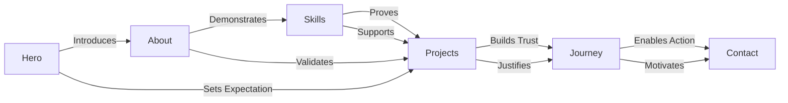

### Content Density

| Section | Content Density | Scan Time | Read Time |
|---------|----------------|-----------|-----------|
| **Hero** | Minimal (5-10 words) | 2 seconds | 5 seconds |
| **About** | Medium (100-200 words) | 10 seconds | 1 minute |
| **Skills** | Low (icons + labels) | 5 seconds | 15 seconds |
| **Projects** | Medium (300-500 words) | 20 seconds | 2 minutes |
| **Journey** | Low (3-5 milestones) | 10 seconds | 30 seconds |
| **Contact** | Minimal (form + links) | 5 seconds | 15 seconds |

## فارسی

### مدل IA: سلسله مراتب تخت

وب‌سایت از **سلسله مراتب تخت** استفاده می‌کند — تمام محتوا در یک صفحه زندگی می‌کند، در بخش‌های سازمان‌دهی شده. این عمدی است:

| انتخاب | دلیل |
|--------|------|
| صفحه تکی | چگالی محتوا را به حداکثر می‌رساند، اصطکاک ناوبری را به حداقل می‌رساند |
| مبتنی بر بخش | هر بخش هدف و مرز واضحی دارد |
| ناوبری Anchor | دسترسی مستقیم به هر بخش بدون بارگذاری صفحه |
| بدون صفحات تو در تو | محتوای V3 ساختار چند صفحه‌ای را توجیه نمی‌کند |

### اصول سازمان‌دهی محتوا

۱. **افشای تدریجی:** مهم‌ترین محتوا اول
۲. **جریان منطقی:** هر بخش به طور طبیعی به بعدی منتهی می‌شود
۳. **بخش‌های مستقل:** هر بخش به تنهایی ایستاده اما به دیگران متصل است
۴. **قابل اسکن:** بازدیدکنندگان می‌توانند در ۳۰ ثانیه اسکن کنند، در ۵ دقیقه بخوانند
۵. **Mobile-First:** سلسله مراتب محتوا در کوچکترین صفحه‌نمایش کار می‌کند

### نقشه استقلال بخش‌ها

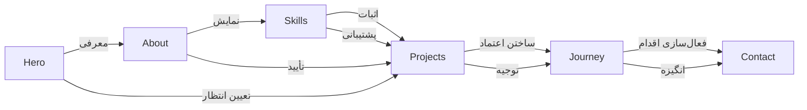

### چگالی محتوا

| بخش | چگالی محتوا | زمان اسکن | زمان خواندن |
|-----|-------------|-----------|-------------|
| **Hero** | حداقل (۵-۱۰ کلمه) | ۲ ثانیه | ۵ ثانیه |
| **About** | متوسط (۱۰۰-۲۰۰ کلمه) | ۱۰ ثانیه | ۱ دقیقه |
| **Skills** | کم (آیکون + برچسب) | ۵ ثانیه | ۱۵ ثانیه |
| **Projects** | متوسط (۳۰۰-۵۰۰ کلمه) | ۲۰ ثانیه | ۲ دقیقه |
| **Journey** | کم (۳-۵ نقطه عطف) | ۱۰ ثانیه | ۳۰ ثانیه |
| **Contact** | حداقل (فرم + لینک) | ۵ ثانیه | ۱۵ ثانیه |

---

# 3. User Flow

## English

### Primary Flow: Visitor → Opportunity

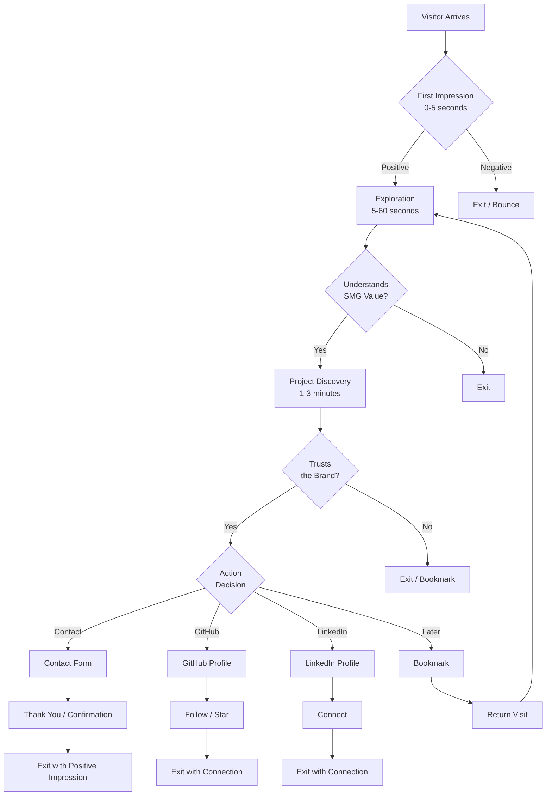

### Flow Metrics

| Step | Duration | Success Rate | Drop-off Rate |
|------|----------|-------------|---------------|
| **Arrival** | 0s | 100% | — |
| **First Impression** | 0-5s | 60-70% stay | 30-40% bounce |
| **Exploration** | 5-60s | 50-60% understand | 10-20% confused |
| **Project Discovery** | 1-3min | 40-50% trust | 10-15% unconvinced |
| **Action** | 3-5min | 5-10% convert | 30-40% exit |

### Conversion Funnel

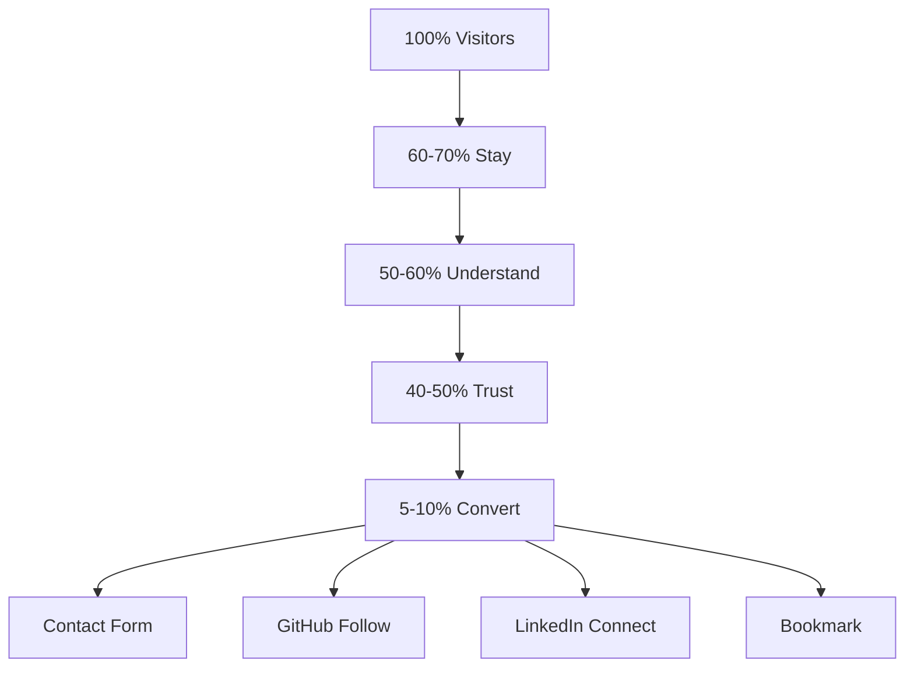

## فارسی

### جریان اصلی: بازدیدکننده → فرصت

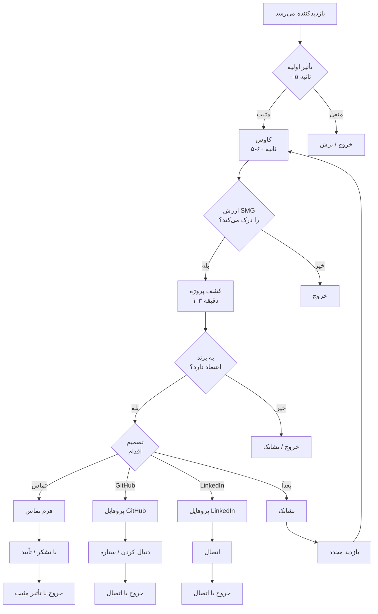

### معیارهای جریان

| مرحله | مدت | نرخ موفقیت | نرخ ریزش |
|-------|------|-----------|----------|
| **ورود** | ۰ ثانیه | ۱۰۰٪ | — |
| **تأثیر اولیه** | ۰-۵ ثانیه | ۶۰-۷۰٪ می‌مانند | ۳۰-۴۰٪ پرش |
| **کاوش** | ۵-۶۰ ثانیه | ۵۰-۶۰٪ درک می‌کنند | ۱۰-۲۰٪ گیج |
| **کشف پروژه** | ۱-۳ دقیقه | ۴۰-۵۰٪ اعتماد می‌کنند | ۱۰-۱۵٪ قانع نشده |
| **اقدام** | ۳-۵ دقیقه | ۵-۱۰٪ تبدیل می‌شوند | ۳۰-۴۰٪ خارج می‌شوند |

### قیف تبدیل

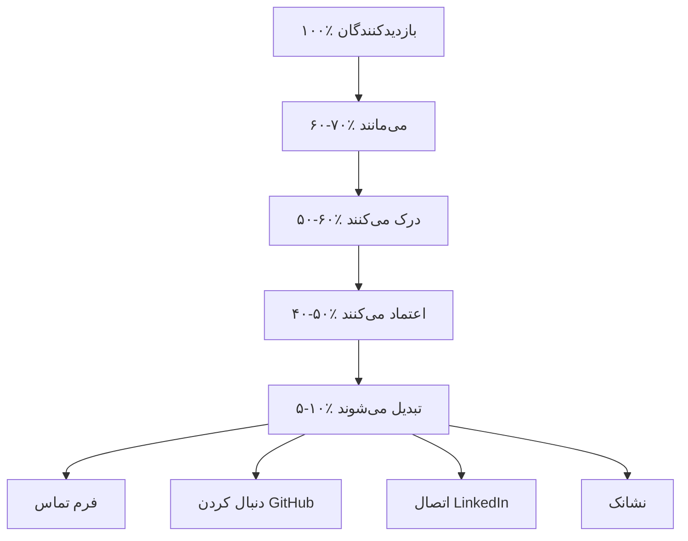

---

# 4. Navigation Flow

## English

### Navigation Model

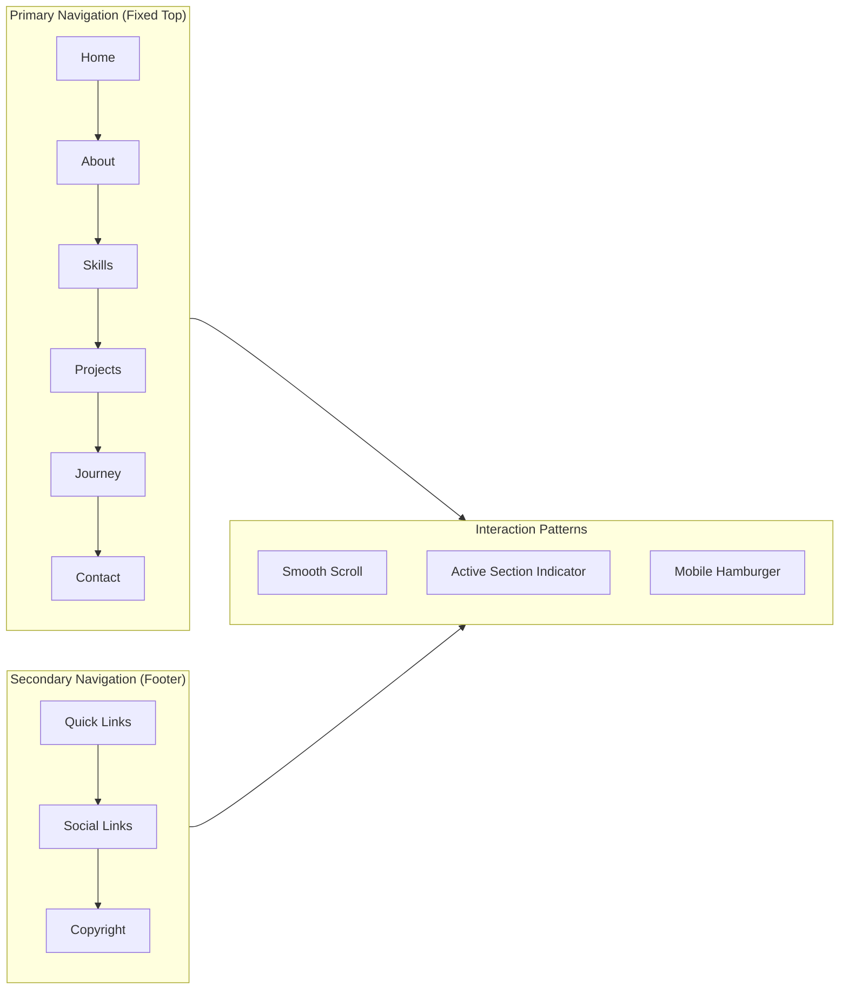

### Navigation States

| State | Behavior | Visual |
|-------|----------|--------|
| **Default** | Transparent background | Text visible on hero |
| **Scrolled** | Glass effect background | Frosted glass appearance |
| **Mobile Closed** | Hamburger icon | Three lines |
| **Mobile Open** | Full-screen overlay | Navigation links centered |
| **Active Section** | Highlighted link | Underline or color change |

### Navigation Timing

| Interaction | Expected Response | Max Acceptable |
|-------------|------------------|----------------|
| **Click link** | Immediate scroll | 500ms |
| **Mobile menu open** | 200ms animation | 300ms |
| **Mobile menu close** | 200ms animation | 300ms |
| **Section highlight** | On scroll enter | 100ms delay |

### Keyboard Navigation

| Key | Action |
|-----|--------|
| **Tab** | Move to next interactive element |
| **Shift+Tab** | Move to previous interactive element |
| **Enter** | Activate focused link |
| **Escape** | Close mobile menu |
| **Arrow Keys** | Navigate within dropdown (future) |

## فارسی

### مدل ناوبری

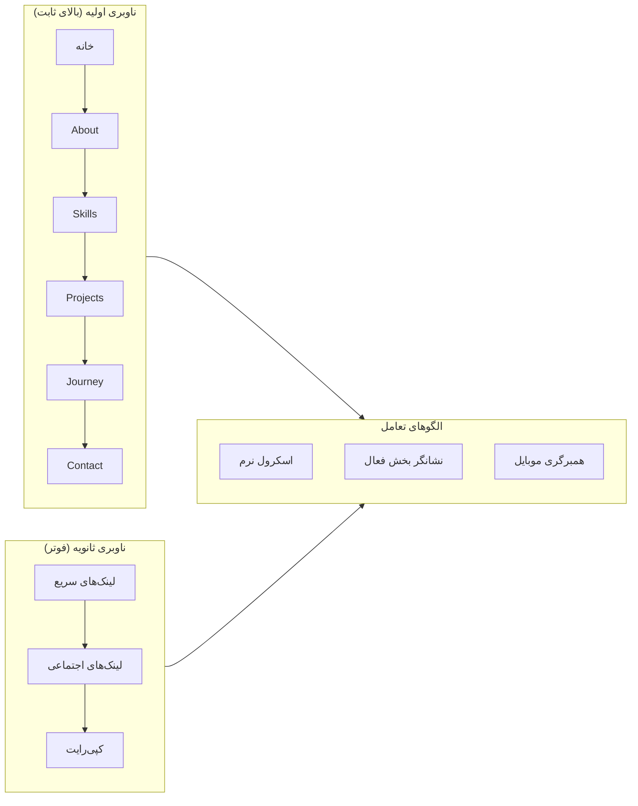

### حالت‌های ناوبری

| حالت | رفتار | بصری |
|------|-------|------|
| **پیش‌فرض** | پس‌زمینه شفاف | متن روی Hero قابل مشاهده |
| **اسکرول شده** | اثر شیشه‌ای | ظاهر شیشه یخ‌زده |
| **موبایل بسته** | آیکون همبرگری | سه خط |
| **موبایل باز** | تمام صفحه overlay | لینک‌های ناوبری مرکز شده |
| **بخش فعال** | لینک هایلایت شده | خط زیر یا تغییر رنگ |

### زمان‌بندی ناوبری

| تعامل | پاسخ مورد انتظار | حداکثر قابل قبول |
|--------|------------------|------------------|
| **کلیک لینک** | اسکرول فوری | ۵۰۰ میلی‌ثانیه |
| **باز شدن منوی موبایل** | انیمیشن ۲۰۰ میلی‌ثانیه | ۳۰۰ میلی‌ثانیه |
| **بسته شدن منوی موبایل** | انیمیشن ۲۰۰ میلی‌ثانیه | ۳۰۰ میلی‌ثانیه |
| **هایلایت بخش** | در ورود اسکرول | ۱۰۰ میلی‌ثانیه تأخیر |

### ناوبری صفحه‌کلید

| کلید | عمل |
|------|------|
| **Tab** | حرکت به عنصر تعاملی بعدی |
| **Shift+Tab** | حرکت به عنصر تعاملی قبلی |
| **Enter** | فعال‌سازی لینک تمرکز شده |
| **Escape** | بستن منوی موبایل |
| **کلیدهای جهت‌نما** | ناوبری درون dropdown (آینده) |

---

# 5. Content Hierarchy

## English

### Hierarchy Model

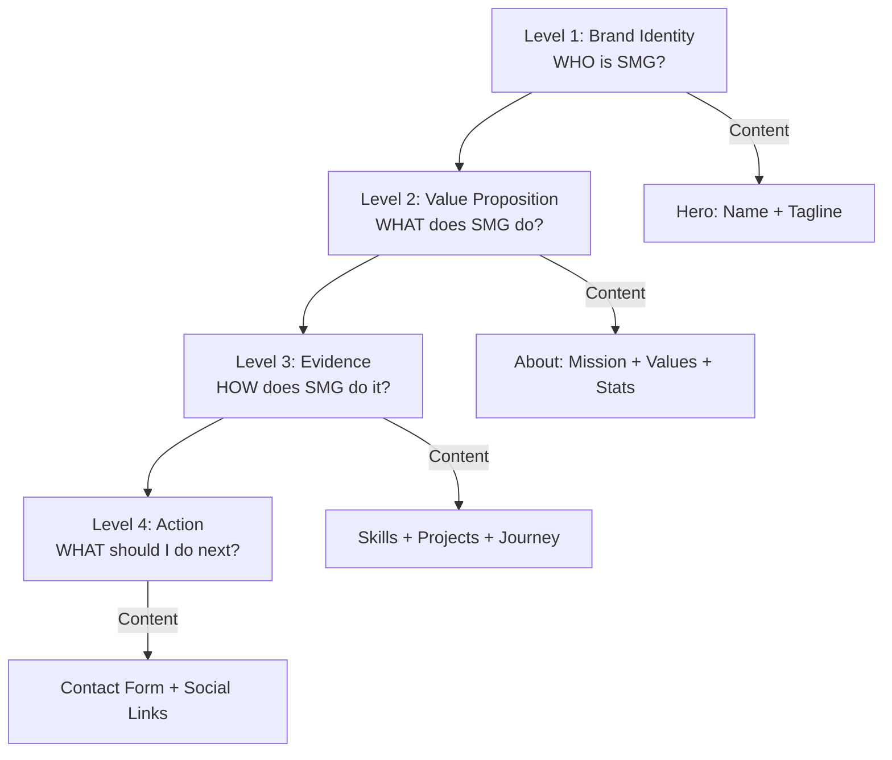

### Content Priority Matrix

| Priority | Content Type | Location | Purpose |
|----------|-------------|----------|---------|
| **P0** | Brand Name | Hero | Identity |
| **P0** | Tagline | Hero | Value Proposition |
| **P0** | Featured Project | Projects | Capability Evidence |
| **P0** | Mission Statement | About | Brand Purpose |
| **P1** | Core Values | About | Brand Personality |
| **P1** | Key Statistics | About | Credibility |
| **P1** | Skills Grid | Skills | Technical Capabilities |
| **P1** | Contact Form | Contact | Conversion |
| **P2** | Project Grid | Projects | Range of Work |
| **P2** | Journey Timeline | Journey | Trust Building |
| **P2** | Social Links | Footer | Connection |
| **P3** | Footer Nav | Footer | Navigation |

### Content Density by Section

| Section | Words | Images | Icons | Interactive |
|---------|-------|--------|-------|-------------|
| **Hero** | 5-10 | 0-1 | 1 | Scroll indicator |
| **About** | 100-200 | 0-1 | 4 | Stats counter |
| **Skills** | 20-40 | 0 | 8-12 | Grid hover |
| **Projects** | 300-500 | 3-5 | 3-5 | Card hover, links |
| **Journey** | 100-150 | 0 | 3 | Timeline animation |
| **Contact** | 20-30 | 0 | 4-6 | Form, links |

## فارسی

### مدل سلسله مراتب

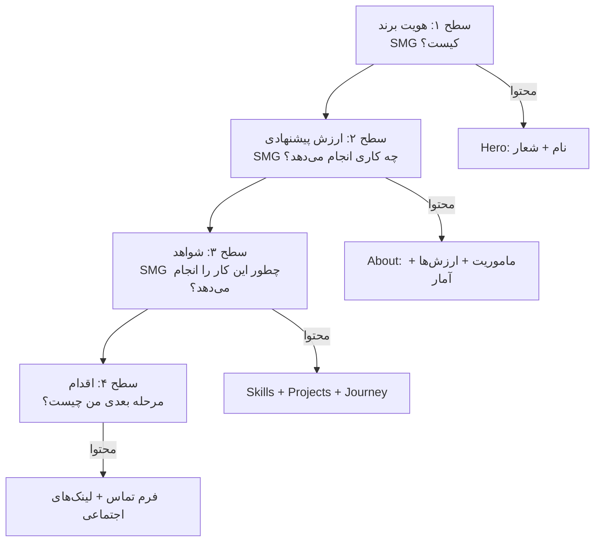

### ماتریس اولویت محتوا

| اولویت | نوع محتوا | مکان | هدف |
|--------|-----------|------|------|
| **P0** | نام برند | Hero | هویت |
| **P0** | شعار | Hero | ارزش پیشنهادی |
| **P0** | پروژه شاخص | Projects | شواهد توانایی |
| **P0** | بیانیه ماموریت | About | هدف برند |
| **P1** | ارزش‌های اصلی | About | شخصیت برند |
| **P1** | آمار کلیدی | About | اعتبار |
| **P1** | شبکه مهارت‌ها | Skills | توانایی‌های فنی |
| **P1** | فرم تماس | Contact | تبدیل |
| **P2** | شبکه پروژه‌ها | Projects | دامنه کار |
| **P2** | جدول زمانی Journey | Journey | ساختن اعتماد |
| **P2** | لینک‌های اجتماعی | Footer | اتصال |
| **P3** | ناوبری فوتر | Footer | ناوبری |

### چگالی محتوا به ازای هر بخش

| بخش | کلمات | تصاویر | آیکون‌ها | تعاملی |
|-----|-------|--------|----------|--------|
| **Hero** | ۵-۱۰ | ۰-۱ | ۱ | نشانگر اسکرول |
| **About** | ۱۰۰-۲۰۰ | ۰-۱ | ۴ | شمارنده آمار |
| **Skills** | ۲۰-۴۰ | ۰ | ۸-۱۲ | Hover شبکه |
| **Projects** | ۳۰۰-۵۰۰ | ۳-۵ | ۳-۵ | Hover کارت، لینک‌ها |
| **Journey** | ۱۰۰-۱۵۰ | ۰ | ۳ | انیمیشن جدول زمانی |
| **Contact** | ۲۰-۳۰ | ۰ | ۴-۶ | فرم، لینک‌ها |

---

# 6. Feature Hierarchy

## English

### Feature Map

```mermaid
graph TD
    CORE[Core Features] --> NAV[Navigation]
    CORE --> HERO_F[Hero Section]
    CORE --> ABOUT_F[About Section]
    CORE --> SKILLS_F[Skills Section]
    CORE --> PROJECTS_F[Projects Section]
    CORE --> JOURNEY_F[Journey Section]
    CORE --> CONTACT_F[Contact Section]
    CORE --> FOOTER_F[Footer]
    
    NAV --> NAV_FIXED[Fixed Top Bar]
    NAV --> NAV_SMOOTH[Smooth Scroll]
    NAV --> NAV_ACTIVE[Active Indicator]
    NAV --> NAV_MOBILE[Mobile Menu]
    
    HERO_F --> HERO_NAME[Brand Name]
    HERO_F --> HERO_TAG[Tagline]
    HERO_F --> HERO_BG[Background Animation]
    HERO_F --> HERO_SCROLL[Scroll Indicator]
    
    ABOUT_F --> ABOUT_MISS[Mission]
    ABOUT_F --> ABOUT_VAL[Values]
    ABOUT_F --> ABOUT_STAT[Statistics]
    
    SKILLS_F --> SKILLS_CAT[Categories]
    SKILLS_F --> SKILLS_GRID[Grid Layout]
    
    PROJECTS_F --> PROJ_FEAT[Featured Project]
    PROJECTS_F --> PROJ_GRID[Project Grid]
    PROJECTS_F --> PROJ_CARD[Project Cards]
    
    JOURNEY_F --> JOURNEY_TL[Timeline]
    JOURNEY_F --> JOURNEY_MS[Milestones]
    
    CONTACT_F --> CONTACT_FORM[Form]
    CONTACT_F --> CONTACT_SOCIAL[Social Links]
    
    FOOTER_F --> FOOT_NAV[Quick Links]
    FOOTER_F --> FOOT_SOCIAL[Social Links]
    FOOTER_F --> FOOT_COPY[Copyright]
```

### Feature Priority

| Priority | Feature | Rationale |
|----------|---------|-----------|
| **P0** | Navigation | Core usability |
| **P0** | Hero | First impression |
| **P0** | Projects | Capability evidence |
| **P0** | About | Brand identity |
| **P0** | Dark Theme | Brand consistency |
| **P0** | Responsive | Mobile accessibility |
| **P1** | Skills | Technical showcase |
| **P1** | Contact | Conversion |
| **P2** | Journey | Trust building |
| **P2** | Footer | Navigation + Legal |
| **P3** | Animations | Polish (not essential) |

### Feature Dependencies

| Feature | Depends On | Blocks |
|---------|-----------|--------|
| Navigation | Layout | All sections |
| Hero | Layout | About, Skills |
| About | Hero | Projects |
| Skills | About | Projects |
| Projects | Skills | Journey |
| Journey | Projects | Contact |
| Contact | Journey | Footer |
| Footer | Contact | — |

## فارسی

### نقشه ویژگی‌ها

```mermaid
graph TD
    CORE[ویژگی‌های هسته] --> NAV[ناوبری]
    CORE --> HERO_F[بخش Hero]
    CORE --> ABOUT_F[بخش About]
    CORE --> SKILLS_F[بخش Skills]
    CORE --> PROJECTS_F[بخش Projects]
    CORE --> JOURNEY_F[بخش Journey]
    CORE --> CONTACT_F[بخش Contact]
    CORE --> FOOTER_F[فوتر]
    
    NAV --> NAV_FIXED[نوار بالای ثابت]
    NAV --> NAV_SMOOTH[اسکرول نرم]
    NAV --> NAV_ACTIVE[نشانگر فعال]
    NAV --> NAV_MOBILE[منوی موبایل]
    
    HERO_F --> HERO_NAME[نام برند]
    HERO_F --> HERO_TAG[شعار]
    HERO_F --> HERO_BG[انیمیشن پس‌زمینه]
    HERO_F --> HERO_SCROLL[نشانگر اسکرول]
    
    ABOUT_F --> ABOUT_MISS[ماموریت]
    ABOUT_F --> ABOUT_VAL[ارزش‌ها]
    ABOUT_F --> ABOUT_STAT[آمار]
    
    SKILLS_F --> SKILLS_CAT[دسته‌بندی‌ها]
    SKILLS_F --> SKILLS_GRID[طرح شبکه]
    
    PROJECTS_F --> PROJ_FEAT[پروژه شاخص]
    PROJECTS_F --> PROJ_GRID[شبکه پروژه‌ها]
    PROJECTS_F --> PROJ_CARD[کارت‌های پروژه]
    
    JOURNEY_F --> JOURNEY_TL[جدول زمانی]
    JOURNEY_F --> JOURNEY_MS[نقاط عطف]
    
    CONTACT_F --> CONTACT_FORM[فرم]
    CONTACT_F --> CONTACT_SOCIAL[لینک‌های اجتماعی]
    
    FOOTER_F --> FOOT_NAV[لینک‌های سریع]
    FOOTER_F --> FOOT_SOCIAL[لینک‌های اجتماعی]
    FOOTER_F --> FOOT_COPY[کپی‌رایت]
```

### اولویت ویژگی‌ها

| اولویت | ویژگی | دلیل |
|--------|-------|------|
| **P0** | ناوبری | قابلیت استفاده هسته |
| **P0** | Hero | تأثیر اولیه |
| **P0** | پروژه‌ها | شواهد توانایی |
| **P0** | About | هویت برند |
| **P0** | تم تاریک | یکپارچگی برند |
| **P0** | واکنش‌گرا | دسترسی موبایل |
| **P1** | مهارت‌ها | نمایش فنی |
| **P1** | تماس | تبدیل |
| **P2** | Journey | ساختن اعتماد |
| **P2** | فوتر | ناوبری + قانونی |
| **P3** | انیمیشن‌ها | صیقل (غیرضروری) |

### وابستگی‌های ویژگی

| ویژگی | وابسته به | بلاک می‌کند |
|-------|-----------|------------|
| ناوبری | Layout | تمام بخش‌ها |
| Hero | Layout | About, Skills |
| About | Hero | Projects |
| Skills | About | Projects |
| Projects | Skills | Journey |
| Journey | Projects | Contact |
| Contact | Journey | Footer |
| Footer | Contact | — |

---

# Appendix: Architecture Decision Log

| Date | Decision | Rationale | Alternatives |
|------|----------|-----------|--------------|
| 2026-08-06 | Single page architecture | Simplicity, performance, SEO for portfolio | Multi-page (overkill) |
| 2026-08-06 | Section-based organization | Clear boundaries, easy navigation | Free-form (confusing) |
| 2026-08-06 | Flat hierarchy | Content doesn't warrant nesting | Deep hierarchy (unnecessary) |
| 2026-08-06 | Anchor navigation | Fast, no page loads | Router-based (heavier) |
| 2026-08-06 | Progressive disclosure | Most important content first | Reverse chronology (blog-style) |
| 2026-08-06 | P0 features first | Core experience before polish | All features at once (chaos) |

---

**Document Version:** 3.0
**Last Updated:** 2026-08-06
**Author:** SMG / Saman Qasempour
**Status:** Active — Architecture Document
**Depends On:** PRD.md, PRODUCT_STRATEGY.md
