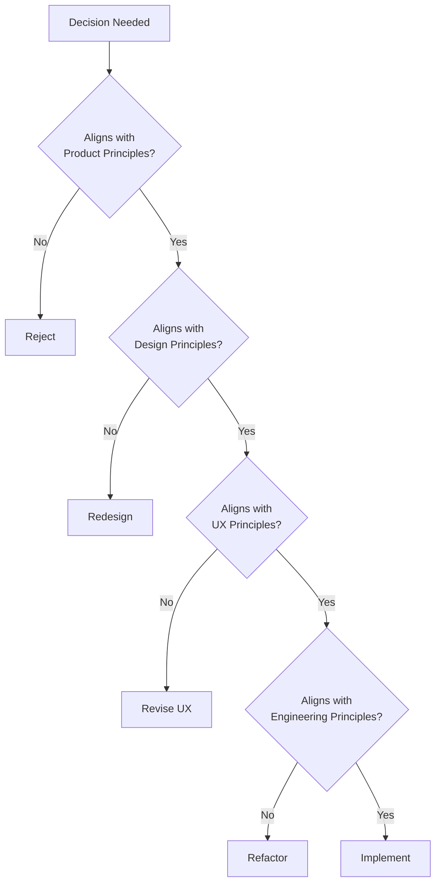
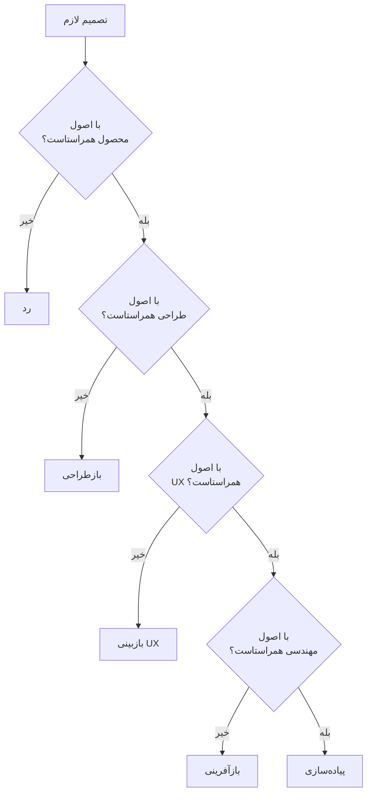

# SMG Portfolio V3 — Product Rules

| Field | Value |
|-------|-------|
| **Document** | Product Rules |
| **Version** | 3.0 |
| **Owner** | Saman Qasempour |
| **Brand** | SMG |
| **Website** | samansmg.ir |
| **Status** | Active |
| **Last Updated** | 2026-08-06 |
| **Depends On** | PRD.md, PRODUCT_STRATEGY.md, PRODUCT_ARCHITECTURE.md |

---

## Table of Contents

- [1. Project Rules](#1-project-rules)
- [2. Design Principles](#2-design-principles)
- [3. UX Principles](#3-ux-principles)
- [4. Engineering Principles](#4-engineering-principles)
- [5. Naming Rules](#5-naming-rules)
- [6. Decision Rules](#6-decision-rules)
- [7. Acceptance Criteria](#7-acceptance-criteria)
- [8. Do & Don't](#8-do--dont)

---

# 1. Project Rules

## English

### Rule 1: Document-Driven Development

> **Every feature starts with a document, not code.**

Before writing any code, the feature must be:
1. Defined in a specification document
2. Reviewed against product principles
3. Approved by the decision framework

**Why:** Documents force clarity. Code without clarity is technical debt.

### Rule 2: Phase-Based Execution

> **Complete each phase before starting the next.**

| Phase | Must Complete Before |
|-------|---------------------|
| PRD | Strategy, Architecture |
| Strategy | Architecture, Rules |
| Architecture | Components, Content |
| Components | Implementation |
| Content | Implementation |
| Implementation | Testing |
| Testing | Deployment |

**Why:** Dependencies exist. Skipping phases creates rework.

### Rule 3: Quality Over Speed

> **Never ship something you wouldn't show on your homepage.**

Every commit, every component, every pixel must meet the quality bar.

**Why:** The website IS the product. Quality is non-negotiable.

### Rule 4: Single Source of Truth

> **This document set is the single source of truth.**

If it's not in these documents, it doesn't exist. If it contradicts these documents, these documents win.

**Why:** Ambiguity creates bugs. Documents eliminate ambiguity.

### Rule 5: No Feature Without Purpose

> **Every feature must answer: "Why does this exist?"**

If you can't articulate the purpose, the feature doesn't belong.

**Why:** Features without purpose are clutter. Clutter kills brands.

## فارسی

### قانون ۱: توسعه مبتنی بر مستندات

> **هر ویژگی با مستند شروع می‌شود، نه کد.**

قبل از نوشتن هر کدی، ویژگی باید:
۱. در سند مشخصات تعریف شده باشد
۲. در برابر اصول محصول بازبینی شده باشد
۳. توسط چارچوب تصمیم‌گیری تأیید شده باشد

**چرا:** مستندات وضوح را مجبور می‌کنند. کد بدون وضوح بدهی فنی است.

### قانون ۲: اجرای مبتنی بر فاز

> **هر فاز را قبل از شروع فاز بعدی کامل کن.**

| فاز | باید قبل از این کامل شود |
|-----|-------------------------|
| PRD | استراتژی، معماری |
| استراتژی | معماری، قوانین |
| معماری | کامپوننت‌ها، محتوا |
| کامپوننت‌ها | پیاده‌سازی |
| محتوا | پیاده‌سازی |
| پیاده‌سازی | تست |
| تست | استقرار |

**چرا:** وابستگی‌ها وجود دارند. رد کردن فازها بازآفرینی ایجاد می‌کند.

### قانون ۳: کیفیت بر سرعت

> **هرگز چیزی را ارسال نکن که در صفحه اصلی‌ات نشان نمی‌دهی.**

هر کامیت، هر کامپوننت، هر پیکسل باید استاندارد کیفیت را برآورده کند.

**چرا:** وب‌سایت خودش محصول است. کیفیت غیرقابل مذاکره است.

### قانون ۴: منبع واحد حقیقت

> **این مجموعه مستندات، منبع واحد حقیقت است.**

اگر در این مستندات نیست، وجود ندارد. اگر با این مستندات تناقض دارد، این مستندات برنده می‌شوند.

**چرا:** ابهام باگ ایجاد می‌کند. مستندات ابهام را از بین می‌برند.

### قانون ۵: بدون ویژگی بدون هدف

> **هر ویژگی باید به این سوال پاسخ دهد: "چرا این وجود دارد؟"**

اگر نمی‌توانی هدف را بیان کنی، ویژگی جایی ندارد.

**چرا:** ویژگی‌های بدون هدف شلوغی هستند. شلوغی برندها را می‌کشد.

---

# 2. Design Principles

## English

### Principle 1: Minimalism Is Not Empty

> Minimalism is not the absence of design. It is the presence of purpose.

Every element must earn its place. If it doesn't contribute, remove it.

### Principle 2: Consistency Over Novelty

> Consistent patterns beat novel interactions.

Users should never have to relearn how to interact with the site.

### Principle 3: Visual Hierarchy Guides Attention

> The most important element should be the most visually prominent.

Use size, color, contrast, and spacing to guide the eye.

### Principle 4: White Space Is a Feature

> White space is not wasted space. It is breathing room.

Give content room to breathe. Don't fill every pixel.

### Principle 5: Typography Is the Interface

> 90% of web design is typography.

Choose typefaces carefully. Establish clear hierarchy. Maintain readability.

### Design Rules

| Rule | Standard | Rationale |
|------|----------|-----------|
| **Max font sizes** | H1: 48-72px, H2: 32-40px, H3: 24-28px | Readable hierarchy |
| **Min font size** | 16px body, 14px small | Mobile readability |
| **Line height** | 1.5-1.7 for body text | Comfortable reading |
| **Max content width** | 1200px | Prevents eye strain |
| **Section padding** | 80-120px vertical | Breathing room |
| **Component spacing** | 16/24/32/48px grid | Consistent rhythm |
| **Border radius** | 8-16px for cards | Modern, soft feel |
| **Shadows** | Subtle, layered | Depth without heaviness |

## فارسی

### اصل ۱: مینیمالیسم خالی نیست

> مینیمالیسم فقدان طراحی نیست. حضور هدف است.

هر عنصر باید جای خود را کسب کند. اگر کمک نمی‌کند، حذفش کن.

### اصل ۲: یکپارچگی بر نوآوری

> الگوهای یکپارچه به تعاملات نوآورانه ارجحیت دارند.

کاربران نباید هرگز مجبور باشند نحوه تعامل با سایت را دوباره یاد بگیرند.

### اصل ۳: سلسله مراتب بصری توجه را هدایت می‌کند

> مهم‌ترین عنصر باید برجسته‌ترین عنصر بصری باشد.

از اندازه، رنگ، کنتراست و فاصله برای هدایت چشم استفاده کن.

### اصل ۴: فضای سفید یک ویژگی است

> فضای سفید فضای هدر رفته نیست. فضای تنفس است.

به محتوا فضای تنفس بده. هر پیکسل را پر نکن.

### اصل ۵: تایپوگرافی رابط کاربری است

> ۹۰٪ طراحی وب تایپوگرافی است.

فونت‌ها را با دقت انتخاب کن. سلسله مراتب واضح ایجاد کن. خوانایی را حفظ کن.

### قوانین طراحی

| قانون | استاندارد | دلیل |
|-------|----------|------|
| **حداکثر اندازه فونت** | H1: ۴۸-۷۲px, H2: ۳۲-۴۰px, H3: ۲۴-۲۸px | سلسله مراتب خوانا |
| **حداقل اندازه فونت** | ۱۶px بدنه، ۱۴px کوچک | خوانایی موبایل |
| **ارتفاع خط** | ۱.۵-۱.۷ برای متن بدنه | خواندن راحت |
| **حداکثر عرض محتوا** | ۱۲۰۰px | جلوگیری از خستگی چشم |
| **پدینگ بخش** | ۸۰-۱۲۰px عمودی | فضای تنفس |
| **فاصله کامپوننت** | ۱۶/۲۴/۳۲/۴۸px grid | ریتم یکپارچه |
| **شعاع حاشیه** | ۸-۱۶px برای کارت‌ها | حس مدرن، نرم |
| **سایه‌ها** | ظریف، لایه‌ای | عمق بدون سنگینی |

---

# 3. UX Principles

## English

### Principle 1: Don't Make Me Think

> Every page should be self-explanatory.

If a visitor needs instructions, the design has failed.

### Principle 2: Progressive Disclosure

> Show the most important information first.

Don't overwhelm visitors. Reveal complexity gradually.

### Principle 3: Consistent Patterns

> Similar things should look and behave similarly.

Consistency reduces cognitive load.

### Principle 4: Feedback Every Action

> Every user action should produce a visible result.

Clicks, hovers, form submissions — all need feedback.

### Principle 5: Forgiving Design

> Mistakes should be easy to recover from.

Form validation should be helpful, not punishing.

### UX Rules

| Rule | Standard | Rationale |
|------|----------|-----------|
| **Click targets** | Minimum 44x44px | Mobile touch |
| **Form validation** | Inline, real-time | Immediate feedback |
| **Loading states** | Show for >300ms | Perceived performance |
| **Error messages** | Helpful, specific | User guidance |
| **Hover states** | All interactive elements | Affordance |
| **Focus indicators** | Visible on all focusable | Accessibility |
| **Scroll behavior** | Smooth, not instant | Comfortable navigation |
| **Mobile gestures** | Standard (tap, swipe) | Familiarity |

## فارسی

### اصل ۱: مجبورم نکن فکر کنم

> هر صفحه باید خودتوضیحی باشد.

اگر بازدیدکننده به دستورالعمل نیاز دارد، طراحی شکست خورده است.

### اصل ۲: افشای تدریجی

> مهم‌ترین اطلاعات را اول نشان بده.

بازدیدکنندگان را تحت تأثیر قرار نده. پیچیدگی را به تدریج آشکار کن.

### اصل ۳: الگوهای یکپارچه

> چیزهای مشابه باید مشابه به نظر برسند و رفتار کنند.

یکپارچگی بار شناختی را کاهش می‌دهد.

### اصل ۴: بازخورد هر عمل

> هر عمل کاربر باید نتیجه قابل مشاهده تولید کند.

کلیک‌ها، hoverها، ارسال‌های فرم — همه به بازخورد نیاز دارند.

### اصل ۵: طراحی بخشنده

> اشتباهات باید به راحتی قابل بازیابی باشند.

اعتبارسنجی فرم باید مفید باشد، نه مجازات‌گر.

### قوانین UX

| قانون | استاندارد | دلیل |
|-------|----------|------|
| **اهداف کلیک** | حداقل ۴۴x۴۴px | لمس موبایل |
| **اعتبارسنجی فرم** | Inline، بلادرنگ | بازخورد فوری |
| **حالت‌های بارگذاری** | برای >۳۰۰ms نمایش بده | عملکرد ادراکی |
| **پیام‌های خطا** | مفید، خاص | راهنمای کاربر |
| **حالت‌های Hover** | تمام عناصر تعاملی | قابلیت استفاده |
| **نشانگرهای تمرکز** | روی تمام قابل تمرکزها قابل مشاهده | دسترسی‌پذیری |
| **رفتار اسکرول** | نرم، نه آنی | ناوبری راحت |
| **حرکات موبایل** | استاندارد (tap, swipe) | آشنایی |

---

# 4. Engineering Principles

## English

### Principle 1: TypeScript Strict Mode Always

> No `any` types. No exceptions.

TypeScript strict mode catches bugs at compile time, not runtime.

### Principle 2: Components Are Single Responsibility

> One component, one job.

If a component does two things, split it.

### Principle 3: No Duplicated Logic

> Extract to utils, don't copy-paste.

DRY (Don't Repeat Yourself) is non-negotiable.

### Principle 4: Performance Is a Feature

> Every kilobyte matters. Every millisecond counts.

Optimize aggressively. Lazy load. Code split.

### Principle 5: Accessibility Is Not Optional

> WCAG AA compliance is mandatory.

Every interactive element must be keyboard accessible with proper ARIA labels.

### Engineering Rules

| Rule | Standard | Rationale |
|------|----------|-----------|
| **TypeScript** | Strict mode | Type safety |
| **Imports** | Use `@/` alias | Clean imports |
| **Components** | Functional only | Modern React |
| **Styling** | Tailwind CSS only | Consistency |
| **State** | Minimal, local | Simplicity |
| **Side effects** | `useEffect` with deps | Correctness |
| **Error handling** | Graceful degradation | Reliability |
| **Testing** | Critical paths | Quality assurance |
| **Git** | Conventional commits | Clear history |
| **Linting** | ESLint + Prettier | Code quality |

### Component Rules

| Rule | Standard |
|------|----------|
| **File naming** | PascalCase (`Button.tsx`) |
| **Export** | Named export (`export function Button`) |
| **Props** | TypeScript interface |
| **Default props** | Avoid, use optional props |
| **Children** | Use `React.ReactNode` |
| **Events** | `onClick`, `onSubmit` naming |
| **Accessibility** | `aria-label` on all interactive |
| **Animation** | `viewport={{ once: true }}` |
| **Responsiveness** | Mobile-first breakpoints |

## فارسی

### اصل ۱: TypeScript حالت سخت‌گیرانه همیشه

> بدون نوع `any`. بدون استثنا.

TypeScript حالت سخت‌گیرانه باگ‌ها را در زمان کامپایل شکار می‌کند، نه زمان اجرا.

### اصل ۲: کامپوننت‌ها مسئولیت واحد دارند

> یک کامپوننت، یک کار.

اگر کامپوننت دو کار انجام می‌دهد، آن را تقسیم کن.

### اصل ۳: بدون منطق تکراری

> به utils استخراج کن، کپی-پیست نکن.

DRY (خودت را تکرار نکن) غیرقابل مذاکره است.

### اصل ۴: عملکرد یک ویژگی است

> هر کیلوبایت مهم است. هر میلی‌ثانیه شمرده می‌شود.

بهینه‌سازی تهاجمی. بارگذاری تنبل. تقسیم کد.

### اصل ۵: دسترسی‌پذیری اختیاری نیست

> انطباق WCAG AA اجباری است.

هر عنصر تعاملی باید از صفحه‌کلید قابل دسترسی باشد با برچسب‌های ARIA مناسب.

### قوانین مهندسی

| قانون | استاندارد | دلیل |
|-------|----------|------|
| **TypeScript** | حالت سخت‌گیرانه | ایمنی نوع |
| **واردات** | استفاده از alias `@/` | واردات تمیز |
| **کامپوننت‌ها** | فقط تابعی | React مدرن |
| **استایل** | فقط Tailwind CSS | یکپارچگی |
| **وضعیت** | حداقل، محلی | سادگی |
| **عوارض جانبی** | `useEffect` با deps | صحت |
| **مدیریت خطا** | تخریب محترمانه | قابلیت اطمینان |
| **تست** | مسیرهای حیاتی | تضمین کیفیت |
| **Git** | کمیت‌های متعارف | تاریخ واضح |
| **Linting** | ESLint + Prettier | کیفیت کد |

### قوانین کامپوننت

| قانون | استاندارد |
|-------|----------|
| **نام‌گذاری فایل** | PascalCase (`Button.tsx`) |
| **خروجی** | خروجی نام‌گذاری شده (`export function Button`) |
| **Props** | interface TypeScript |
| **پیش‌فرض props** | اجتناب، استفاده از props اختیاری |
| **Children** | استفاده از `React.ReactNode` |
| **رویدادها** | نام‌گذاری `onClick`, `onSubmit` |
| **دسترسی‌پذیری** | `aria-label` روی تمام تعاملی‌ها |
| **انیمیشن** | `viewport={{ once: true }}` |
| **واکنش‌گرایی** | Breakpoint‌های Mobile-first |

---

# 5. Naming Rules

## English

### File Naming

| Type | Convention | Example |
|------|-----------|---------|
| **Components** | PascalCase | `Button.tsx`, `GlassCard.tsx` |
| **Pages** | lowercase | `page.tsx`, `layout.tsx` |
| **Utilities** | camelCase | `cn.ts`, `formatDate.ts` |
| **Constants** | UPPER_SNAKE | `SITE_CONFIG.ts` |
| **Types** | PascalCase | `Project.ts`, `NavItem.ts` |
| **Styles** | camelCase | `globals.css` |

### Variable Naming

| Type | Convention | Example |
|------|-----------|---------|
| **Components** | PascalCase | `const Navbar = () => {}` |
| **Functions** | camelCase | `const scrollTo = () => {}` |
| **Constants** | UPPER_SNAKE | `const SITE_CONFIG = {}` |
| **Types** | PascalCase | `type Project = {}` |
| **Interfaces** | PascalCase | `interface NavItem {}` |
| **Booleans** | is/has/can prefix | `isVisible`, `hasError` |
| **Events** | on prefix | `onClick`, `onSubmit` |

### CSS Class Naming

| Type | Convention | Example |
|------|-----------|---------|
| **Tailwind utilities** | As-is | `flex`, `items-center` |
| **Custom classes** | camelCase | `glassCard`, `gradientText` |
| **BEM (if used)** | block__element--modifier | `card__title--featured` |

### Component Naming

| Rule | Standard |
|------|----------|
| **One component per file** | `Button.tsx` exports `Button` |
| **Descriptive names** | `ProjectCard`, not `Card2` |
| **No abbreviations** | `Navigation`, not `Nav` (in component names) |
| **Consistent suffixes** | `Card`, `Button`, `Section`, `Page` |

## فارسی

### نام‌گذاری فایل

| نوع | قرارداد | مثال |
|-----|---------|------|
| **کامپوننت‌ها** | PascalCase | `Button.tsx`, `GlassCard.tsx` |
| **صفحات** | lowercase | `page.tsx`, `layout.tsx` |
| **ابزارها** | camelCase | `cn.ts`, `formatDate.ts` |
| **ثابت‌ها** | UPPER_SNAKE | `SITE_CONFIG.ts` |
| **انواع** | PascalCase | `Project.ts`, `NavItem.ts` |
| **استایل‌ها** | camelCase | `globals.css` |

### نام‌گذاری متغیر

| نوع | قرارداد | مثال |
|-----|---------|------|
| **کامپوننت‌ها** | PascalCase | `const Navbar = () => {}` |
| **توابع** | camelCase | `const scrollTo = () => {}` |
| **ثابت‌ها** | UPPER_SNAKE | `const SITE_CONFIG = {}` |
| **انواع** | PascalCase | `type Project = {}` |
| **interface‌ها** | PascalCase | `interface NavItem {}` |
| **布尔ین‌ها** | پیشوند is/has/can | `isVisible`, `hasError` |
| **رویدادها** | پیشوند on | `onClick`, `onSubmit` |

### نام‌گذاری کلاس CSS

| نوع | قرارداد | مثال |
|-----|---------|------|
| **ابزارهای Tailwind** | همانطور که هست | `flex`, `items-center` |
| **کلاس‌های سفارشی** | camelCase | `glassCard`, `gradientText` |
| **BEM (در صورت استفاده)** | block__element--modifier | `card__title--featured` |

### نام‌گذاری کامپوننت

| قانون | استاندارد |
|-------|----------|
| **یک کامپوننت در هر فایل** | `Button.tsx` خروجی `Button` |
| **نام‌های توصیفی** | `ProjectCard`, نه `Card2` |
| **بدون اختصارات** | `Navigation`, نه `Nav` (در نام‌های کامپوننت) |
| **پسوندهای یکپارچه** | `Card`, `Button`, `Section`, `Page` |

---

# 6. Decision Rules

## English

### Decision Framework

When facing a decision, follow this hierarchy:

### Priority Resolution

When principles conflict, use this priority:

| Priority | Principle | Wins Over |
|----------|----------|-----------|
| 1 | Accessibility | Everything |
| 2 | Performance | Visual effects |
| 3 | User needs | Business wants |
| 4 | Consistency | Novelty |
| 5 | Simplicity | Complexity |

### Trade-off Rules

| Situation | Choose | Reject |
|-----------|--------|--------|
| **Animation vs Performance** | Performance | Heavy animations |
| **Feature vs Simplicity** | Simplicity | Unnecessary features |
| **Custom vs Library** | Library (if proven) | Custom (unless needed) |
| **Speed vs Quality** | Quality | Rushed implementation |
| **Scope vs Time** | Scope reduction | Quality reduction |

## فارسی

### چارچوب تصمیم‌گیری

هنگام مواجهه با یک تصمیم، این سلسله مراتب را دنبال کن:

### حل تعارض اولویت

وقتی اصول با هم تعارض دارند، این اولویت را استفاده کن:

| اولویت | اصل | برنده می‌شود بر |
|--------|------|----------------|
| ۱ | دسترسی‌پذیری | همه چیز |
| ۲ | عملکرد | جلوه‌های بصری |
| ۳ | نیازهای کاربر | خواسته‌های تجاری |
| ۴ | یکپارچگی | نوآوری |
| ۵ | سادگی | پیچیدگی |

### قوانین مصالحه

| موقعیت | انتخاب کن | رد کن |
|--------|-----------|-------|
| **انیمیشن در مقابل عملکرد** | عملکرد | انیمیشن‌های سنگین |
| **ویژگی در مقابل سادگی** | سادگی | ویژگی‌های غیرضروری |
| **سفارشی در مقابل کتابخانه** | کتابخانه (اگر اثبات شده) | سفارشی (مگر اینکه لازم باشد) |
| **سرعت در مقابل کیفیت** | کیفیت | پیاده‌سازی عجولانه |
| **دامنه در مقابل زمان** | کاهش دامنه | کاهش کیفیت |

---

# 7. Acceptance Criteria

## English

### Universal Acceptance Criteria

Every feature must meet ALL of these:

| # | Criterion | How to Verify |
|---|-----------|---------------|
| 1 | **Accessible** | Keyboard navigation, ARIA labels, screen reader test |
| 2 | **Responsive** | Works on 320px to 1920px viewport |
| 3 | **Performant** | Lighthouse score > 95 |
| 4 | **Consistent** | Matches design system tokens |
| 5 | **Typed** | Full TypeScript coverage, no `any` |
| 6 | **Tested** | Critical paths tested |
| 7 | **Documented** | Props documented, decisions logged |
| 8 | **Semantic** | Uses proper HTML elements |
| 9 | **Internationalized** | Supports bilingual content |
| 10 | **Maintainable** | Single responsibility, no duplication |

### Section-Specific Criteria

#### Hero Section

- [ ] Loads within 1 second
- [ ] Brand name visible immediately
- [ ] Tagline readable on all devices
- [ ] Scroll indicator visible
- [ ] Animations don't affect performance
- [ ] Works without JavaScript

#### About Section

- [ ] Mission statement prominent
- [ ] Values clearly presented
- [ ] Statistics visible
- [ ] Content readable on mobile
- [ ] Section flows from Hero

#### Projects Section

- [ ] Featured project visually distinct
- [ ] Project cards consistent
- [ ] Tags visible
- [ ] Links work correctly
- [ ] Grid responsive
- [ ] Status indicators clear

#### Contact Section

- [ ] Form validates all fields
- [ ] Email format validated
- [ ] Social links open in new tab
- [ ] Form usable on mobile
- [ ] ARIA labels present
- [ ] Keyboard navigation works

## فارسی

### معیارهای پذیرش جهانی

هر ویژگی باید ALL اینها را برآورده کند:

| # | معیار | چطور تأیید کنیم |
|---|-------|-----------------|
| ۱ | **قابل دسترسی** | ناوبری صفحه‌کلید، برچسب‌های ARIA، تست خواننده صفحه‌نمایش |
| ۲ | **واکنش‌گرا** | از ۳۲۰px تا ۱۹۲۰px viewport کار می‌کند |
| ۳ | **عملکردی** | امتیاز Lighthouse > ۹۵ |
| ۴ | **یکپارچه** | با توکن‌های سیستم طراحی مطابقت دارد |
| ۵ | **تایپ شده** | پوشش TypeScript کامل، بدون `any` |
| ۶ | **تست شده** | مسیرهای حیاتی تست شده |
| ۷ | **مستند شده** | Props مستند شده، تصمیمات ثبت شده |
| ۸ | **معنایی** | از عناصر HTML مناسب استفاده می‌کند |
| ۹ | **بین‌المللی شده** | از محتوای دوزبانه پشتیبانی می‌کند |
| ۱۰ | **نگهداری‌پذیر** | مسئولیت واحد، بدون تکرار |

### معیارهای خاص هر بخش

#### بخش Hero

- [ ] ظرف ۱ ثانیه بارگذاری می‌شود
- [ ] نام برند فوراً قابل مشاهده است
- [ ] شعار در تمام دستگاه‌ها خوانا است
- [ ] نشانگر اسکرول قابل مشاهده است
- [ ] انیمیشن‌ها بر عملکرد تأثیر نمی‌گذارند
- [ ] بدون JavaScript کار می‌کند

#### بخش About

- [ ] بیانیه ماموریت برجسته است
- [ ] ارزش‌ها به وضوح ارائه شده‌اند
- [ ] آمار قابل مشاهده است
- [ ] محتوا در موبایل خوانا است
- [ ] بخش از Hero جریان می‌یابد

#### بخش Projects

- [ ] پروژه شاخص از نظر بصری متمایز است
- [ ] کارت‌های پروژه یکپارچه هستند
- [ ] تگ‌ها قابل مشاهده هستند
- [ ] لینک‌ها به درستی کار می‌کنند
- [ ] شبکه واکنش‌گرا است
- [ ] نشانگرهای وضعیت واضح هستند

#### بخش Contact

- [ ] فرم تمام فیلدها را اعتبارسنجی می‌کند
- [ ] قالب ایمیل اعتبارسنجی می‌شود
- [ ] لینک‌های اجتماعی در تب جدید باز می‌شوند
- [ ] فرم در موبایل قابل استفاده است
- [ ] برچسب‌های ARIA وجود دارد
- [ ] ناوبری صفحه‌کلید کار می‌کند

---

# 8. Do & Don't

## English

### DO

| Category | Do This | Why |
|----------|---------|-----|
| **Design** | Use consistent spacing (8px grid) | Visual rhythm |
| **Design** | Maintain color palette | Brand consistency |
| **Design** | Use typography scale | Readable hierarchy |
| **Design** | Add hover states to interactive elements | Affordance |
| **Design** | Use white space generously | Breathing room |
| **UX** | Provide feedback for all actions | User confidence |
| **UX** | Use inline form validation | Immediate feedback |
| **UX** | Make touch targets 44x44px minimum | Mobile usability |
| **UX** | Show loading states for >300ms | Perceived performance |
| **UX** | Use smooth scroll | Comfortable navigation |
| **Engineering** | Use TypeScript strict mode | Type safety |
| **Engineering** | Extract shared logic to utils | DRY principle |
| **Engineering** | Add aria-labels to interactive elements | Accessibility |
| **Engineering** | Use semantic HTML elements | SEO + Accessibility |
| **Engineering** | Lazy load images | Performance |
| **Content** | Be specific, not generic | Credibility |
| **Content** | Show, don't tell | Evidence-based |
| **Content** | Keep copy concise | Scannability |
| **Content** | Use active voice | Clarity |
| **Content** | Proofread everything | Professionalism |

### DON'T

| Category | Don't Do This | Why |
|----------|--------------|-----|
| **Design** | Don't use more than 3 font sizes per section | Clutter |
| **Design** | Don't use neon/bright colors on dark backgrounds | Eye strain |
| **Design** | Don't add shadows that are too heavy | Dated look |
| **Design** | Don't use decorative fonts for body text | Readability |
| **Design** | Don't center every text block | Alignment issues |
| **UX** | Don't use "click here" links | Unclear affordance |
| **UX** | Don't require confirmation for non-destructive actions | Friction |
| **UX** | Don't show CAPTCHA on contact form | Friction |
| **UX** | Don't auto-play audio/video | Annoying |
| **UX** | Don't use infinite scroll for limited content | Unnecessary |
| **Engineering** | Don't use `any` type | Type safety |
| **Engineering** | Don't duplicate logic | DRY violation |
| **Engineering** | Don't use `useEffect` without dependency array | Bugs |
| **Engineering** | Don't use inline styles | Maintainability |
| **Engineering** | Don't skip error handling | Reliability |
| **Content** | Don't use "passionate about" clichés | Generic |
| **Content** | Don't list technologies without context | Meaningless |
| **Content** | Don't use all caps for headings | Accessibility |
| **Content** | Don't write paragraphs longer than 3 lines | Scannability |
| **Content** | Don't use jargon without explanation | Exclusionary |

## فارسی

### انجام بده

| دسته‌بندی | این کار را بکن | چرا |
|-----------|---------------|------|
| **طراحی** | از فاصله یکپارچه استفاده کن (grid ۸px) | ریتم بصری |
| **طراحی** | پالت رنگ را حفظ کن | یکپارچگی برند |
| **طراحی** | از مقیاس تایپوگرافی استفاده کن | سلسله مراتب خوانا |
| **طراحی** | حالت‌های Hover به عناصر تعاملی اضافه کن | قابلیت استفاده |
| **طراحی** | از فضای سفید به وفور استفاده کن | فضای تنفس |
| **UX** | برای تمام اعمال بازخورد بده | اعتماد کاربر |
| **UX** | از اعتبارسنجی inline فرم استفاده کن | بازخورد فوری |
| **UX** | اهداف لمسی حداقل ۴۴x۴۴px باشند | قابلیت استفاده موبایل |
| **UX** | برای >۳۰۰ms حالت بارگذاری نشان بده | عملکرد ادراکی |
| **UX** | از اسکرول نرم استفاده کن | ناوبری راحت |
| **مهندسی** | از TypeScript حالت سخت‌گیرانه استفاده کن | ایمنی نوع |
| **مهندسی** | منطق مشترک را به utils استخراج کن | اصل DRY |
| **مهندسی** | برچسب‌های aria به عناصر تعاملی اضافه کن | دسترسی‌پذیری |
| **مهندسی** | از عناصر HTML معنایی استفاده کن | SEO + دسترسی‌پذیری |
| **مهندسی** | تصاویر را lazy load کن | عملکرد |
| **محتوا** | خاص باش، نه عمومی | اعتبار |
| **محتوا** | نشان بده، نگو | مبتنی بر شواهد |
| **محتوا** | متن را مختصر نگه دار | قابلیت اسکن |
| **محتوا** | از صدای فعال استفاده کن | وضوح |
| **محتوا** | همه چیز را بازخوانی کن | حرفه‌ای بودن |

### انجام نده

| دسته‌بندی | این کار را نکن | چرا |
|-----------|---------------|------|
| **طراحی** | از بیش از ۳ اندازه فونت در هر بخش استفاده نکن | شلوغی |
| **طراحی** | از رنگ‌های نئونی/روشن روی پس‌زمینه تاریک استفاده نکن | خستگی چشم |
| **طراحی** | سایه‌های خیلی سنگین اضافه نکن | ظاهر قدیمی |
| **طراحی** | از فونت‌های تزئینی برای متن بدنه استفاده نکن | خوانایی |
| **طراحی** | هر بلوک متنی را مرکز نکن | مشکلات تراز |
| **UX** | از لینک‌های "اینجا کلیک کنید" استفاده نکن | قابلیت استفاده نامشخص |
| **UX** | برای اعمال غیرمخرب تأیید نخواه | اصطکاک |
| **UX** | CAPTCHA روی فرم تماس نگذار | اصطکاک |
| **UX** | صدا/ویدیو را به صورت خودکار پخش نکن | آزاردهنده |
| **UX** | برای محتوای محدود scroll بی‌نهایت استفاده نکن | غیرضروری |
| **مهندسی** | از نوع `any` استفاده نکن | ایمنی نوع |
| **مهندسی** | منطق را تکرار نکن | نقض DRY |
| **مهندسی** | بدون آرایه وابستگی از `useEffect` استفاده نکن | باگ |
| **مهندسی** | از inline styles استفاده نکن | نگهداری‌پذیری |
| **مهندسی** | مدیریت خطا را رد نکن | قابلیت اطمینان |
| **محتوا** | از کلیشه‌های "علاقه‌مند به" استفاده نکن | عمومی |
| **محتوا** | فناوری‌ها را بدون زمینه فهرست نکن | بی‌معنی |
| **محتوا** | برای تیترها از حروف بزرگ استفاده نکن | دسترسی‌پذیری |
| **محتوا** | پاراگراف‌های بیش از ۳ خط ننویس | قابلیت اسکن |
| **محتوا** | از اصطلاحات تخصصی بدون توضیح استفاده نکن | حذف‌کننده |

---

# Appendix: Rule Enforcement

### How Rules Are Enforced

| Rule Type | Enforcement Method |
|-----------|-------------------|
| **Design Rules** | Visual review, design system tokens |
| **UX Rules** | User testing, heuristic evaluation |
| **Engineering Rules** | ESLint, TypeScript compiler, code review |
| **Content Rules** | Editorial review, style guide |
| **Naming Rules** | Linter, code review |

### Rule Violation Process

1. **Identify** the violation
2. **Document** in decision log
3. **Assess** impact (critical/minor)
4. **Fix** immediately if critical
5. **Schedule** fix if minor
6. **Prevent** recurrence through automation

---

**Document Version:** 3.0
**Last Updated:** 2026-08-06
**Author:** SMG / Saman Qasempour
**Status:** Active — Rules Document
**Depends On:** PRD.md, PRODUCT_STRATEGY.md, PRODUCT_ARCHITECTURE.md
