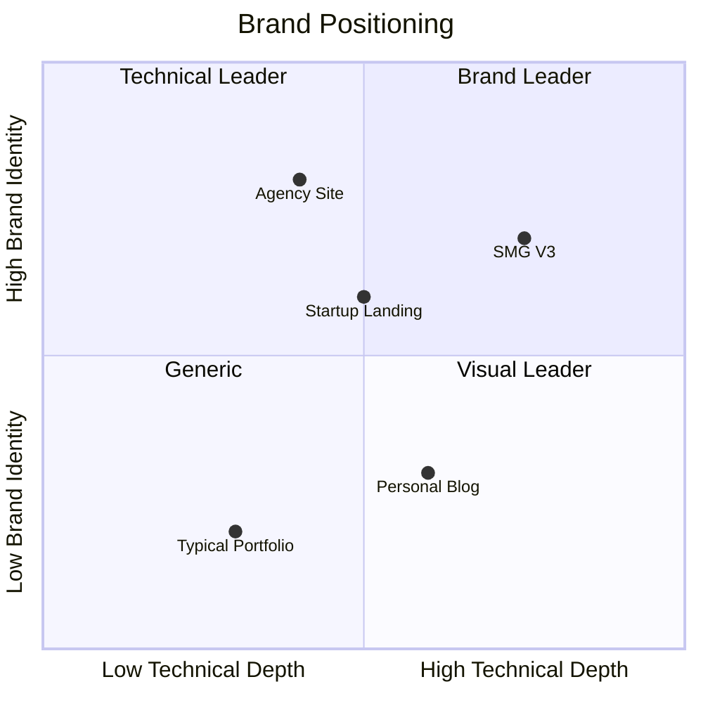
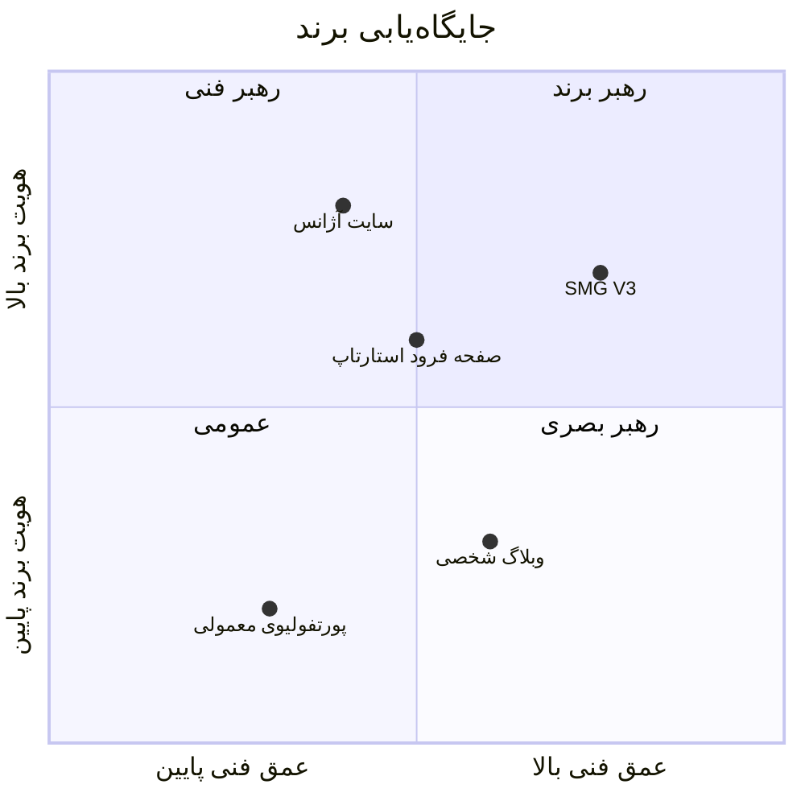
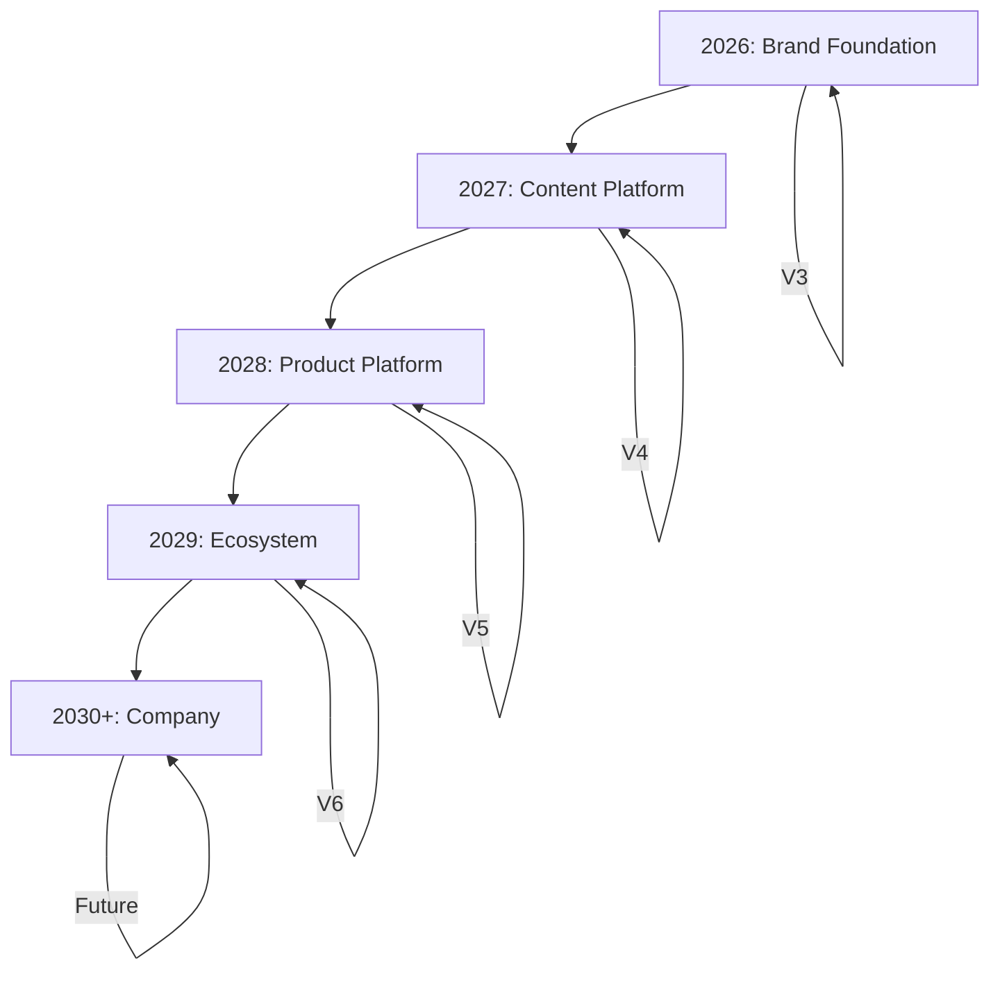
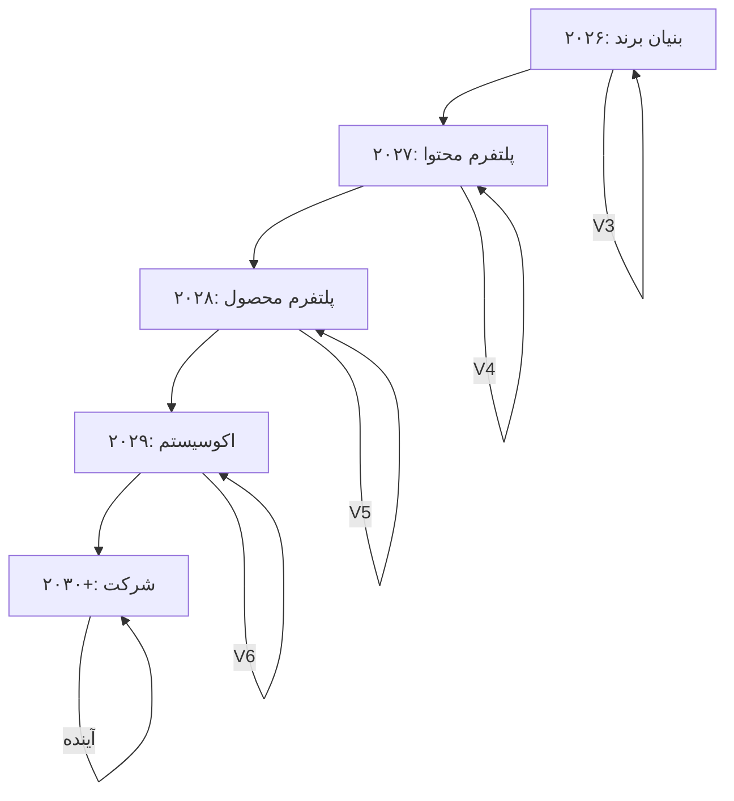
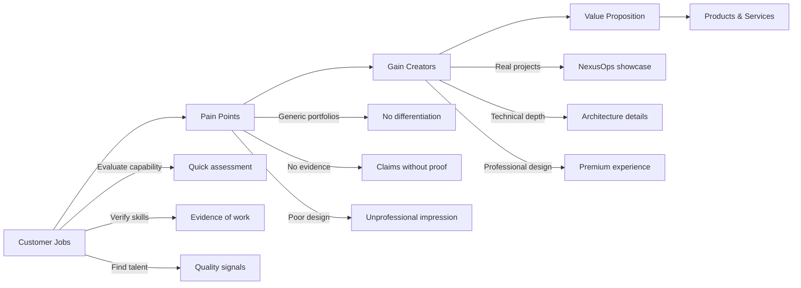
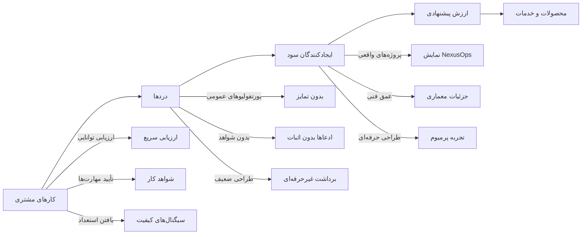
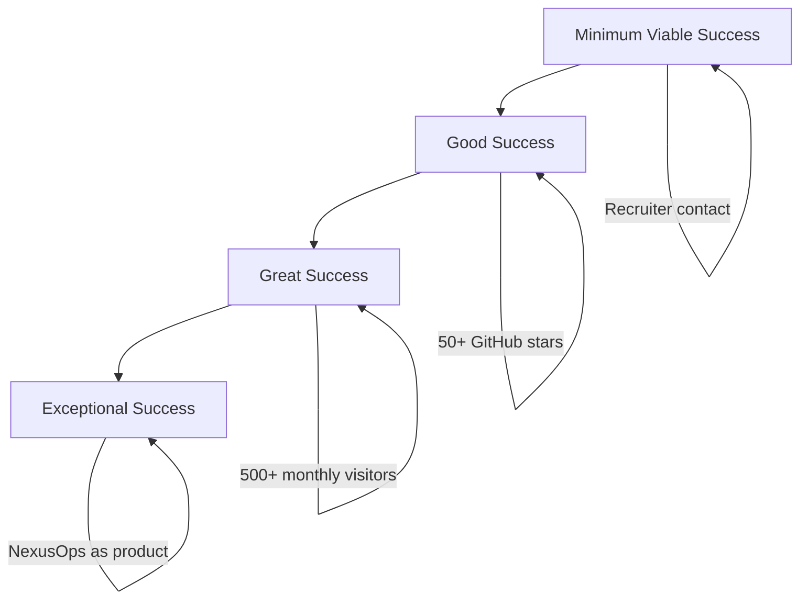
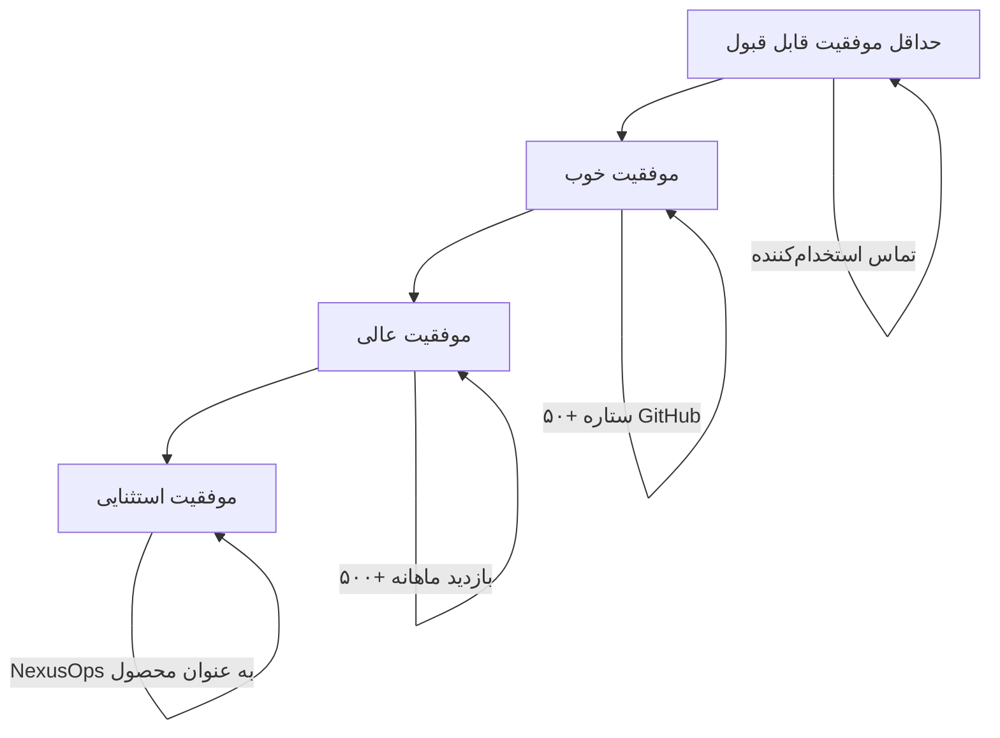

# SMG Portfolio V3 — Product Strategy

| Field | Value |
|-------|-------|
| **Document** | Product Strategy |
| **Version** | 3.0 |
| **Owner** | Saman Qasempour |
| **Brand** | SMG |
| **Website** | samansmg.ir |
| **Status** | Active |
| **Last Updated** | 2026-08-06 |
| **Depends On** | PRD.md |

---

## Table of Contents

- [1. Why SMG?](#1-why-smg)
- [2. Why This Portfolio?](#2-why-this-portfolio)
- [3. Brand Positioning](#3-brand-positioning)
- [4. Competitor Analysis](#4-competitor-analysis)
- [5. SWOT Analysis](#5-swot-analysis)
- [6. Long-Term Strategy](#6-long-term-strategy)
- [7. Value Proposition](#7-value-proposition)
- [8. Business Model](#8-business-model)
- [9. Success Definition](#9-success-definition)

---

# 1. Why SMG?

## English

### The Name

"SMG" is derived from **S**a**m**an **G**asempour (Qasempour). It is short, memorable, and scalable — it works as a personal brand today and can evolve into a company brand tomorrow.

### Why a Brand, Not Just a Name?

| Approach | Limitation |
|----------|-----------|
| **Name only** | "Saman Qasempour" — personal, not scalable |
| **Name + Title** | "Saman — DevOps Engineer" — limits positioning |
| **Brand (SMG)** | Flexible, professional, can represent products |

SMG as a brand:
- Can represent multiple products (NexusOps, future products)
- Sounds professional in any context
- Is domain-friendly (samansmg.ir)
- Is short enough for logos, headers, business cards
- Can evolve from personal brand to company brand

### Why Now?

| Factor | Timing |
|--------|--------|
| **Market** | DevOps/AI talent is in high demand |
| **Products** | NexusOps is reaching maturity |
| **Skills** | Engineering skills are at a level worth showcasing |
| **Competition** | Most portfolios are mediocre — opportunity to stand out |
| **Career stage** | Building now creates compound returns later |

## فارسی

### نام

"SMG" از **S**a**m**an **G**asempour (قاسمپور) گرفته شده. کوتاه، به یاد ماندنی و مقیاس‌پذیر است — امروز به عنوان برند شخصی کار می‌کند و فردا می‌تواند به برند شرکتی تبدیل شود.

### چرا برند، نه فقط نام؟

| رویکرد | محدودیت |
|--------|---------|
| **فقط نام** | "سامان قاسمپور" — شخصی، نه مقیاس‌پذیر |
| **نام + عنوان** | "سامان — مهندس DevOps" — جایگاه‌یابی را محدود می‌کند |
| **برند (SMG)** | انعطاف‌پذیر، حرفه‌ای، می‌تواند محصولات را نمایندگی کند |

SMG به عنوان یک برند:
- می‌تواند محصولات متعدد را نمایندگی کند (NexusOps، محصولات آینده)
- در هر زمینه‌ای حرفه‌ای به نظر می‌رسد
- دامنه‌پسند است (samansmg.ir)
- برای لوگو، هدر، کارت ویزیت کافی کوتاه است
- می‌تواند از برند شخصی به برند شرکتی تکامل یابد

### چرا الان؟

| عامل | زمان‌بندی |
|------|-----------|
| **بازار** | استعداد DevOps/AI تقاضای بالایی دارد |
| **محصولات** | NexusOps به بلوغ می‌رسد |
| **مهارت‌ها** | مهارت‌های مهندسی در سطحی هستند که ارزش نمایش دارند |
| **رقابت** | بیشتر پورتفولیوها متوسط هستند — فرصتی برای متمایز شدن |
| **مرحله شغلی** | ساختن الان بازده مرکب در آینده ایجاد می‌کند |

---

# 2. Why This Portfolio?

## English

### The Problem

| Problem | Impact |
|---------|--------|
| **Generic portfolios** | Don't differentiate from thousands of others |
| **Template-based designs** | Look cheap, not premium |
| **Surface-level content** | Don't demonstrate real capability |
| **Missing evidence** | Claims without proof |
| **Poor mobile experience** | Lose 60%+ of visitors |
| **No brand system** | Inconsistent, forgettable |

### The Solution

A **technology brand headquarters** that:

1. **Demonstrates capability** through real products (NexusOps)
2. **Builds trust** through technical depth and transparency
3. **Stands out** through premium, custom-crafted design
4. **Converts visitors** into opportunities (recruitment, collaboration)
5. **Scales** into a platform for future products

### The Opportunity

Most developer portfolios are:
- Built with templates
- Filled with generic content
- Missing real project evidence
- Designed for desktop only
- Inaccessible to screen readers

**SMG can be different.** By investing in quality, brand, and evidence, the portfolio can achieve what 99% of developer portfolios cannot: **genuine credibility**.

## فارسی

### مشکل

| مشکل | تأثیر |
|------|--------|
| **پورتفولیوهای عمومی** | از هزاران پورتفولیوی دیگر متمایز نمی‌شوند |
| **طراحی‌های مبتنی بر قالب** | ارزان به نظر می‌رسند، نه پرمیوم |
| **محتوای سطحی** | توانایی واقعی را نشان نمی‌دهند |
| **شواهد ناپذیر** | ادعاها بدون اثبات |
| **تجربه موبایل ضعیف** | بیش از ۶۰٪ بازدیدکنندگان را از دست می‌دهند |
| **بدون سیستم برند** | ناسازگار، فراموش‌شدنی |

### راه‌حل

**مقر دیجیتال یک برند فناوری** که:

۱. **توانایی را نشان می‌دهد** از طریق محصولات واقعی (NexusOps)
۲. **اعتماد می‌سازد** از طریق عمق فنی و شفافیت
۳. **متمایز می‌شود** از طریق طراحی پرمیوم، سفارشی
۴. **بازدیدکنندگان را تبدیل می‌کند** به فرصت‌ها (استخدام، همکاری)
۵. **مقیاس‌پذیر است** به پلتفرمی برای محصولات آینده

### فرصت

بیشتر پورتفولیوهای توسعه‌دهنده:
- با قالب ساخته شده‌اند
- با محتوای عمومی پر شده‌اند
- شواهد پروژه واقعی ندارند
- فقط برای دسکتاپ طراحی شده‌اند
- برای خوانندگان صفحه‌نمایش غیرقابل دسترسی هستند

**SMG می‌تواند متفاوت باشد.** با سرمایه‌گذاری روی کیفیت، برند و شواهد، پورتفولیو می‌تواند به چیزی برسد که ۹۹٪ پورتفولیوهای توسعه‌دهنده نمی‌توانند: **اعتبار واقعی**.

---

# 3. Brand Positioning

## English

### Positioning Framework

```
┌─────────────────────────────────────────────────────────────┐
│                                                             │
│  For: Recruiters, clients, and collaborators                │
│  Who: Need to evaluate engineering capability               │
│  SMG is: The digital headquarters of a technology brand     │
│  That: Builds reliable systems and digital products         │
│  Unlike: Typical developer portfolios                       │
│  SMG provides: Specific evidence of capability              │
│  Through: Real projects, technical depth, professional      │
│           presentation                                       │
│                                                             │
└─────────────────────────────────────────────────────────────┘
```

### Positioning Axes



### Key Differentiators

| Differentiator | How SMG Delivers |
|----------------|-----------------|
| **Technical Depth** | Architecture diagrams, real code, detailed explanations |
| **Product Focus** | NexusOps as flagship, not just code snippets |
| **Brand System** | Consistent visual identity, voice, and messaging |
| **Premium Design** | Custom-crafted, not template-based |
| **Evidence-Based** | Real projects, not mockups or claims |
| **Performance** | Fast, accessible, and reliable |

## فارسی

### چارچوب جایگاه‌یابی

```
┌─────────────────────────────────────────────────────────────┐
│                                                             │
│  برای: استخدام‌کنندگان، مشتریان و همکاران                    │
│  که: نیاز به ارزیابی توانایی مهندسی دارند                    │
│  SMG هست: مقر دیجیتال یک برند فناوری                        │
│  که: سیستم‌های قابل اعتماد و محصولات دیجیتال می‌سازد          │
│  برخلاف: پورتفولیوهای معمولی توسعه‌دهنده                     │
│  SMG ارائه می‌دهد: شواهد خاص توانایی                         │
│  از طریق: پروژه‌های واقعی، عمق فنی، ارائه حرفه‌ای            │
│                                                             │
└─────────────────────────────────────────────────────────────┘
```

### محورهای جایگاه‌یابی



### متمایزکننده‌های کلیدی

| متمایزکننده | چطور SMG ارائه می‌دهد |
|------------|----------------------|
| **عمق فنی** | نمودارهای معماری، کد واقعی، توضیحات دقیق |
| **تمرکز محصول** | NexusOps به عنوان پرچم، نه فقط قطعات کد |
| **سیستم برند** | هویت بصری، صدا و پیام‌رسانی یکپارچه |
| **طراحی پرمیوم** | سفارشی‌سازی شده، نه مبتنی بر قالب |
| **مبتنی بر شواهد** | پروژه‌های واقعی، نه ماکاپ یا ادعاها |
| **عملکرد** | سریع، قابل دسترسی و قابل اعتماد |

---

# 4. Competitor Analysis

## English

### Direct Competitors

| Competitor | Type | Strength | Weakness | SMG Advantage |
|------------|------|----------|----------|---------------|
| **GitHub Pages Portfolios** | Free, easy | Low cost | Generic, template-based | Custom design, brand system |
| **Carbonmade** | Portfolio platform | Easy to use | Limited customization | Full control, SEO optimization |
| **Squarespace Portfolios** | Paid platform | Polished templates | Monthly cost, lock-in | Free, own code, no lock-in |
| **Webflow Portfolios** | Visual builder | Design flexibility | Learning curve, cost | Code-based, faster, free |

### Indirect Competitors

| Competitor | Type | Strength | Weakness | SMG Advantage |
|------------|------|----------|----------|---------------|
| **LinkedIn Profiles** | Professional network | Built-in audience | Limited design, no brand | Full brand control |
| **Dev.to / Medium** | Writing platforms | Built-in readers | No brand control | Own platform |
| **Twitter/X** | Social platform | High reach | No depth, algorithm-dependent | Long-form content |
| **Personal Blogs** | Self-hosted | Full control | Content-heavy, maintenance | Visual + content balance |

### Competitive Advantage

```
┌─────────────────────────────────────────────────────────────┐
│                    COMPETITIVE MOAT                          │
├─────────────────────────────────────────────────────────────┤
│                                                             │
│  1. REAL PRODUCTS      → Not just code, but working systems│
│  2. TECHNICAL DEPTH    → Architecture, decisions, rationale│
│  3. BRAND SYSTEM       → Consistent, memorable, scalable   │
│  4. PREMIUM DESIGN     → Custom-crafted, not template      │
│  5. PERFORMANCE        → Fast, accessible, reliable        │
│  6. TRANSPARENCY       → Open source, honest journey       │
│                                                             │
└─────────────────────────────────────────────────────────────┘
```

## فارسی

### رقبای مستقیم

| رقیب | نوع | قوت | ضعف | مزیت SMG |
|------|------|------|------|----------|
| **پورتفولیوهای GitHub Pages** | رایگان، آسان | هزینه کم | عمومی، مبتنی بر قالب | طراحی سفارشی، سیستم برند |
| **Carbonmade** | پلتفرم پورتفولیو | آسان در استفاده | سفارشی‌سازی محدود | کنترل کامل، بهینه‌سازی SEO |
| **پورتفولیوهای Squarespace** | پلتفرم پولی | قالب‌های صیقلی | هزینه ماهانه، قفل شدن | رایگان، کد متعلق به خود، بدون قفل |
| **پورتفولیوهای Webflow** | سازنده بصری | انعطاف‌پذیری طراحی | منحنی یادگیری، هزینه | مبتنی بر کد، سریعتر، رایگان |

### رقبای غیرمستقیم

| رقیب | نوع | قوت | ضعف | مزیت SMG |
|------|------|------|------|----------|
| **پروفایل‌های LinkedIn** | شبکه حرفه‌ای | مخاطب از پیش ساخته شده | طراحی محدود، بدون برند | کنترل کامل برند |
| **Dev.to / Medium** | پلتفرم نوشتن | خوانندگان از پیش ساخته شده | بدون کنترل برند | پلتفرم متعلق به خود |
| **Twitter/X** | پلتفرم اجتماعی | دسترسی بالا | عمق ندارد، وابسته به الگوریتم | محتوای بلندформ |
| **وبلاگ‌های شخصی** | میزبانی خودمحور | کنترل کامل | سنگین محتوا، نگهداری | تعادل بصری + محتوا

### مزیت رقابتی

```
┌─────────────────────────────────────────────────────────────┐
│                  خندق رقابتی                                 │
├─────────────────────────────────────────────────────────────┤
│                                                             │
│  ۱. محصولات واقعی    → نه فقط کد، بلکه سیستم‌های کاری       │
│  ۲. عمق فنی          → معماری، تصمیمات، دلایل               │
│  ۳. سیستم برند       → یکپارچه، به یاد ماندنی، مقیاس‌پذیر  │
│  ۴. طراحی پرمیوم     → سفارشی‌سازی شده، نه قالب             │
│  ۵. عملکرد           → سریع، قابل دسترسی، قابل اعتماد      │
│  ۶. شفافیت          → Open Source، مسیر صادقانه            │
│                                                             │
└─────────────────────────────────────────────────────────────┘
```

---

# 5. SWOT Analysis

## English

### Strengths

| # | Strength | Evidence |
|---|----------|----------|
| 1 | Real products (NexusOps) | Active development, GitHub repo |
| 2 | Technical depth (DevOps, Linux, Docker) | Hands-on experience |
| 3 | Full-stack capability | Frontend + Backend + Infrastructure |
| 4 | Open source contributions | DockerOrbit, Server Bot Reporter |
| 5 | Young with high growth potential | Early career, fast learner |

### Weaknesses

| # | Weakness | Mitigation |
|---|----------|------------|
| 1 | Limited brand recognition | Content marketing, SEO |
| 2 | Solo developer (bus factor = 1) | Documentation, automation |
| 3 | No formal design training | Follow brand guidelines strictly |
| 4 | Limited time (part-time development) | Phase-based approach |
| 5 | No client testimonials yet | Build through open source reputation |

### Opportunities

| # | Opportunity | Strategy |
|---|-------------|----------|
| 1 | DevOps talent shortage | Position as expert, publish content |
| 2 | AI/ML infrastructure growth | Build AI-powered features in NexusOps |
| 3 | Remote work normalization | Global reach through website |
| 4 | Open source community | Build reputation through contributions |
| 5 | Startup ecosystem growth | Offer technical partnership |

### Threats

| # | Threat | Mitigation |
|---|--------|------------|
| 1 | Market saturation (many portfolios) | Differentiate through quality |
| 2 | Rapid technology changes | Focus on fundamentals, stay current |
| 3 | Competition from experienced engineers | Build unique brand, niche down |
| 4 | Platform dependency (Vercel, GitHub) | Standard technologies, easy migration |
| 5 | Economic downturn affecting hiring | Diversify income streams |

## فارسی

### نقاط قوت

| # | نقطه قوت | شواهد |
|---|-----------|-------|
| ۱ | محصولات واقعی (NexusOps) | توسعه فعال، مخزن GitHub |
| ۲ | عمق فنی (DevOps, Linux, Docker) | تجربه عملی |
| ۳ | توانایی فول‌استک | فرانت‌اند + بک‌اند + زیرساخت |
| ۴ | مشارکت‌های Open Source | DockerOrbit, Server Bot Reporter |
| ۵ | جوان با پتانسیل رشد بالا | شغل اولیه، یادگیرنده سریع |

### نقاط ضعف

| # | نقطه ضعف | کاهش |
|---|-----------|------|
| ۱ | شهرت محدود برند | بازاریابی محتوا، SEO |
| ۲ | توسعه‌دهنده تنها (عامل اتوبوس = ۱) | مستندسازی، خودکارسازی |
| ۳ | آموزش رسمی طراحی ندارد | پیروی سخت‌گیرانه از راهنمای برند |
| ۴ | زمان محدود (توسعه پاره‌وقت) | رویکرد مبتنی بر فاز |
| ۵ | هنوز شواهد مشتری ندارد | از طریق شهرت Open Source بسازد |

### فرصت‌ها

| # | فرصت | استراتژی |
|---|------|----------|
| ۱ | کمبود استعداد DevOps | جایگاه‌یابی به عنوان متخصص، انتشار محتوا |
| ۲ | رشد زیرساخت AI/ML | ساخت ویژگی‌های AI-powered در NexusOps |
| ۳ | عادی شدن کار از راه دور | دسترسی جهانی از طریق وب‌سایت |
| ۴ | جامعه Open Source | ساخت شهرت از طریق مشارکت‌ها |
| ۵ | رشد اکوسیستم استارتاپ | ارائه شراکت فنی |

### تهدیدها

| # | تهدید | کاهش |
|---|--------|------|
| ۱ | اشباع بازار (پورتفولیوهای زیاد) | متمایز شدن از طریق کیفیت |
| ۲ | تغییرات سریع فناوری | تمرکز روی اصول، به‌روز ماندن |
| ۳ | رقابت از مهندسان با تجربه | ساخت برند منحصر به فرد، تخصص‌گرایی |
| ۴ | وابستگی پلتفرم (Vercel, GitHub) | فناوری‌های استاندارد، مهاجرت آسان |
| ۵ | رکود اقتصادی بر استخدام | متنوع‌سازی جریان‌های درآمد |

---

# 6. Long-Term Strategy

## English

### Strategic Vision



### Phase 1: Brand Foundation (V3 — 2026)

**Goal:** Establish SMG as a recognizable technology brand.

**Strategy:**
- Premium single-page website
- NexusOps as flagship project
- SEO optimization for DevOps keywords
- Open source contribution for visibility
- Technical content for credibility

**Success Metrics:**
- Recruiter contact within 3 months
- 50+ GitHub stars for NexusOps within 6 months
- 100+ monthly organic visitors within 6 months

### Phase 2: Content Platform (V4 — 2027)

**Goal:** Build an audience through valuable content.

**Strategy:**
- Technical blog (DevOps, Linux, Docker)
- Project detail pages with architecture deep dives
- Documentation for NexusOps
- Newsletter for community building
- Regular content cadence (2-4 posts/month)

**Success Metrics:**
- 500+ monthly organic visitors
- 100+ newsletter subscribers
- 5+ technical blog posts with 1000+ views

### Phase 3: Product Platform (V5 — 2028)

**Goal:** Launch NexusOps as a product.

**Strategy:**
- Product landing page (SaaS-style)
- Pricing page
- Documentation
- API reference
- Community features

**Success Metrics:**
- First paying customer
- 100+ active users
- Product-market fit validation

### Phase 4: Ecosystem (V6 — 2029+)

**Goal:** Build a technology ecosystem.

**Strategy:**
- Multiple products under SMG brand
- Community platform
- Educational content
- Consulting/services (optional)
- Team expansion (if needed)

## فارسی

### چشم‌انداز استراتژیک



### فاز ۱: بنیان برند (V3 — ۲۰۲۶)

**هدف:** تثبیت SMG به عنوان یک برند فناوری شناخته شده.

**استراتژی:**
- وب‌سایت تک صفحه‌ای پرمیوم
- NexusOps به عنوان پروژه پرچم
- بهینه‌سازی SEO برای کلیدواژه‌های DevOps
- مشارکت Open Source برای دیده شدن
- محتوای فنی برای اعتبار

**معیارهای موفقیت:**
- تماس استخدام‌کننده ظرف ۳ ماه
- ۵۰+ ستاره GitHub برای NexusOps ظرف ۶ ماه
- ۱۰۰+ بازدید ارگانیک ماهانه ظرف ۶ ماه

### فاز ۲: پلتفرم محتوا (V4 — ۲۰۲۷)

**هدف:** ایجاد مخاطب از طریق محتوای ارزشمند.

**استراتژی:**
- وبلاگ فنی (DevOps, Linux, Docker)
- صفحات جزئیات پروژه با غوص عمیق معماری
- مستندات برای NexusOps
- خبرنامه برای ساخت جامعه
- ریتم محتوای منظم (۲-۴ پست/ماه)

**معیارهای موفقیت:**
- ۵۰۰+ بازدید ارگانیک ماهانه
- ۱۰۰+ مشترک خبرنامه
- ۵+ پست وبلاگ فنی با ۱۰۰۰+ بازدید

### فاز ۳: پلتفرم محصول (V5 — ۲۰۲۸)

**هدف:** راه‌اندازی NexusOps به عنوان محصول.

**استراتژی:**
- صفحه فرود محصول (سبک SaaS)
- صفحه قیمت‌گذاری
- مستندات
- مرجع API
- ویژگی‌های جامعه

**معیارهای موفقیت:**
- اولین مشتری پولدار
- ۱۰۰+ کاربر فعال
- اعتبارسنجی تناسب محصول-بازار

### فاز ۴: اکوسیستم (V6 — ۲۰۲۹+)

**هدف:** ساخت یک اکوسیستم فناوری.

**استراتژی:**
- محصولات متعدد تحت برند SMG
- پلتفرم جامعه
- محتوای آموزشی
- مشاوره/خدمات (اختیاری)
- گسترش تیم (در صورت نیاز)

---

# 7. Value Proposition

## English

### Core Value Proposition

> **SMG builds reliable systems and digital products.**
>
> For recruiters, clients, and collaborators who need to evaluate engineering capability, SMG provides specific evidence of capability through real projects, technical depth, and professional presentation.

### Value Proposition Canvas



### Value by Audience

| Audience | Primary Value | How It's Delivered |
|----------|--------------|-------------------|
| **Recruiters** | Quick capability assessment | Hero + Projects + About |
| **Developers** | Learning from real projects | Technical depth + Code repos |
| **Clients** | Evidence of relevant experience | Project showcase + Case studies |
| **Founders** | Technical partner evaluation | Architecture + Infrastructure Lab |
| **Investors** | Founder capability assessment | Brand quality + Product vision |

## فارسی

### ارزش پیشنهادی اصلی

> **SMG سیستم‌های قابل اعتماد و محصولات دیجیتال می‌سازد.**
>
> برای استخدام‌کنندگان، مشتریان و همکاران که نیاز به ارزیابی توانایی مهندسی دارند، SMG شواهد خاص توانایی را از طریق پروژه‌های واقعی، عمق فنی و ارائه حرفه‌ای ارائه می‌دهد.

### کانواس ارزش پیشنهادی



### ارزش به ازای هر مخاطب

| مخاطب | ارزش اصلی | چطور ارائه می‌شود |
|-------|-----------|-------------------|
| **استخدام‌کنندگان** | ارزیابی سریع توانایی | Hero + پروژه‌ها + About |
| **توسعه‌دهندگان** | یادگیری از پروژه‌های واقعی | عمق فنی + مخازن کد |
| **مشتریان** | شواهد تجربه مرتبط | نمایش پروژه‌ها + مطالعات موردی |
| **بنیان‌گذاران** | ارزیابی شریک فنی | معماری + آزمایشگاه زیرساخت |
| **سرمایه‌گذاران** | ارزیابی توانایی بنیان‌گذار | کیفیت برند + چشم‌انداز محصول |

---

# 8. Business Model

## English

### Revenue Model (Future)

The portfolio itself is **not a revenue generator** in V3. It is a **credibility builder** that enables future revenue.

| Revenue Stream | Timeline | Description |
|----------------|----------|-------------|
| **Employment** | Immediate | Full-time DevOps/Infrastructure role |
| **Consulting** | V4+ | Infrastructure consulting (optional) |
| **NexusOps** | V5+ | SaaS product revenue |
| **Open Source** | V4+ | Sponsorship, donations |
| **Content** | V4+ | Sponsored content, courses (optional) |

### Cost Structure

| Cost | Amount | Notes |
|------|--------|-------|
| **Domain** | ~$10/year | samansmg.ir |
| **Hosting** | $0 | Vercel free tier |
| **Development** | $0 | Self-developed |
| **Design** | $0 | Self-designed |
| **Total** | ~$10/year | Minimal cost |

### Investment vs. Return

```
┌─────────────────────────────────────────────────────────────┐
│                    INVESTMENT → RETURN                      │
├─────────────────────────────────────────────────────────────┤
│                                                             │
│  INVESTMENT:                                                │
│  • Time: Part-time development                              │
│  • Money: ~$10/year                                         │
│  • Effort: Document-driven development                      │
│                                                             │
│  RETURN:                                                    │
│  • Credibility: Professional brand presence                 │
│  • Opportunities: Inbound recruitment                       │
│  • Network: Professional connections                        │
│  • Products: Platform for future launches                   │
│  • Skills: Engineering growth through building              │
│                                                             │
└─────────────────────────────────────────────────────────────┘
```

## فارسی

### مدل درآمد (آینده)

خود پورتفولیو در V3 **تولیدکننده درآمد نیست**. این یک **ایجادکننده اعتبار** است که درآمد آینده را ممکن می‌کند.

| جریان درآمد | بازه زمانی | توضیح |
|-------------|-----------|-------|
| **اشتغال** | فوری | نقش تمام‌وقت DevOps/زیرساخت |
| **مشاوره** | V4+ | مشاوره زیرساخت (اختیاری) |
| **NexusOps** | V5+ | درآمد محصول SaaS |
| **Open Source** | V4+ | حمایت مالی، کمک‌های مالی |
| **محتوا** | V4+ | محتوای حمایت شده، دوره‌ها (اختیاری) |

### ساختار هزینه

| هزینه | مقدار | توضیحات |
|-------|-------|---------|
| **دامنه** | ~۱۰$/سال | samansmg.ir |
| **میزبانی** | ۰$ | لایه رایگان Vercel |
| **توسعه** | ۰$ | خودمحور |
| **طراحی** | ۰$ | خودطراحی شده |
| **کل** | ~۱۰$/سال | هزینه حداقل |

### سرمایه‌گذاری در مقابل بازده

```
┌─────────────────────────────────────────────────────────────┐
│              سرمایه‌گذاری → بازده                             │
├─────────────────────────────────────────────────────────────┤
│                                                             │
│  سرمایه‌گذاری:                                               │
│  • زمان: توسعه پاره‌وقت                                     │
│  • پول: ~۱۰$/سال                                           │
│  • تلاش: توسعه مبتنی بر مستندات                             │
│                                                             │
│  بازده:                                                     │
│  • اعتبار: حضور حرفه‌ای برند                                │
│  • فرصت‌ها: استخدام Inbound                                 │
│  • شبکه: اتصالات حرفه‌ای                                    │
│  • محصولات: پلتفرم برای راه‌اندازی‌های آینده                  │
│  • مهارت‌ها: رشد مهندسی از طریق ساختن                       │
│                                                             │
└─────────────────────────────────────────────────────────────┘
```

---

# 9. Success Definition

## English

### What Does "Success" Mean?

Success for SMG Portfolio V3 is **not**:

| It Is NOT | Why |
|-----------|-----|
| Traffic numbers alone | Quality > Quantity |
| Design awards | Purpose > Aesthetics |
| Feature count | Simplicity > Complexity |
| Social media followers | Depth > Reach |

Success **is**:

| It IS | How We Measure |
|-------|----------------|
| **Recruiter contacts** | Inbound opportunities |
| **GitHub stars** | Developer recognition |
| **Project inquiries** | Client interest |
| **Professional connections** | Network growth |
| **Technical credibility** | Industry respect |
| **Brand recognition** | Name recall in DevOps community |

### Success Tiers



### Minimum Viable Success (3 months)

- [ ] Website is live and passes Core Web Vitals
- [ ] At least 1 recruiter contacts Saman
- [ ] NexusOps repo has 10+ stars
- [ ] Website appears in Google for "Saman Qasempour"

### Good Success (6 months)

- [ ] 50+ GitHub stars for NexusOps
- [ ] 100+ monthly organic visitors
- [ ] At least 1 collaboration inquiry
- [ ] Brand is recognizable in local DevOps community

### Great Success (12 months)

- [ ] 200+ GitHub stars for NexusOps
- [ ] 500+ monthly organic visitors
- [ ] Multiple recruitment offers
- [ ] NexusOps has active users
- [ ] Brand is recognized in regional tech community

### Exceptional Success (18+ months)

- [ ] NexusOps becomes a recognized product
- [ ] SMG brand is associated with infrastructure quality
- [ ] Website is primary inbound channel
- [ ] Multiple revenue streams active
- [ ] Team expansion (if needed)

## فارسی

### "موفقیت" چه معنی دارد؟

موفقیت برای SMG Portfolio V3 **این نیست**:

| این نیست | چرا |
|----------|------|
| فقط اعداد ترافیک | کیفیت > کمیت |
| جوایز طراحی | هدف > زیبایی |
| تعداد ویژگی‌ها | سادگی > پیچیدگی |
| دنبال‌کنندگان شبکه اجتماعی | عمق > دسترسی |

موفقیت **این است**:

| این است | چطور اندازه می‌گیریم |
|---------|---------------------|
| **تماس‌های استخدام‌کننده** | فرصت‌های Inbound |
| **ستاره‌های GitHub** | شناخت توسعه‌دهندگان |
| **درخواست‌های پروژه** | علاقه مشتری |
| **اتصالات حرفه‌ای** | رشد شبکه |
| **اعتبار فنی** | احترام صنعت |
| **شناخت برند** | یادآوری نام در جامعه DevOps |

### سطوح موفقیت



### حداقل موفقیت قابل قبول (۳ ماه)

- [ ] وب‌سایت زنده است و Core Web Vitals را پاس می‌کند
- [ ] حداقل ۱ استخدام‌کننده با سامان تماس می‌گیرد
- [ ] مخزن NexusOps ۱۰+ ستاره دارد
- [ ] وب‌سایت در Google برای "Saman Qasempour" ظاهر می‌شود

### موفقیت خوب (۶ ماه)

- [ ] ۵۰+ ستاره GitHub برای NexusOps
- [ ] ۱۰۰+ بازدید ارگانیک ماهانه
- [ ] حداقل ۱ درخواست همکاری
- [ ] برند در جامعه محلی DevOps شناخته شده است

### موفقیت عالی (۱۲ ماه)

- [ ] ۲۰۰+ ستاره GitHub برای NexusOps
- [ ] ۵۰۰+ بازدید ارگانیک ماهانه
- [ ] پیشنهادات استخدام متعدد
- [ ] NexusOps کاربر فعال دارد
- [ ] برند در جامعه فناوری منطقه‌ای شناخته شده است

### موفقیت استثنایی (۱۸+ ماه)

- [ ] NexusOps به محصول شناخته‌شده تبدیل می‌شود
- [ ] برند SMG با کیفیت زیرساخت مرتبط می‌شود
- [ ] وب‌سایت کانال اصلی Inbound است
- [ ] جریان‌های درآمدی متعدد فعال هستند
- [ ] گسترش تیم (در صورت نیاز)

---

# Appendix: Strategy Decision Log

| Date | Decision | Rationale | Alternatives Considered |
|------|----------|-----------|------------------------|
| 2026-08-06 | Brand name: SMG | Short, scalable, domain-friendly | SamanQasempour.com (too long), SQ (not meaningful) |
| 2026-08-06 | Single page V3 | Simplicity, performance, focus | Multi-page (overkill for portfolio) |
| 2026-08-06 | Dark theme only | Consistent brand, reduces complexity | Dark/Light toggle (V4+) |
| 2026-08-06 | NexusOps as flagship | Most mature project, strongest signal | Multiple projects (dilutes focus) |
| 2026-08-06 | Next.js + Tailwind | Proven stack, Vercel deployment | Astro (less ecosystem), Remix (less mature) |
| 2026-08-06 | Bilingual docs | Accessibility for both audiences | English only (excludes Farsi readers) |

---

**Document Version:** 3.0
**Last Updated:** 2026-08-06
**Author:** SMG / Saman Qasempour
**Status:** Active — Strategy Document
**Depends On:** PRD.md
