# SMG Portfolio V3 — UX Specification

| Field | Value |
|-------|-------|
| **Document** | UX Specification |
| **Version** | 3.0 |
| **Owner** | Saman Qasempour |
| **Brand** | SMG |
| **Website** | samansmg.ir |
| **Status** | Active |
| **Last Updated** | 2026-08-07 |
| **Depends On** | PRD.md, PRODUCT_STRATEGY.md, PRODUCT_ARCHITECTURE.md, BRAND_BOOK.md |

---

## Table of Contents

- [1. User Journey](#1-user-journey)
- [2. User Flow](#2-user-flow)
- [3. Information Architecture](#3-information-architecture)
- [4. Sitemap](#4-sitemap)
- [5. Navigation](#5-navigation)
- [6. CTA Strategy](#6-cta-strategy)
- [7. UX Rules](#7-ux-rules)

---

# 1. User Journey

## English

### Journey Map: Recruiter Arash

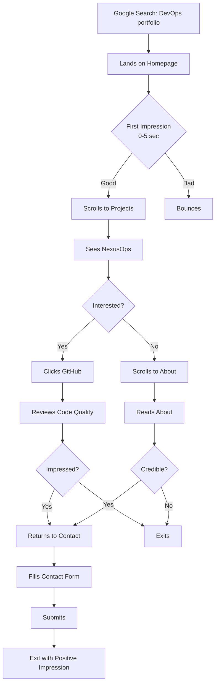

### Journey Map: Developer Dariush

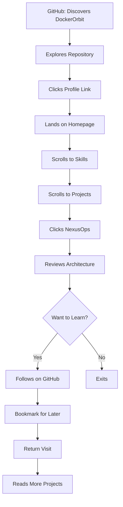

### Journey Map: Founder Negar

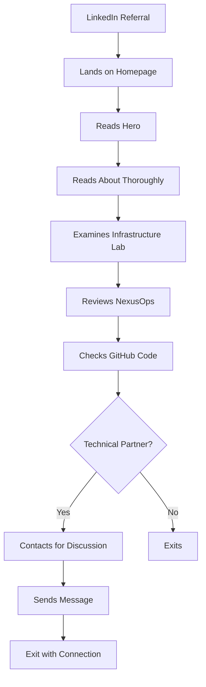

### Journey Emotions

| Stage | Recruiter Arash | Developer Dariush | Founder Negar |
|-------|----------------|-------------------|---------------|
| **Discovery** | Neutral | Curious | Hopeful |
| **First Impression** | Evaluating | Assessing | Judging |
| **Exploration** | Scanning | Learning | Analyzing |
| **Project Review** | Verifying | Inspired | Convinced |
| **Trust Building** | Building | Confident | Assured |
| **Action** | Contacting | Following | Connecting |
| **Exit** | Satisfied | Enriched | Impressed |

### Pain Points by Stage

| Stage | Pain Point | Solution |
|-------|-----------|----------|
| **Discovery** | Can't find quality portfolios | SEO optimization, unique content |
| **First Impression** | Generic look, slow load | Custom design, performance |
| **Exploration** | Can't find what I need | Clear navigation, logical flow |
| **Projects** | Shallow descriptions | Deep technical content |
| **Trust** | No evidence of real work | Live projects, GitHub repos |
| **Action** | Hard to contact | Simple form, social links |
| **Exit** | Forgettable experience | Memorable brand, quality content |

## فارسی

### نقشه سفر: استخدام‌کننده آرش

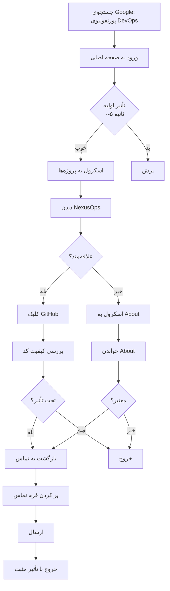

### نقشه سفر: توسعه‌دهنده داریوش

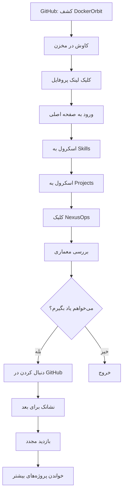

### نقشه سفر: بنیان‌گذار نگار

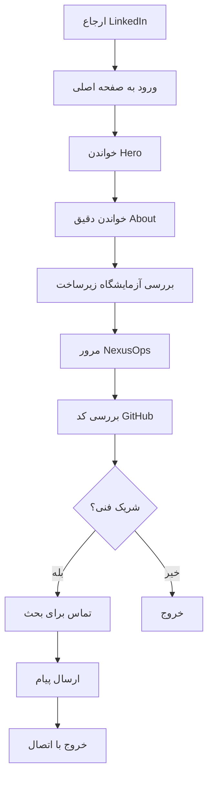

### احساسات سفر

| مرحله | استخدام‌کننده آرش | توسعه‌دهنده داریوش | بنیان‌گذار نگار |
|-------|------------------|-------------------|----------------|
| **کشف** | خنثی | کنجکاو | امیدوار |
| **تأثیر اولیه** | در حال ارزیابی | در حال ارزیابی | در حال قضاوت |
| **کاوش** | در حال اسکن | در حال یادگیری | در حال تحلیل |
| **بررسی پروژه** | در حال تأیید | الهام گرفته | قانع شده |
| **ساختن اعتماد** | در حال ساختن | مطمئن | مطمئن |
| **اقدام** | در حال تماس | در حال دنبال کردن | در حال اتصال |
| **خروج** | راضی | غنی شده | تحت تأثیر |

### دردها بر اساس مرحله

| مرحله | درد | راه‌حل |
|-------|------|--------|
| **کشف** | پورتفولیوهای باکیفیت پیدا نمی‌شوند | بهینه‌سازی SEO، محتوای منحصر به فرد |
| **تأثیر اولیه** | ظاهر عمومی، بارگذاری کند | طراحی سفارشی، عملکرد |
| **کاوش** | نمی‌توانم چیزی که نیاز دارم را پیدا کنم | ناوبری واضح، جریان منطقی |
| **پروژه‌ها** | توصیفات سطحی | محتوای فنی عمیق |
| **اعتماد** | شواهدی از کار واقعی نیست | پروژه‌های زنده، مخازن GitHub |
| **اقدام** | تماس دشوار | فرم ساده، لینک‌های اجتماعی |
| **خروج** | تجربه فراموش‌شدنی | برند به یاد ماندنی، محتوای باکیفیت |

---

# 2. User Flow

## English

### Primary Flow: Visitor → Opportunity

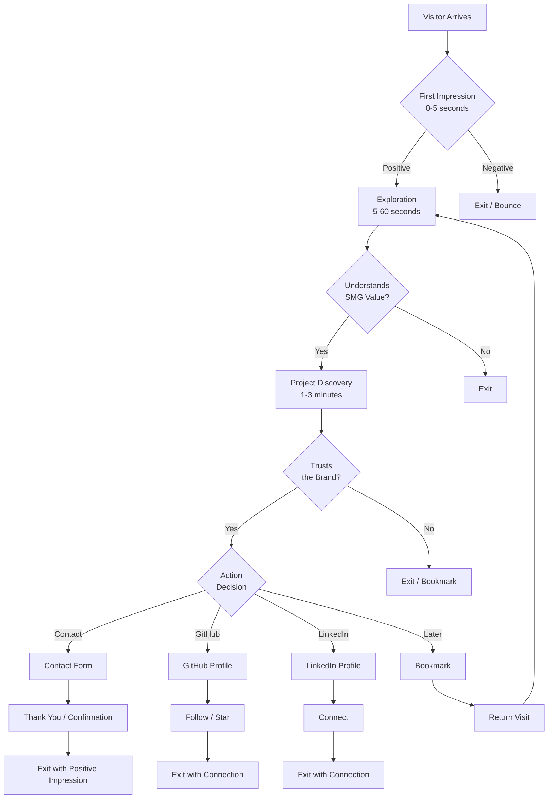

### Flow Metrics

| Step | Duration | Success Rate | Drop-off Rate |
|------|----------|-------------|---------------|
| **Arrival** | 0s | 100% | — |
| **First Impression** | 0-5s | 60-70% stay | 30-40% bounce |
| **Exploration** | 5-60s | 50-60% understand | 10-20% confused |
| **Project Discovery** | 1-3min | 40-50% trust | 10-15% unconvinced |
| **Action** | 3-5min | 5-10% convert | 30-40% exit |

### Conversion Funnel

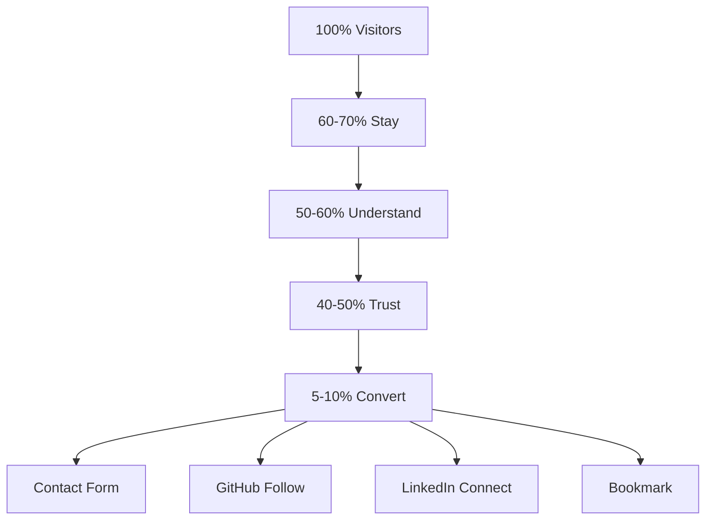

### Alternative Flows

#### Flow A: Direct to Projects

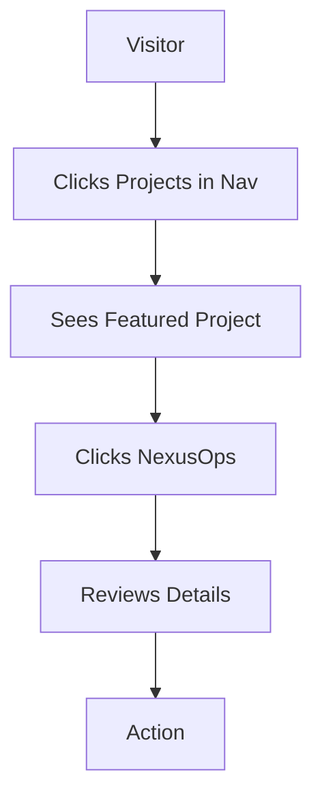

#### Flow B: Mobile Experience

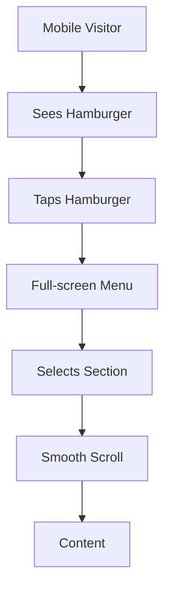

#### Flow C: Return Visitor

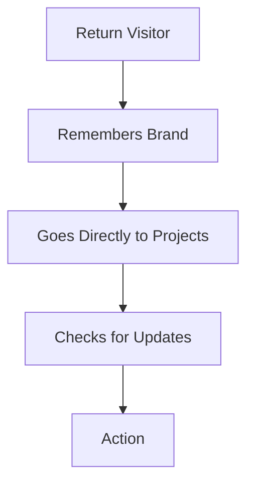

## فارسی

### جریان اصلی: بازدیدکننده → فرصت

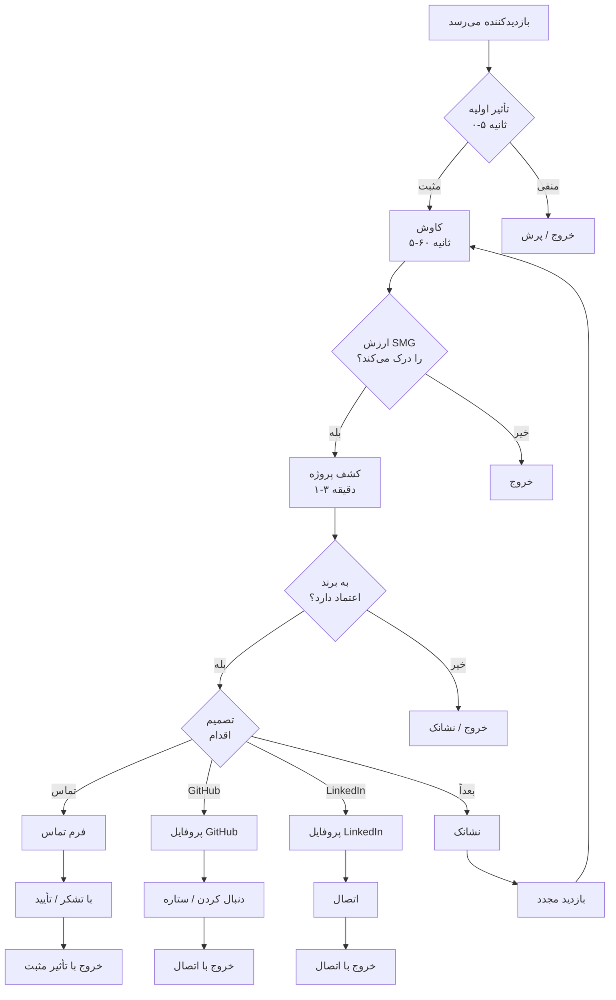

### معیارهای جریان

| مرحله | مدت | نرخ موفقیت | نرخ ریزش |
|-------|------|-----------|----------|
| **ورود** | ۰ ثانیه | ۱۰۰٪ | — |
| **تأثیر اولیه** | ۰-۵ ثانیه | ۶۰-۷۰٪ می‌مانند | ۳۰-۴۰٪ پرش |
| **کاوش** | ۵-۶۰ ثانیه | ۵۰-۶۰٪ درک می‌کنند | ۱۰-۲۰٪ گیج |
| **کشف پروژه** | ۱-۳ دقیقه | ۴۰-۵۰٪ اعتماد می‌کنند | ۱۰-۱۵٪ قانع نشده |
| **اقدام** | ۳-۵ دقیقه | ۵-۱۰٪ تبدیل می‌شوند | ۳۰-۴۰٪ خارج می‌شوند |

### قیف تبدیل

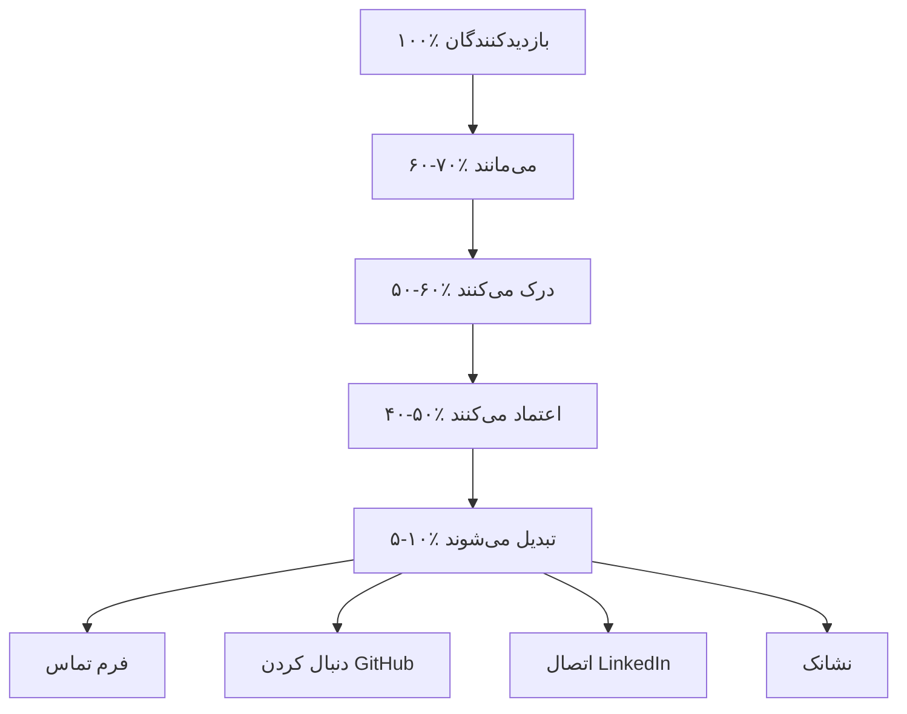

### جریان‌های جایگزین

#### جریان A: مستقیم به پروژه‌ها

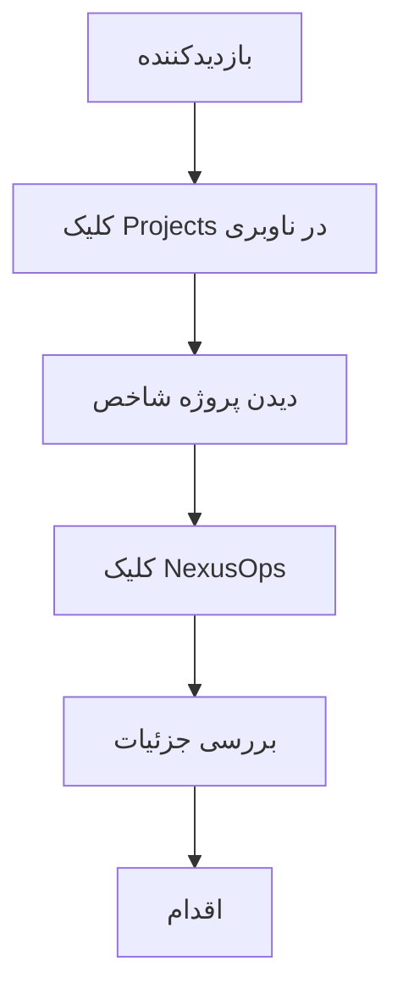

#### جریان B: تجربه موبایل

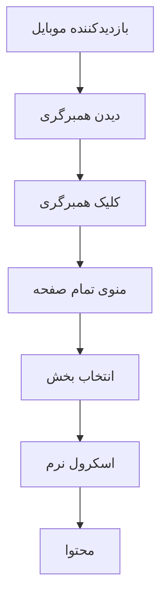

#### جریان C: بازدیدکننده مجدد

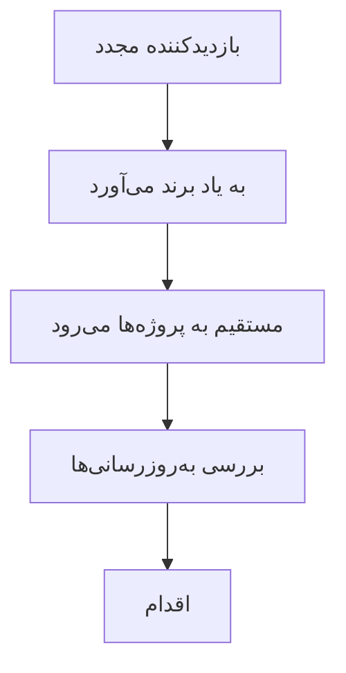

---

# 3. Information Architecture

## English

### IA Principles

1. **Progressive Disclosure:** Most important information first
2. **Logical Flow:** Each section naturally leads to the next
3. **No Dead Ends:** Every page has a clear next step
4. **Shallow Hierarchy:** Maximum 2 levels of navigation
5. **Search-First Architecture:** Content organized for both humans and search engines

### Content Hierarchy

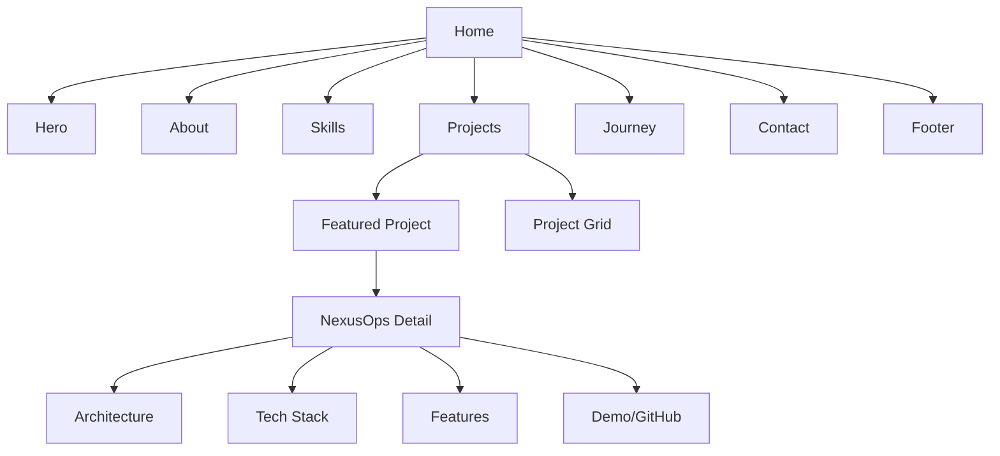

### Section Priority

| Priority | Section | Purpose | Depth |
|----------|---------|---------|-------|
| P0 | Hero | Brand message + first impression | Surface |
| P0 | Projects | Capability evidence | Deep |
| P0 | About | Who + what + why | Medium |
| P1 | Skills | Technical capabilities | Surface |
| P1 | Contact | Conversion mechanism | Surface |
| P2 | Journey | Trust building | Surface |
| P3 | Footer | Navigation + social links | Surface |

### Section Purpose Map

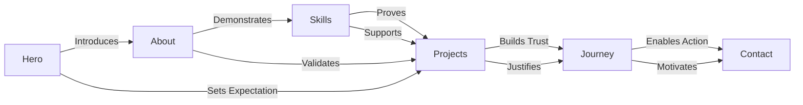

## فارسی

### اصول IA

۱. **افشای تدریجی:** مهم‌ترین اطلاعات اول
۲. **جریان منطقی:** هر بخش به طور طبیعی به بعدی منتهی می‌شود
۳. **بدون بن‌بست:** هر صفحه یک مرحله بعدی واضح دارد
۴. **سلسله مراتب کم‌عمق:** حداکثر ۲ سطح ناوبری
۵. **معماری جستجو-اول:** محتوا برای انسان‌ها و موتورهای جستجو سازمان‌دهی شده

### سلسله مراتب محتوا

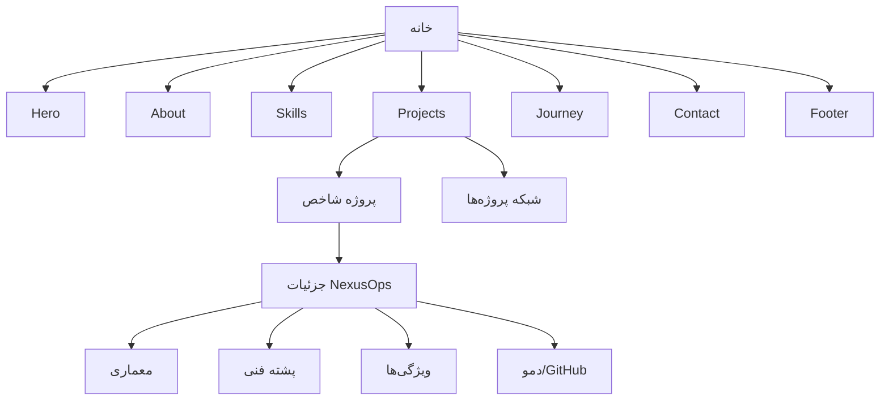

### اولویت بخش‌ها

| اولویت | بخش | هدف | عمق |
|--------|------|------|-----|
| P0 | Hero | پیام برند + تأثیر اولیه | سطحی |
| P0 | پروژه‌ها | شواهد توانایی | عمیق |
| P0 | About | چه کسی + چه چیزی + چرا | متوسط |
| P1 | Skills | توانایی‌های فنی | سطحی |
| P1 | Contact | مکانیزم تبدیل | سطحی |
| P2 | Journey | ساختن اعتماد | سطحی |
| P3 | Footer | ناوبری + لینک‌های اجتماعی | سطحی |

### نقشه هدف بخش‌ها

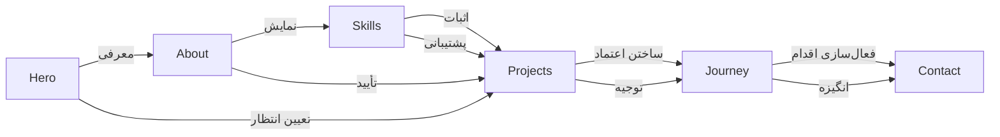

---

# 4. Sitemap

## English

### V3 Sitemap (Current)

```mermaid
graph TD
    HOME[/<br/>Home] --> HERO[Hero Section]
    HOME --> ABOUT[About Section]
    HOME --> SKILLS[Skills Section]
    HOME --> PROJECTS[Projects Section]
    HOME --> JOURNEY[Journey Section]
    HOME --> CONTACT[Contact Section]
    HOME --> FOOTER[Footer]
    
    HERO --> |Brand Message| HM[SMG + Tagline]
    HERO --> |Scroll Indicator| SC[↓]
    
    ABOUT --> |Mission| AM[Mission Statement]
    ABOUT --> |Values| AV[Core Values]
    ABOUT --> |Stats| AS[Key Statistics]
    
    SKILLS --> |Categories| SC2[Backend / DevOps / AI / Tools]
    SKILLS --> |Grid| SG[Skill Cards]
    
    PROJECTS --> |Featured| PF[NexusOps Showcase]
    PROJECTS --> |Grid| PG[Project Cards]
    
    PF --> |Details| PFD[NexusOps Deep Dive]
    PFD --> |Architecture| PFA[Architecture Diagram]
    PFD --> |Tech Stack| PFT[Technology Stack]
    PFD --> |Features| PFF[Feature List]
    PFD --> |Links| PFL[GitHub / Demo]
    
    JOURNEY --> |Timeline| JT[Career Timeline]
    JOURNEY --> |Milestones| JM[Year Markers]
    
    CONTACT --> |Form| CF[Contact Form]
    CONTACT --> |Social| CS[Social Links]
    
    FOOTER --> |Nav| FN[Quick Navigation]
    FOOTER --> |Social| FS[Social Links]
    FOOTER --> |Legal| FL[Copyright]
```

### URL Structure

| URL | Section | Type | Priority |
|-----|---------|------|----------|
| `/` | Home | Single Page | P0 |
| `/#home` | Hero | Section Anchor | P0 |
| `/#about` | About | Section Anchor | P0 |
| `/#skills` | Skills | Section Anchor | P1 |
| `/#projects` | Projects | Section Anchor | P0 |
| `/#journey` | Journey | Section Anchor | P2 |
| `/#contact` | Contact | Section Anchor | P1 |

## فارسی

### نقشه سایت V3 (فعلی)

```mermaid
graph TD
    HOME[/<br/>خانه] --> HERO[بخش Hero]
    HOME --> ABOUT[بخش About]
    HOME --> SKILLS[بخش Skills]
    HOME --> PROJECTS[بخش Projects]
    HOME --> JOURNEY[بخش Journey]
    HOME --> CONTACT[بخش Contact]
    HOME --> FOOTER[فوتر]
    
    HERO --> |پیام برند| HM[SMG + شعار]
    HERO --> |نشانگر اسکرول| SC[↓]
    
    ABOUT --> |ماموریت| AM[بیانیه ماموریت]
    ABOUT --> |ارزش‌ها| AV[ارزش‌های اصلی]
    ABOUT --> |آمار| AS[آمار کلیدی]
    
    SKILLS --> |دسته‌بندی‌ها| SC2[Backend / DevOps / AI / Tools]
    SKILLS --> |شبکه| SG[کارت‌های مهارت]
    
    PROJECTS --> |شاخص| PF[نمایش NexusOps]
    PROJECTS --> |شبکه| PG[کارت‌های پروژه]
    
    PF --> |جزئیات| PFD[جزئیات NexusOps]
    PFD --> |معماری| PFA[نمودار معماری]
    PFD --> |پشته فنی| PFT[پشته فناوری]
    PFD --> |ویژگی‌ها| PFF[لیست ویژگی‌ها]
    PFD --> |لینک‌ها| PFL[GitHub / دمو]
    
    JOURNEY --> |جدول زمانی| JT[جدول زمانی شغلی]
    JOURNEY --> |نقاط عطف| JM[نشانگرهای سال]
    
    CONTACT --> |فرم| CF[فرم تماس]
    CONTACT --> |اجتماعی| CS[لینک‌های اجتماعی]
    
    FOOTER --> |ناوبری| FN[ناوبری سریع]
    FOOTER --> |اجتماعی| FS[لینک‌های اجتماعی]
    FOOTER --> |قانونی| FL[کپی‌رایت]
```

### ساختار URL

| URL | بخش | نوع | اولویت |
|-----|------|------|---------|
| `/` | خانه | صفحه تکی | P0 |
| `/#home` | Hero | بخش Anchor | P0 |
| `/#about` | About | بخش Anchor | P0 |
| `/#skills` | Skills | بخش Anchor | P1 |
| `/#projects` | Projects | بخش Anchor | P0 |
| `/#journey` | Journey | بخش Anchor | P2 |
| `/#contact` | Contact | بخش Anchor | P1 |

---

# 5. Navigation

## English

### Navigation Model

```mermaid
graph LR
    subgraph Primary["Primary Navigation (Fixed Top)"]
        N1[Home] --> N2[About]
        N2 --> N3[Skills]
        N3 --> N4[Projects]
        N4 --> N5[Journey]
        N5 --> N6[Contact]
    end
    
    subgraph Secondary["Secondary Navigation (Footer)"]
        F1[Quick Links] --> F2[Social Links]
        F2 --> F3[Copyright]
    end
    
    subgraph Interaction["Interaction Patterns"]
        I1[Smooth Scroll]
        I2[Active Section Indicator]
        I3[Mobile Hamburger]
    end
    
    Primary --> Interaction
    Secondary --> Interaction
```

### Navigation States

| State | Behavior | Visual |
|-------|----------|--------|
| **Default** | Transparent background | Text visible on hero |
| **Scrolled** | Glass effect background | Frosted glass appearance |
| **Mobile Closed** | Hamburger icon | Three lines |
| **Mobile Open** | Full-screen overlay | Navigation links centered |
| **Active Section** | Highlighted link | Underline or color change |

### Navigation Timing

| Interaction | Expected Response | Max Acceptable |
|-------------|------------------|----------------|
| **Click link** | Immediate scroll | 500ms |
| **Mobile menu open** | 200ms animation | 300ms |
| **Mobile menu close** | 200ms animation | 300ms |
| **Section highlight** | On scroll enter | 100ms delay |

### Keyboard Navigation

| Key | Action |
|-----|--------|
| **Tab** | Move to next interactive element |
| **Shift+Tab** | Move to previous interactive element |
| **Enter** | Activate focused link |
| **Escape** | Close mobile menu |
| **Arrow Keys** | Navigate within dropdown (future) |

### Navigation Wireframe

#### Desktop

```
┌─────────────────────────────────────────────────────────────┐
│  SMG          Home   About   Skills   Projects   Contact   │
├─────────────────────────────────────────────────────────────┤
│                                                             │
│                      [Hero Content]                         │
│                                                             │
├─────────────────────────────────────────────────────────────┤
│  © 2026 SMG    GitHub    LinkedIn    Telegram    Instagram  │
└─────────────────────────────────────────────────────────────┘
```

#### Mobile

```
┌─────────────────────┐
│  SMG            ☰   │
├─────────────────────┤
│                     │
│   [Hero Content]    │
│                     │
├─────────────────────┤
│  © 2026 SMG         │
│  GitHub  LinkedIn   │
└─────────────────────┘
```

#### Mobile Menu (Open)

```
┌─────────────────────┐
│  SMG            ✕   │
├─────────────────────┤
│                     │
│      Home           │
│      About          │
│      Skills         │
│      Projects       │
│      Journey        │
│      Contact        │
│                     │
└─────────────────────┘
```

## فارسی

### مدل ناوبری

```mermaid
graph LR
    subgraph Primary["ناوبری اولیه (بالای ثابت)"]
        N1[خانه] --> N2[About]
        N2 --> N3[Skills]
        N3 --> N4[Projects]
        N4 --> N5[Journey]
        N5 --> N6[Contact]
    end
    
    subgraph Secondary["ناوبری ثانویه (فوتر)"]
        F1[لینک‌های سریع] --> F2[لینک‌های اجتماعی]
        F2 --> F3[کپی‌رایت]
    end
    
    subgraph Interaction["الگوهای تعامل"]
        I1[اسکرول نرم]
        I2[نشانگر بخش فعال]
        I3[همبرگری موبایل]
    end
    
    Primary --> Interaction
    Secondary --> Interaction
```

### حالت‌های ناوبری

| حالت | رفتار | بصری |
|------|-------|------|
| **پیش‌فرض** | پس‌زمینه شفاف | متن روی Hero قابل مشاهده |
| **اسکرول شده** | اثر شیشه‌ای | ظاهر شیشه یخ‌زده |
| **موبایل بسته** | آیکون همبرگری | سه خط |
| **موبایل باز** | تمام صفحه overlay | لینک‌های ناوبری مرکز شده |
| **بخش فعال** | لینک هایلایت شده | خط زیر یا تغییر رنگ |

### زمان‌بندی ناوبری

| تعامل | پاسخ مورد انتظار | حداکثر قابل قبول |
|--------|------------------|------------------|
| **کلیک لینک** | اسکرول فوری | ۵۰۰ میلی‌ثانیه |
| **باز شدن منوی موبایل** | انیمیشن ۲۰۰ میلی‌ثانیه | ۳۰۰ میلی‌ثانیه |
| **بسته شدن منوی موبایل** | انیمیشن ۲۰۰ میلی‌ثانیه | ۳۰۰ میلی‌ثانیه |
| **هایلایت بخش** | در ورود اسکرول | ۱۰۰ میلی‌ثانیه تأخیر |

### ناوبری صفحه‌کلید

| کلید | عمل |
|------|------|
| **Tab** | حرکت به عنصر تعاملی بعدی |
| **Shift+Tab** | حرکت به عنصر تعاملی قبلی |
| **Enter** | فعال‌سازی لینک تمرکز شده |
| **Escape** | بستن منوی موبایل |
| **کلیدهای جهت‌نما** | ناوبری درون dropdown (آینده) |

### وایرفریم ناوبری

#### دسکتاپ

```
┌─────────────────────────────────────────────────────────────┐
│  SMG          Home   About   Skills   Projects   Contact   │
├─────────────────────────────────────────────────────────────┤
│                                                             │
│                      [محتوای Hero]                          │
│                                                             │
├─────────────────────────────────────────────────────────────┤
│  © ۲۰۲۶ SMG    GitHub    LinkedIn    Telegram    Instagram  │
└─────────────────────────────────────────────────────────────┘
```

#### موبایل

```
┌─────────────────────┐
│  SMG            ☰   │
├─────────────────────┤
│                     │
│   [محتوای Hero]     │
│                     │
├─────────────────────┤
│  © ۲۰۲۶ SMG         │
│  GitHub  LinkedIn   │
└─────────────────────┘
```

#### منوی موبایل (باز)

```
┌─────────────────────┐
│  SMG            ✕   │
├─────────────────────┤
│                     │
│      خانه           │
│      About          │
│      Skills         │
│      Projects       │
│      Journey        │
│      Contact        │
│                     │
└─────────────────────┘
```

---

# 6. CTA Strategy

## English

### CTA Hierarchy

| Level | CTA | Location | Priority | Action |
|-------|-----|----------|----------|--------|
| **Primary** | Contact Form | Contact Section | P1 | Submit message |
| **Secondary** | GitHub Profile | Footer + Projects | P1 | Follow/Star |
| **Tertiary** | LinkedIn | Footer | P2 | Connect |
| **Passive** | Scroll Indicator | Hero | P3 | Explore more |

### CTA by Section

| Section | CTA | Text | Destination |
|---------|-----|------|-------------|
| **Hero** | Scroll Indicator | ↓ | About Section |
| **About** | (None) | — | — |
| **Skills** | (None) | — | — |
| **Projects** | Project Link | "View on GitHub" | GitHub Repo |
| **Journey** | (None) | — | — |
| **Contact** | Submit Button | "Send Message" | Form Submit |
| **Footer** | Social Links | Platform names | External URLs |

### CTA Design Rules

| Rule | Standard |
|------|----------|
| **Size** | Minimum 44x44px touch target |
| **Color** | Primary blue (#3B82F6) for main CTAs |
| **Text** | Action-oriented, specific |
| **Placement** | Above fold for primary CTA |
| **Feedback** | Hover state, focus state, loading state |
| **Spacing** | Minimum 16px around CTAs |

### CTA Copy Guidelines

| DO | DON'T |
|----|-------|
| "Send Message" | "Submit" |
| "View on GitHub" | "Click here" |
| "Connect on LinkedIn" | "Follow me" |
| "Explore Projects" | "Learn more" |

## فارسی

### سلسله مراتب CTA

| سطح | CTA | مکان | اولویت | عمل |
|-----|-----|------|--------|------|
| **اصلی** | فرم تماس | بخش Contact | P1 | ارسال پیام |
| **ثانویه** | پروفایل GitHub | فوتر + پروژه‌ها | P1 | دنبال کردن/ستاره |
| **ثالث** | LinkedIn | فوتر | P2 | اتصال |
| **منفعل** | نشانگر اسکرول | Hero | P3 | کاوش بیشتر |

### CTA به ازای هر بخش

| بخش | CTA | متن | مقصد |
|-----|-----|------|------|
| **Hero** | نشانگر اسکرول | ↓ | بخش About |
| **About** | (هیچ) | — | — |
| **Skills** | (هیچ) | — | — |
| **Projects** | لینک پروژه | "مشاهده در GitHub" | مخزن GitHub |
| **Journey** | (هیچ) | — | — |
| **Contact** | دکمه ارسال | "ارسال پیام" | ارسال فرم |
| **Footer** | لینک‌های اجتماعی | نام پلتفرم‌ها | URLهای خارجی |

### قوانین طراحی CTA

| قانون | استاندارد |
|-------|----------|
| **اندازه** | حداقل ۴۴x۴۴px هدف لمسی |
| **رنگ** | آبی اصلی (#3B82F6) برای CTAهای اصلی |
| **متن** | مبتنی بر عمل، خاص |
| **جایگذاری** | بالای خط برای CTA اصلی |
| **بازخورد** | حالت Hover، حالت تمرکز، حالت بارگذاری |
| **فاصله** | حداقل ۱۶px اطراف CTAها |

### راهنمای متن CTA

| بکن | نکن |
|-----|-----|
| "ارسال پیام" | "ارسال" |
| "مشاهده در GitHub" | "اینجا کلیک کنید" |
| "اتصال در LinkedIn" | "من را دنبال کنید" |
| "کاوش پروژه‌ها" | "بیشتر بدانید" |

---

# 7. UX Rules

## English

### Rule 1: Don't Make Me Think

> Every page should be self-explanatory.

If a visitor needs instructions, the design has failed.

### Rule 2: Progressive Disclosure

> Show the most important information first.

Don't overwhelm visitors. Reveal complexity gradually.

### Rule 3: Consistent Patterns

> Similar things should look and behave similarly.

Consistency reduces cognitive load.

### Rule 4: Feedback Every Action

> Every user action should produce a visible result.

Clicks, hovers, form submissions — all need feedback.

### Rule 5: Forgiving Design

> Mistakes should be easy to recover from.

Form validation should be helpful, not punishing.

### Rule 6: Mobile-First

> Design for the smallest screen first, then enhance.

Mobile is 60%+ of traffic. Design for it first.

### Rule 7: Accessibility Is Not Optional

> WCAG AA compliance is mandatory.

Every interactive element must be keyboard accessible with proper ARIA labels.

### Rule 8: Performance Is UX

> A slow website is a broken website.

Core Web Vitals are non-negotiable.

### UX Rules Table

| Rule | Standard | Rationale |
|------|----------|-----------|
| **Click targets** | Minimum 44x44px | Mobile touch |
| **Form validation** | Inline, real-time | Immediate feedback |
| **Loading states** | Show for >300ms | Perceived performance |
| **Error messages** | Helpful, specific | User guidance |
| **Hover states** | All interactive elements | Affordance |
| **Focus indicators** | Visible on all focusable | Accessibility |
| **Scroll behavior** | Smooth, not instant | Comfortable navigation |
| **Mobile gestures** | Standard (tap, swipe) | Familiarity |
| **Color contrast** | 4.5:1 minimum | Readability |
| **Font size** | 16px minimum | Mobile readability |

### Accessibility Checklist

- [ ] All interactive elements have `aria-label`
- [ ] All images have `alt` text
- [ ] All form fields have labels
- [ ] Color contrast meets WCAG AA (4.5:1)
- [ ] Keyboard navigation works
- [ ] Screen reader compatible
- [ ] Focus indicators visible
- [ ] No content relies solely on color
- [ ] Animations respect `prefers-reduced-motion`
- [ ] Skip navigation link present

### Performance Checklist

- [ ] Lighthouse score > 95
- [ ] LCP < 2.5s
- [ ] FID < 100ms
- [ ] CLS < 0.1
- [ ] TTFB < 600ms
- [ ] FCP < 1.8s
- [ ] Total weight < 500KB
- [ ] Images optimized (WebP)
- [ ] Code splitting implemented
- [ ] Lazy loading enabled

## فارسی

### قانون ۱: مجبورم نکن فکر کنم

> هر صفحه باید خودتوضیحی باشد.

اگر بازدیدکننده به دستورالعمل نیاز دارد، طراحی شکست خورده است.

### قانون ۲: افشای تدریجی

> مهم‌ترین اطلاعات را اول نشان بده.

بازدیدکنندگان را تحت تأثیر قرار نده. پیچیدگی را به تدریج آشکار کن.

### قانون ۳: الگوهای یکپارچه

> چیزهای مشابه باید مشابه به نظر برسند و رفتار کنند.

یکپارچگی بار شناختی را کاهش می‌دهد.

### قانون ۴: بازخورد هر عمل

> هر عمل کاربر باید نتیجه قابل مشاهده تولید کند.

کلیک‌ها، hoverها، ارسال‌های فرم — همه به بازخورد نیاز دارند.

### قانون ۵: طراحی بخشنده

> اشتباهات باید به راحتی قابل بازیابی باشند.

اعتبارسنجی فرم باید مفید باشد، نه مجازات‌گر.

### قانون ۶: Mobile-First

> اول برای کوچکترین صفحه‌نمایش طراحی کن، سپس بهبود بده.

موبایل بیش از ۶۰٪ ترافیک است. اول برای آن طراحی کن.

### قانون ۷: دسترسی‌پذیری اختیاری نیست

> انطباق WCAG AA اجباری است.

هر عنصر تعاملی باید از صفحه‌کلید قابل دسترسی باشد با برچسب‌های ARIA مناسب.

### قانون ۸: عملکرد UX است

> یک وب‌سایت کند یک وب‌سایت شکسته است.

Core Web Vitals غیرقابل مذاکره هستند.

### جدول قوانین UX

| قانون | استاندارد | دلیل |
|-------|----------|------|
| **اهداف کلیک** | حداقل ۴۴x۴۴px | لمس موبایل |
| **اعتبارسنجی فرم** | Inline، بلادرنگ | بازخورد فوری |
| **حالت‌های بارگذاری** | برای >۳۰۰ms نمایش بده | عملکرد ادراکی |
| **پیام‌های خطا** | مفید، خاص | راهنمای کاربر |
| **حالت‌های Hover** | تمام عناصر تعاملی | قابلیت استفاده |
| **نشانگرهای تمرکز** | روی تمام قابل تمرکزها قابل مشاهده | دسترسی‌پذیری |
| **رفتار اسکرول** | نرم، نه آنی | ناوبری راحت |
| **حرکات موبایل** | استاندارد (tap, swipe) | آشنایی |
| **کنتراست رنگ** | حداقل ۴.۵:۱ | خوانایی |
| **اندازه فونت** | حداقل ۱۶px | خوانایی موبایل |

### چک‌لیست دسترسی‌پذیری

- [ ] تمام عناصر تعاملی `aria-label` دارند
- [ ] تمام تصاویر `alt` text دارند
- [ ] تمام فیلدهای فرم label دارند
- [ ] کنتراست رنگ WCAG AA (4.5:1) را رعایت می‌کند
- [ ] ناوبری صفحه‌کلید کار می‌کند
- [ ] سازگار با خواننده صفحه‌نمایش
- [ ] نشانگرهای تمرکز قابل مشاهده هستند
- [ ] هیچ محتوایی فقط بر اساس رنگ نیست
- [ ] انیمیشن‌ها prefers-reduced-motion را رعایت می‌کنند
- [ ] لینک رد کردن ناوبری وجود دارد

### چک‌لیست عملکرد

- [ ] امتیاز Lighthouse > ۹۵
- [ ] LCP < ۲.۵ ثانیه
- [ ] FID < ۱۰۰ میلی‌ثانیه
- [ ] CLS < ۰.۱
- [ ] TTFB < ۶۰۰ میلی‌ثانیه
- [ ] FCP < ۱.۸ ثانیه
- [ ] وزن کل < ۵۰۰KB
- [ ] تصاویر بهینه شده (WebP)
- [ ] تقسیم کد پیاده‌سازی شده
- [ ] بارگذاری تنبل فعال شده

---

# Appendix: UX Decision Log

| Date | Decision | Rationale | Alternatives |
|------|----------|-----------|--------------|
| 2026-08-07 | Single page with sections | Maximizes content density, minimizes navigation friction | Multi-page (heavier, slower) |
| 2026-08-07 | Fixed top navigation | Always accessible, consistent | Hidden nav (discoverability issues) |
| 2026-08-07 | Smooth scroll | Comfortable navigation | Instant jump (jarring) |
| 2026-08-07 | Glass effect on scroll | Premium feel, visual depth | Solid background (less interesting) |
| 2026-08-07 | Mobile hamburger menu | Standard pattern, familiar | Always-visible mobile nav (cluttered) |
| 2026-08-07 | Progressive disclosure | Most important content first | Reverse chronology (blog-style) |
| 2026-08-07 | Primary CTA = Contact | Direct conversion path | GitHub (less direct) |

---

**Document Version:** 3.0
**Last Updated:** 2026-08-07
**Author:** SMG / Saman Qasempour
**Status:** Active — UX Specification
**Depends On:** PRD.md, PRODUCT_STRATEGY.md, PRODUCT_ARCHITECTURE.md, BRAND_BOOK.md
